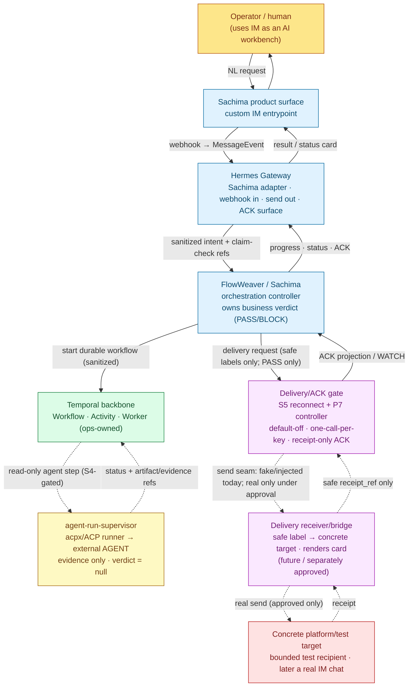
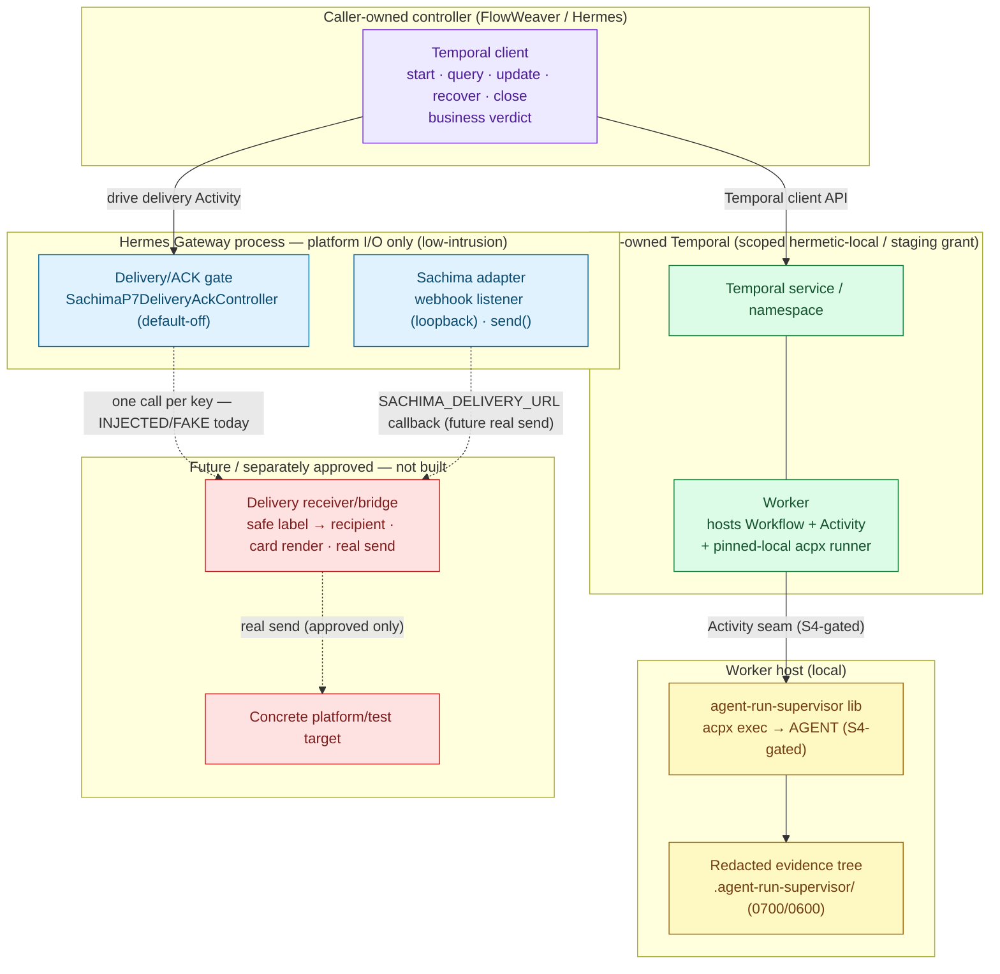
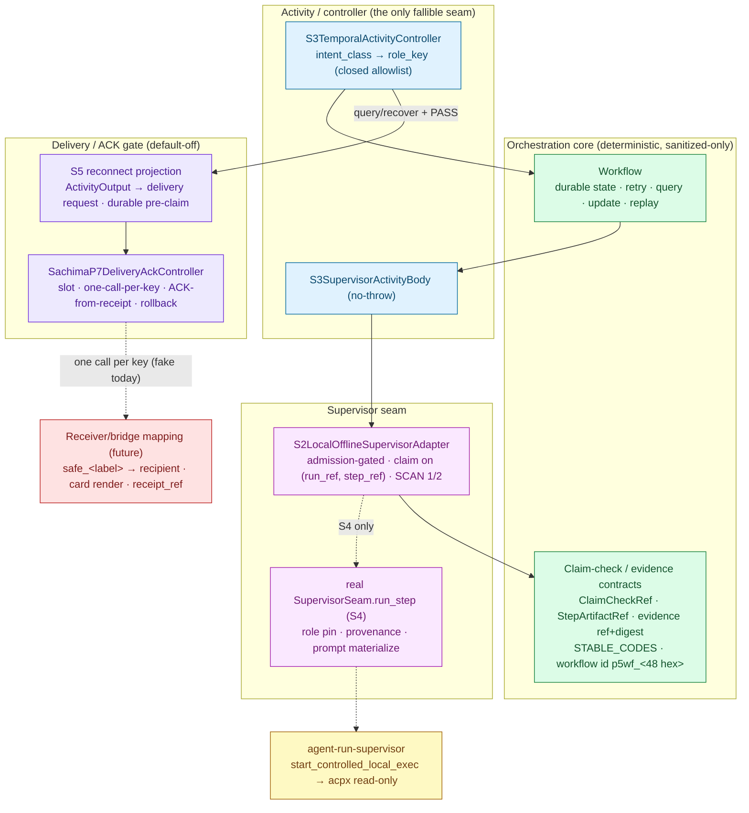
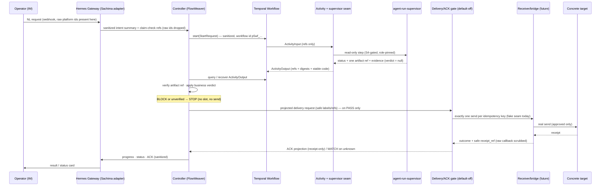
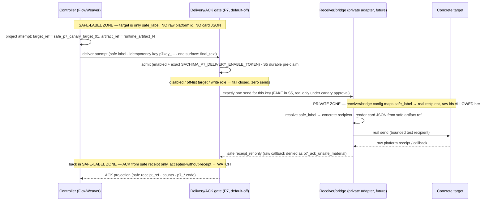

# Sachima Global Architecture — agent-run-supervisor × Temporal (Authoritative Target v1)

Date: 2026-07-02
Owner: Architect
Status: **Authoritative architecture reference (docs-only).** This document is the first
architecture source for the Sachima integration of **agent-run-supervisor** and
**Temporal**. It clarifies the target architecture and names components; it changes no
runtime behavior, grants no approval, and enables nothing. It writes documentation only.

> **How to read this document.** This is the *architecture map*, not a plan, an approval,
> or a status ledger. It answers three questions and keeps them separate: (1) *target* —
> what the components are and how they are meant to fit; (2) *current state* — what is
> actually merged, what is only designed/default-off, and what does not exist; (3) *gaps*
> — what is missing or unclear and what that blocks. Phase/task truth lives in
> `docs/roadmap/current-status.md`; per-stage design contracts live in the S1–S5 / P7
> packets under `docs/plans/` and `docs/runbooks/`. Where those and this document seem to
> disagree about a contract detail, the named packet wins; where they disagree about
> *what a thing is called or where it sits*, this document is the intended source.

---

## 1. Verdict — the ambiguity is the blocker

**Architecture ambiguity is a real, current blocker, and it is worth fixing before more
integration work lands.** The individual S1–S5 / P7 packets are internally precise, but
across them the same idea appears under several names, milestone labels get used as if
they were components, and one load-bearing component — the thing that turns a *safe label*
into a *real recipient* and performs a real send — is described only as a "future injected
seam" and never given a stable name or a fixed place. That single missing name is where
most of the confusion concentrates: it is unclear *who renders the card, who resolves the
recipient, where raw platform identity is allowed to exist, and what actually blocks a
real send.*

This document fixes that by doing four things:

1. **Naming the components once**, with the milestone labels demoted to a mapping table
   (§3–§4).
2. **Giving the delivery path its missing component an explicit name — the delivery
   receiver/bridge — and a fixed place** in the trust boundary (§4, §7, §8, §11).
3. **Separating target / current-state / gaps** so a reader can tell what exists from what
   is designed from what is missing (§9).
4. **Pinning the two configuration and no-leak boundaries** that the whole safety argument
   rests on (§8, §11).

**One-sentence target.** A custom-IM request enters through the Sachima surface on the
Hermes Gateway, is reduced to sanitized intent + claim-check refs, drives a durable
Temporal workflow whose only fallible seam is an Activity that may delegate a single
bounded read-only step to agent-run-supervisor, and — only after a caller-owned PASS — is
projected as a *safe-label* delivery request that a default-off delivery/ACK gate hands to
a delivery receiver/bridge, which is the *only* place a safe label becomes a real
recipient and a real send occurs.

**The single most important clarification in this document:** *core Sachima never knows a
real recipient or a real card.* Everything from the Gateway inward through Temporal and the
delivery/ACK gate carries only safe labels, refs, digests, counts, and stable codes. The
resolution of a safe label to a concrete platform target — and the rendering of an actual
card — happens exclusively inside the **delivery receiver/bridge**, downstream of durable
history, behind a separate approval. That component does not yet exist as approved real
code; today the seam it fills is fake/injected. See §9 (gaps) and §11 (config boundary).

---

## 2. Scope and non-negotiables carried in

This document preserves — and does not weaken — every explicit non-approval already in
force (§13). In particular it does not approve, imply, or perform: real external ingress;
real delivery or a real send; the P7 real-send canary execute; Gateway/Feishu/live/
default-on behavior; a Temporal Worker/service/runtime/subprocess start; a real
agent/`acpx`/`npx` run; write-capable roles; production config writes; or Gateway-owned
Temporal lifecycle. Temporal semantics referenced here defer to the official Temporal
documentation (`https://docs.temporal.io/`) as the source of truth.

---

## 3. Terms — names first (glossary)

These are the architecture's components and boundaries. **Use these names.** The right-hand
column points at the concrete anchor (a source module, a contract type, or a config
surface) so the name is not abstract.

| Term (use this name) | What it is | Concrete anchor |
|---|---|---|
| **Sachima product surface / custom IM entrypoint** | The custom IM channel an operator talks to: inbound requests and outbound results as IM messages. The product, not a component. | Sachima Envelope v1 wire contract (`docs/protocols/sachima-envelope-v1.md`; `jovijovi/sachima-protocols`). |
| **Hermes Gateway** | The Hermes subsystem that hosts platform adapters, renders/sends platform messages, receives inbound webhooks, and owns the ACK surface. The **Sachima adapter** is one platform inside it. It is the platform I/O boundary — *not* an orchestration or Temporal owner. | `gateway/platforms/sachima.py` (`SachimaAdapter`, `Platform.SACHIMA`, inbound webhook listener, `send()`). |
| **FlowWeaver / Sachima orchestration controller** | The caller-owned business brain: reduces a request to sanitized intent, resolves intent → role key, drives the durable workflow (start/query/update/recover/close), and **owns the business verdict (PASS/BLOCK)**. It is a Temporal *client*, not the Gateway. | `S3TemporalActivityController` (`sachima_supervisor/p5_temporal/s3_activity_controller.py`). |
| **Temporal backbone** | The durable orchestration substrate: **Workflow** (deterministic state, retry, query, update, replay-recovery), **Activity** (the only fallible / external-work seam), and the **Worker** that hosts them. | `sachima_supervisor/p5_temporal/*`; task queue `P5_TEMPORAL_TASK_QUEUE` (`sachima-p5-temporal-slice-1`); sole Worker builder `p5_temporal_worker.py`. |
| **Worker lifecycle owner** | Whoever starts/stops the Temporal Worker and service. **Ops-owned / caller-owned, never Gateway-owned.** A scoped hermetic-local/staging grant exists; production is not approved. | Ops runbook; scoped P5 grant (`docs/roadmap/boundary-register.md`). |
| **agent-run-supervisor** | A **caller-invoked, local-first supervisor library** (not a daemon, not a Gateway plugin, not an IM adapter) that validates a role, compiles an acpx policy/argv, supervises a runner/session, parses events, redacts, and returns *evidence* — never a business verdict. | External repo `agent-run-supervisor`; caller boundary `caller.py` (`CallerInvocationSpec` → `SupervisorRunner`/`SessionRuntime`). |
| **acpx / ACP runner boundary** | The runner the supervisor invokes to launch an external worker: `acpx exec` (one-shot) or `acpx session` (persistent), speaking the ACP protocol. Pinned-local by provenance; `npx`/fetch/shell basenames fail closed. | `AgentRoleSpec.role_id`; role runner config (`acpx_binary`, adapter, model). |
| **External AGENT** | The actual model/tool worker (Codex, Claude Code, …) behind acpx. It is outside every trust boundary; its raw output is untrusted text. | Selected by role runner/adapter/model fields. |
| **Claim-check store / evidence store** | Where real bytes live so durable state can carry only a *reference + digest*. Durable state holds `ClaimCheckRef`/`StepArtifactRef` (ref + `sha256`), never payloads. Supervisor evidence is redacted to a local artifact tree on the Worker host. | `sachima_supervisor/p5_temporal/contracts.py`; supervisor `.agent-run-supervisor/` tree (dirs `0700`/files `0600`). |
| **Delivery/ACK gate (S5 reconnect + P7 controller)** | The default-off admission + idempotency + ACK-reconciliation logic between orchestration output and the send. One slot per surface, one adapter call per idempotency key, ACK from receipts only, rollback without Gateway restart. It **calls** a send seam; it constructs none. | `gateway/sachima_delivery_ack.py` (`SachimaP7DeliveryAckController`); reconnect `sachima_supervisor/p5_temporal/s5_downstream_delivery_reconnect.py` (`S5DeliveryReconnectController`); injected fake seam `gateway/sachima_fake_send_simulator.py` (`FakeSachimaSendSimulator`). |
| **Delivery receiver/bridge** | The **real implementation of the send seam**: the Gateway-side platform adapter and/or the external delivery receiver behind `SACHIMA_DELIVERY_URL` that privately resolves `safe_<label>` → concrete recipient, renders card JSON from a safe artifact ref, performs the real send, and returns a safe `receipt_ref`. **This is the only place a safe label becomes a real target.** It does not exist as approved real code yet; today the seam is fake/injected. | Future component. Current placeholder: loopback-only `FakeSachimaSendSimulator` (`gateway/sachima_fake_send_simulator.py`). Inbound/outbound edges live in `gateway/platforms/sachima.py` (`SACHIMA_DELIVERY_URL`, `SachimaAdapter.send()`). |
| **Concrete platform/test target** | The actual recipient the receiver/bridge sends to: a single bounded test recipient for the canary; a real IM chat later. Outside core Sachima's trust boundary. | Receiver/bridge private config; `policy.approved_targets` contains only approved `safe_<label>` values. |
| **ACK projection** | The sanitized delivery result carried back into durable state / status: outcome enum, safe `receipt_ref`, counts, stable `p7_*` codes. An ACK is recorded **only** from an accepted receipt; raw callbacks never cross back. | P7 delivery-state projection; `runtime_delivery_ack_N`. |

**Two supporting distinctions the packets rely on but do not always spell out:**

- **The delivery/ACK *gate* is not the *receiver/bridge*.** The gate (`sachima_delivery_ack.py`)
  is admission + idempotency + ACK bookkeeping and lives in the `gateway/` package but sends
  nothing itself. The receiver/bridge is the injected seam it calls; only the receiver/bridge
  touches a real recipient. Conflating the two is the core naming confusion this document
  removes.
- **agent-run-supervisor is a callee, not a peer of the Gateway.** Temporal/Sachima is a
  *caller* of the supervisor. The supervisor owns runner/session lifecycle and evidence; it
  owns no delivery, no IM, no Temporal, and no business verdict.

---

## 4. Milestone labels are not components

**S0, S1, S2, S3, S4, S5, and P7 are milestone/approval labels, not architecture
components.** They name *when* something was designed or approved, not *what part of the
system it is*. Reading them as components is a primary source of the ambiguity. Here is the
map from each label to the actual component or contract it produced, and its state.

| Milestone label | What it actually produced (component / contract) | Concrete anchor | State |
|---|---|---|---|
| **S0 — mainline calibration** | A framing decision: two integration mainlines (agent-run-supervisor, Temporal); P5/P6/P7 reclassified as support foundation. No component. | `docs/plans/2026-06-30-…-mainline-calibration-…-plan.md` | Docs, merged |
| **S1 — integration architecture** | The cross-boundary **contract**: three-layer model, claim-check data model, failure/recovery/no-relaunch mapping, Temporal-history no-leak boundary (SCAN 1 JSON + SCAN 2 serialized bytes). No new source. | `contracts.py` as design basis | Docs, merged |
| **S2 — local/offline adapter seam** | The **supervisor-adapter seam** component: admission-gated, claim-check idempotency on `(run_ref, step_ref)`, no-relaunch recovery, dual no-leak scans, injected fake body. | `S2LocalOfflineSupervisorAdapter` (`sachima_supervisor/p5_temporal/s2_supervisor_adapter.py`) | Code, merged (default-off) |
| **S3 — Activity/controller** | The **Activity body + caller-owned controller**, the intent-class → role-key mapping, hermetic-local Worker binding. | `S3SupervisorActivityBody`, `S3TemporalActivityController` (`s3_activity_controller.py`) | Code, merged (hermetic-local, injected fake) |
| **S4 — read-only real-agent step** | The **real read-only supervisor seam** that binds the injected body to one bounded read-only `acpx exec` via the supervisor. | `s4_read_only_real_agent_step.py`; `activity_controlled_exec.start_controlled_local_exec`; `p6b_read_only_real_agent.py` shape | Code merged (seam); *real-agent execution separately gated* |
| **S5 — downstream delivery reconnect** | The **reconnect projection** from `ActivityOutput` into an initialized delivery request, driving the delivery/ACK gate through an injected/fake send seam. | `s5_downstream_delivery_reconnect.py` (`S5DeliveryReconnectController`) over `sachima_delivery_ack.py`; fake seam `sachima_fake_send_simulator.py` | Code, merged (default-off, fake seam) |
| **P7 — delivery/ACK closure + canary prep** | The **delivery/ACK gate** (default-off controller) and a **prepared bounded real-send canary request packet** (safe labels only). | `gateway/sachima_delivery_ack.py`; `docs/runbooks/sachima-p7-*` | Controller merged (default-off); canary execute **paused** |

The support-foundation slices under these labels: `p5_temporal/*` (Temporal foundation),
`p6_controlled_ai_flow.py` (controlled AI FLOW composition), `p6b_read_only_real_agent.py`
(read-only real-agent step prerequisite), `p6_runtime_attach.py` (caller-owned attach/
recover, starts no runtime).

---

## 5. Context diagram

Who talks to whom, at the system level. Solid arrows are the merged/default-off path;
dashed arrows are steps that are gated behind a separate named approval (real agent step,
real send).



Note the two edges where raw platform identity is allowed to exist — the Gateway inbound
webhook and the receiver/bridge outbound send — and nowhere in between. Everything from
`GW → CTRL` inward carries only sanitized material (§7).

---

## 6. Container / deployment diagram — who owns which lifecycle

The safety story is mostly a *lifecycle ownership* story. This diagram groups components by
the process/owner that starts and stops them, and marks what is local/offline today versus
what is a future production surface.



**Lifecycle rules this diagram fixes:**

- **The Gateway process owns platform I/O and the default-off delivery/ACK gate — and
  nothing else.** It does not own, start, restart, or reload the Temporal service, the
  Worker, the task queue, or any runtime daemon/socket/subprocess. (It legitimately
  owns its *own* platform I/O — the Sachima webhook listener and outbound HTTP — which
  is not Temporal/runtime lifecycle.) This is the `GOAL.md` low-intrusion rule.
- **The Temporal Worker (and the pinned-local acpx runner it hosts) is ops-owned.** Today
  only a scoped hermetic-local/staging grant exists; production is not approved. The Worker
  is never Gateway-owned — the sole real Worker construction is `p5_temporal_worker.py`
  (`build_p5_temporal_worker` / `run_p5_temporal_worker`), which requires a caller-supplied
  connected client, starts no server/subprocess, and is guarded by a static boundary test
  that fails the build on any Gateway/adapter import of it.
- **agent-run-supervisor runs local to the Worker host.** Its redacted evidence tree stays
  on that host; only refs/digests cross into durable state.
- **The receiver/bridge and the concrete target are a future block.** Nothing in that group
  is built or approved; the delivery seam is fake/injected today.

---

## 7. Component diagram — inside the boxes



---

## 8. Sequence — inbound request to operator view (happy path)

The full round trip. The read-only agent step (S4) and the real send (receiver/bridge) are
each behind a separate approval; on the merged/default path the step is a deterministic
fake and the send seam is fake/injected.



---

## 9. Sequence — bounded real-send canary and the safe-label boundary

This is the diagram the ambiguity most needs. It shows **where a safe label is allowed to
be just a label, and the single place it is resolved to a real recipient.** The horizontal
boundary is a trust boundary: above it, raw target identity is forbidden; below it (inside
the receiver/bridge and its private config), a real recipient exists.



**Rules this diagram fixes:**

- **Raw target IDs are forbidden above the private zone.** The controller, Temporal history,
  and the delivery/ACK gate see only `safe_<label>`, refs, digests, counts, and codes.
- **The safe-label → concrete-recipient mapping lives only in the receiver/bridge and its
  private config** — never in `approved_targets` (which holds labels), never in workflow
  state, never in status.
- **Card JSON is rendered only in the receiver/bridge**, from a safe artifact ref, downstream
  of history. It is never built in the projection or carried in a slot/attempt.
- **Only a safe `receipt_ref` crosses back.** A raw callback is denied and scrubbed
  (`p7_ack_unsafe_material`); an accepted send with no safe receipt is WATCH
  (`p7_ack_missing`), not a delivered ACK.
- **The canary is one send:** one surface (`final_text`), `max_attempts = 1`, default-off,
  and no concrete recipient exists until an operator binds one at approval time.

---

## 10. Ownership matrix

One row per responsibility. "Owner" is who is authoritative; "Not owned by" names the most
common wrong assumption; the anchor grounds it.

| Responsibility | Owner | Explicitly **not** owned by | Anchor |
|---|---|---|---|
| **Business verdict (PASS/BLOCK)** | FlowWeaver/Sachima controller | agent-run-supervisor (`business_verdict = null`); Temporal; delivery gate | `S3TemporalActivityController` |
| **Durable workflow state / retry / query / recover** | Temporal Workflow | the Gateway; the controller's process memory | `p5_temporal/*` Workflow |
| **Activity execution (fallible seam)** | Temporal Activity body | the Workflow (deterministic); the controller | `S3SupervisorActivityBody` |
| **Worker / service lifecycle** | Ops (scoped grant) | the Gateway (never); the controller by default | ops runbook; boundary-register |
| **Role policy / authorization** | agent-run-supervisor (`AgentRoleSpec`) | the controller (passes a role *key* ref only); the Gateway | supervisor `role.py`/`policy.py` |
| **Runner / session lifecycle** | agent-run-supervisor | Temporal; the controller; the Gateway | supervisor `runner.py`/`session_runtime.py` |
| **Prompt / context materialization** | agent-run-supervisor (via injected materializer, after pre-claim) | Temporal history (raw prompt never durable) | S4 real seam `_materialize_prompt` |
| **Artifact / evidence refs** | claim-check contracts (refs+digests) upstream; supervisor evidence tree for bytes | durable state (bytes never durable) | `contracts.py`; `.agent-run-supervisor/` |
| **Delivery admission** | Delivery/ACK gate (default-off + exact token) | the Gateway process by default; the controller | `SachimaP7DeliveryAckController` |
| **Safe-label → concrete-target mapping** | **Delivery receiver/bridge (private config)** | core Sachima, Temporal, the delivery gate — all see labels only | future receiver/bridge |
| **Raw platform IDs** | Gateway inbound edge (reduce immediately) and receiver/bridge outbound edge (private) | Temporal history; delivery state; status; logs | `gateway/platforms/sachima.py`; receiver/bridge |
| **ACK closure** | Delivery/ACK gate (receipt-only) | the receiver/bridge; optimistic rendering; exit codes | P7 ACK projection |
| **Rollback / stop** | Delivery/ACK gate (`rollback()`, no Gateway restart); Temporal cancel → WATCH | a Gateway restart; an auto-relaunch | P7 `rollback()`; WP3b WATCH |

---

## 11. Trust / no-leak boundary matrix

Four locations, and exactly what each may hold. This is the whole safety argument in one
table. A value in the wrong column is a leak and must fail closed
(`runtime_history_leak_detected` upstream / `p7_ack_unsafe_material` downstream).

| Location | **May hold** | **Must never hold** |
|---|---|---|
| **Temporal history / query / log / status** | sanitized refs (`run_ref`, `step_ref`, workflow id `p5wf_<48 hex>`); `ClaimCheckRef{ref, sha256 digest, kind, byte_count}`; `StepArtifactRef`; role *keys*; `evidence_ref`+digest; `STABLE_CODES`; counts; idempotency material; heartbeat *counter* only | raw prompt/context/model output; raw acpx stdout/stderr; exception text/tracebacks; card JSON; platform ids (`chat_id`/`user_id`/`message_id`/`oc_`/`ou_`/`om_`); media bytes/private paths; credentials/secrets/signed URLs |
| **S5 / P7 delivery state** | delivery/artifact/attempt/ack refs (`runtime_delivery_N`, `runtime_artifact_N`, `runtime_delivery_ack_N`); `p7key_<…>` idempotency key; `safe_<label>` target; `delivery_url_class` label; surface enum; safe `receipt_ref`; `p7_*` codes; counts | real recipient ids/URLs; card JSON; raw callback payloads; credentials; any platform-derived value |
| **Receiver/bridge + private adapter config only** | `safe_<label>` → concrete recipient mapping; concrete delivery endpoint/URL; rendered card JSON; platform credentials/tokens; raw platform receipt/callback (transiently, to derive a safe `receipt_ref`) | — (this is where these *are* allowed; they must not escape upward) |
| **Supervisor evidence tree (Worker host, local)** | redacted prompt/events/stdout/kill metadata; `redaction-report.json` (pattern+location, never the secret); artifact bytes referenced by claim-check | it must not cross the seam: only refs/digests/status/stable codes leave it |
| **Must never be persisted in any durable/exported surface** | — | raw prompts, raw agent output, tracebacks, card JSON, platform ids, media bytes, credentials, real recipients, raw callbacks — anywhere other than the private zones above, and never durably |

Enforcement is dual: **by construction** (frozen, schema-versioned, allowlist-only
projections; a no-throw Activity that collapses exceptions to stable codes) **and by scan**
(SCAN 1 `scan_projection_for_leak` over the JSON projection, SCAN 2 `scan_bytes_for_leak`
over the serialized event-history bytes, and `scan_sachima_p7_no_leak(...)` /
`scan_sachima_s5_no_leak(...)` over every delivery projection/export).

---

## 12. Current state vs target state — the gap list

What exists, what is only prepared, what is missing, and what the missing pieces block.
Task/phase truth is owned by `docs/roadmap/current-status.md`; this is an architecture-level
read of it.

| Area | Exists (merged) | Prepared / design / default-off only | Missing or unclear | Blocks |
|---|---|---|---|---|
| Temporal foundation | `p5_temporal/*`; task queue constant; deterministic step body | — | production namespace/cluster | production readiness |
| Orchestration composition | `p6_controlled_ai_flow.py` over the P5 seam | — | — | — |
| Activity / controller | `S3SupervisorActivityBody`, `S3TemporalActivityController` (hermetic-local, injected fake) | — | — | — |
| Supervisor seam (fake) | `S2LocalOfflineSupervisorAdapter` (default-off) | — | — | — |
| Supervisor seam (real read-only) | `s4_read_only_real_agent_step.py` seam code | real read-only agent execution is designed + gated | a real read-only smoke has not been run under this gate | S4 real step |
| Claim-check / no-leak | `contracts.py`; SCAN 1 + SCAN 2 | — | — | — |
| Delivery/ACK gate | `gateway/sachima_delivery_ack.py` (default-off); `flowweaver_delivery_activity.py` | — | — | — |
| S5 reconnect | reconnect projection + durable pre-claim (default-off, **fake** send seam) | — | — | — |
| **Delivery receiver/bridge** | — | **only the loopback-only fake seam (`FakeSachimaSendSimulator`) and the S5 seam contract** | **the real safe-label → concrete-target adapter, its card rendering, and its private config do not exist** | **real-send canary; production delivery** |
| **Safe-label mapping** | — | `approved_targets` holds *labels*; mapping is **design-only** | **where/how a label resolves to a recipient is unbuilt (belongs in the receiver/bridge)** | **real-send canary** |
| Bounded real-send canary | request **packet prepared** (safe labels; `execution_authorized=false`) | pre-/post-execution gates defined | a named execute approval binding one packet with a concrete recipient | any real send |
| Production ingress / config / live | Sachima adapter loopback webhook (local) | — | approved external ingress, production config, live/default-on | production |
| Worker / service lifecycle | scoped hermetic-local/staging grant (ops-owned) | — | production Worker/service ownership model | production |

**The two gaps that matter most, stated plainly:** the **delivery receiver/bridge does not
exist as approved real code**, and the **safe-label → concrete-target mapping is
design-only**. Together they are what stands between the merged, default-off machinery and
any real send. Everything upstream (orchestration, the read-only step seam, claim-check,
no-leak) is either merged or one bounded, well-specified step away; the delivery edge is
where the real, still-unbuilt work and the tightest approvals live.

---

## 13. Configuration boundary model

The configuration split is the practical form of the trust boundary. It has three tiers,
and they must not blur.

1. **Core Sachima config knows only safe labels, classes, and refs.** The delivery policy
   carries `approved_targets` (a list of `safe_<label>`), `delivery_url_class` (a class
   label, never a URL), `allowed_surfaces` (an enum allowlist), an `approval_token` control
   constant (`SACHIMA_P7_DELIVERY_ENABLE_TOKEN`, not a secret), and bounded integers. The
   controller and Temporal carry only sanitized refs. **No real recipient, endpoint, card,
   or credential appears in any core config, durable state, status page, or log.**

2. **The receiver/bridge privately owns the concrete mapping.** The resolution
   `safe_<label>` → concrete recipient, the concrete delivery endpoint (e.g. behind
   `SACHIMA_DELIVERY_URL`), card rendering, and platform credentials live only inside the
   receiver/bridge and its private config. This is the *only* tier that holds real
   platform identity, and it is downstream of durable history.

3. **Production config writes and real platform-adapter mutation are separate approvals.**
   Enabling live/default-on behavior, writing production config, opening external ingress,
   mutating a real platform adapter, or binding a concrete recipient each require their own
   named approval (§14). None is granted here, and none is implied by the default-off
   machinery being merged.

The operator's job at real-send approval time is precisely to bind one packet to tier-1
safe values **and** to a matching tier-2 private receiver mapping: `approved_targets` may
contain only the approved `safe_<label>`, while the concrete recipient, endpoint, and card
rendering stay inside the receiver/bridge private config. The binding must never leak tier-2
values into tier-1.

---

## 14. Explicit non-approvals (carried in force)

This architecture reference approves nothing and preserves every non-approval already in
force. The following remain separate, named gates:

```text
real external Sachima ingress
real external delivery / production delivery control
P7 real-send canary execute (paused; separate approval required)
Gateway / Feishu / live / default-on behavior
public webhook / ingress exposure
platform adapter construction or mutation
production config writes or service restart/reload
Gateway restart/reload
Gateway-owned Temporal / Worker / service / subprocess lifecycle
Temporal Worker / service / runtime / subprocess startup
real agent / acpx / npx execution, including any real read-only smoke
write-capable Claude/Codex roles or file/git/state/delivery mutation by agent steps
Satine or Hermes-profile ACP execution
broader real controlled AI FLOW execution
production cluster or production traffic
```

The scoped P5 hermetic-local/staging Temporal lifecycle grant stays ops-owned and is not
exercised by this document. The next gated steps, in order, remain: an S4 read-only
real-agent smoke (separate approval); the S5 reconnect implementation is merged with a fake
seam; and the P7 bounded real-send canary execute (separate approval binding one packet with
a concrete recipient) — still paused.

---

## 15. Using this document

- **First read for any new worker (Claude / Codex / Hermes):** read this file, then
  `docs/roadmap/current-status.md` for task truth, then the specific S1–S5 / P7 packet for
  the contract you are touching.
- **When you need a name:** use §3. When a milestone label shows up, resolve it through §4.
- **When you touch delivery:** the receiver/bridge is a real, missing component (§9, §12);
  do not treat the fake seam as if it were it, and do not let a real recipient, card, or
  callback climb above the private zone (§11).
- **This document does not move any approval.** Behavior changes, runtime starts, and real
  sends remain governed by the named gates in §14 and by `current-status.md`.
