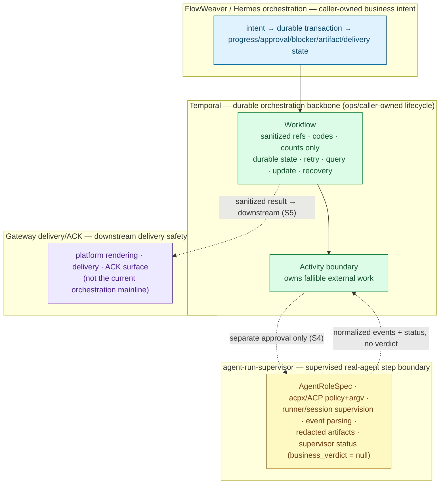
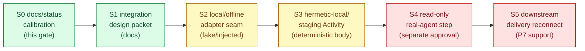

# Sachima Mainline Calibration — agent-run-supervisor × Temporal Integration Plan

Date: 2026-06-30
Status: **Docs/status design plan (plan stage S0).** This is a design/implementation plan, not a PR log and not an approval. It writes documentation only. It starts no Temporal Worker/service/runtime/subprocess, runs no agent/acpx/npx, performs no real send, touches no Gateway/Feishu/live/default-on/public-ingress surface, and writes no production config. Every code-bearing stage below requires its own separate, named approval.

> **Authority and scope.** This document is derivative. It re-centers the Sachima roadmap onto its two current core mainlines and organizes already-merged work behind them; it does not redefine `GOAL.md`, expand scope, or grant any runtime/live/delivery approval. Phase meaning, approvals, and dashboard truth remain owned by `docs/roadmap/current-status.md`. The durable-runtime and step-execution authority remains owned by the P5/P6 plans cited in the reclassification table, and the delivery surface authority by the P7 runbooks.

---

## 1. Purpose and verdict

### 1.1 Purpose

Realign the Sachima roadmap so the current direction is stated as what it actually is: **two integration mainlines**, with the completed P5/P6/P7 slices recognized as the **support foundation** that makes those integrations buildable and safe.

The two current core mainlines are:

1. **Integrate agent-run-supervisor** as the supervised, role-bound real-agent step boundary that FlowWeaver/Hermes drives.
2. **Integrate Temporal** as the durable orchestration backbone for FlowWeaver state, retry, query, update, and recovery.

### 1.2 Verdict

**Proceed with the calibration. Both integration mainlines are well-founded, and the completed P5/P6/P7 work is foundation for them — not wasted work and not the mainline itself.**

- The Temporal backbone (P5) and the controlled AI FLOW composition over its step seam (P6-A) are the load-bearing pieces of the Temporal mainline.
- The controlled read-only real-agent step bridge (P6-B) and the caller-owned attach/recover boundary (P6 runtime lifecycle) are the prerequisite capabilities of the agent-run-supervisor mainline.
- The Gateway delivery/ACK controller (P7) is **downstream delivery safety support**, not the current orchestration mainline. **P7 real-send canary execute is paused** and requires a separate, named future approval; pausing it is a deliberate calibration decision, not an abandonment.

The next concrete step is the **S1 integration design packet** (docs). No code lands until a stage below is separately approved.

---

## 2. Reclassification — completed work as support foundation

Each completed slice keeps its merged status and its boundaries; only its *framing* changes — from "a phase we finished" to "a foundation the mainlines stand on."

| Completed work | Reclassified role | Mainline it supports | Boundary preserved (unchanged) |
|---|---|---|---|
| **P5 Temporal Slice 1** — `sachima_supervisor/p5_temporal/*` (`docs/plans/2026-06-20-…-p5-temporal-production-runtime-enablement-slice-1-design-readiness.md`) | **Temporal foundation.** Default-off, caller-owned durable runtime built on the real Temporal SDK with a controlled-deterministic step body. | Temporal | Hermetic-local + staging namespace only; Worker/service **ops-owned**, never Gateway-owned; no production cluster/traffic; step body is deterministic, not a real agent. |
| **P6-A controlled AI FLOW composition** — `sachima_supervisor/p6_controlled_ai_flow.py` (`docs/plans/2026-06-25-…-p6a-temporal-backed-controlled-ai-flow-execution-implementation.md`) | **Controlled AI FLOW composition control.** Default-off outer composition that runs the unmodified WP4 orchestrator through the P5 `StepExecutor` seam. | Temporal | Deterministic/injected-fake step bodies only; caller-owned query/recover/close without relaunch; no real agent execution, no live/Gateway/Feishu, no real delivery. |
| **P6-B bounded read-only real-agent step** — `sachima_supervisor/p6b_read_only_real_agent.py` (`docs/plans/2026-06-26-…-p6b-bounded-read-only-real-agent-step-execution-implementation.md`) | **Controlled real-agent step / agent-run-supervisor prerequisite capability.** Default-off bridge that adapts the proven one-shot controlled local exec into the WP4/P6 step seam. | agent-run-supervisor | Single approved pinned-local read-only smoke only; reused null-binary read-only roles (non-runnable by construction); no duplicate replay/recover, no write roles, no live surfaces. |
| **P6 runtime lifecycle / controlled attach** — `sachima_supervisor/p6_runtime_attach.py` (`docs/plans/2026-06-28-…-p6-runtime-lifecycle-controlled-attach-implementation.md`) | **Caller-owned lifecycle / recover boundary.** Default-off attach shell over an already-supplied P6 session. | agent-run-supervisor | Caller-owned attach only; fail-closed admission; idempotent no-relaunch recovery; WP3b WATCH preserved; **starts no runtime/Worker/service/subprocess**. |
| **P7 real delivery / ACK closure** + bounded canary request prep — `gateway/sachima_delivery_ack.py` (`docs/runbooks/sachima-real-delivery-ack-closure.md`, `docs/runbooks/sachima-p7-bounded-real-send-canary-request.md`) | **Downstream delivery safety support — NOT the current mainline.** Default-off delivery/ACK closure controller plus a request-packet preparation gate. | Gateway delivery/ACK (downstream) | Bounded caller-supplied adapter seam only; ACK only from an accepted receipt ref; surfaces tracked separately; rollback without Gateway restart. **Real-send canary execute is paused**, separate approval required. |

---

## 3. Three-layer responsibility boundary

The integration has three owners with non-overlapping responsibilities. The seams between them are where the design must stay honest.



### 3.1 agent-run-supervisor

| Owns | Does **not** own |
|---|---|
| `AgentRoleSpec` as the durable role/policy/authorization boundary; acpx/ACP invocation compilation; local runner/session lifecycle supervision; observed event parsing and status classification; redacted local artifacts; local supervisor status. | Sachima business verdict (`business_verdict` stays caller-owned/`null`); Gateway delivery; the Temporal service; production config; public ingress. |

The supervisor is generic and local-first. Supervisor status is evidence, never the caller's PASS/BLOCK. It is invoked only as an explicit, single-AGENT, caller-initiated step — no fan-out, no agent-to-agent auto-routing.

### 3.2 Temporal

| Owns | Does **not** own |
|---|---|
| Durable workflow state, retry, query, update, and replay-based recovery for FlowWeaver orchestration. Activities own fallible external work. | Worker/service lifecycle is **ops-owned/caller-owned, never Gateway-owned**. The Workflow holds only sanitized refs/codes/counts/digests — never raw material. An Activity may call agent-run-supervisor **only under a separate approval** (stage S4). |

Claim-check discipline is the invariant: durable Temporal state carries sanitized references and stable codes, and the no-leak scans apply to both the JSON history projection and the serialized event-history bytes.

### 3.3 Gateway delivery/ACK

| Owns | Does **not** own |
|---|---|
| Platform rendering, delivery, and the ACK surface; downstream delivery safety (default-off, bounded adapter seam, ACK only from accepted receipts, rollback without restart). | The current orchestration mainline; agent execution; Temporal Worker lifecycle. |

Delivery reconnection happens **after** the orchestration mainline is safe (stage S5). Until then, P7 stays default-off and its real-send canary execute stays paused.

---

## 4. Next-stage implementation path

Docs/status first, then code only under separate, named implementation approvals. Each stage is a slice with its own approval, its own scope, and its own verification gate; a later stage never inherits an earlier stage's approval.

| Stage | What it produces | Runtime / agent / delivery posture | Approval |
|---|---|---|---|
| **S0 — docs/status calibration** *(this gate)* | This plan + the recalibrated `current-status.md`. | Docs only. Nothing runs. | This gate (docs-only). |
| **S1 — integration architecture/design packet** | A design packet for Sachima × agent-run-supervisor × Temporal: the Activity↔supervisor seam contract, claim-check data model across the boundary, failure/recovery mapping, and the no-leak surface list. | Docs only. Nothing runs. | Separate docs approval. |
| **S2 — local/offline adapter seam** | The Temporal-Activity-boundary → agent-run-supervisor adapter seam, **fake/injected only by default**, with offline tests. | No real Temporal Worker, no real agent. Fake client / injected step body. | Separate implementation approval. |
| **S3 — hermetic-local/staging Temporal Activity integration** | The Activity calling the seam under a hermetic-local/staging Temporal Worker, using sanitized claim-check refs and a controlled-deterministic or injected-fake step body. | Hermetic-local/staging Worker only when separately approved (ops-owned, scoped P5 grant). **No real agent.** | Separate implementation approval naming the namespace. |
| **S4 — controlled read-only real-agent step inside an Activity** | The Activity invoking agent-run-supervisor for a single bounded read-only real-agent step. | Real read-only agent step only after a separate approval, with role pinning, no-leak, crash/no-relaunch proof, and Codex/Claude review gates. | Separate named approval (read-only, bounded, single step). |
| **S5 — downstream Gateway delivery/ACK reconnection** | Reconnect the P7 delivery/ACK controller to the now-safe orchestration mainline. | Default-off until a separate delivery/canary approval binds concrete safe values; P7 remains safety support. | Separate named send/canary approval. |



---

## 5. Verification plan

**This gate (S0):** docs-only checks — `git diff`, `git diff --check`, and `python3 tools/sync_roadmap_status.py --check --base-remote sachima` so the machine-owned status block stays consistent. No tests that start a Temporal Worker/service/runtime, acpx, npx, a real agent, the Gateway, or any subprocess lifecycle.

**Later implementation stages (S2+):** each stage adds, where applicable:

- unit + static checks and `compileall` import smoke;
- no-leak history scans over **both** the JSON history projection and the serialized event-history bytes;
- fake-client / static-source gates whenever a stage forbids lifecycle (S2 uses an injected/fake step body; the seam is asserted by source/contract, not by a live Worker);
- a hermetic-local Worker **only** when that stage is separately approved (ops-owned, scoped P5 namespace);
- duplicate-start idempotency, recover/no-relaunch, and crash-no-relaunch proof for any real step (S4);
- ACK-surface separation and rollback-without-restart for any delivery reconnection (S5);
- Codex read-only blocker review and CI green before merge.

No verification step in any stage may be read as enabling a stage that has not been separately approved.

---

## 6. Explicit non-approvals

This plan does **not** approve, and each remains a separate named gate:

```text
real external Sachima ingress
real external delivery / production delivery control
P7 real-send canary execute (paused; separate approval required)
Gateway / Feishu / live / default-on behavior
public webhook / ingress exposure
production config writes or service restart/reload
Gateway-owned Temporal / Worker / service / subprocess lifecycle
Temporal Worker / service / runtime / subprocess startup by this gate
additional real agent / acpx / npx execution beyond the recorded bounded read-only smoke
write-capable Claude/Codex roles or file/git mutation by agent steps
Satine or Hermes-profile ACP execution
broader real controlled AI FLOW execution beyond the recorded scope
production cluster or production traffic
```

The scoped P5 hermetic-local/staging Temporal lifecycle grant stays ops-owned and is **not** exercised by this gate. S2 introduces no runtime; S3 needs a separate namespace-scoped approval; S4 needs a separate read-only real-agent approval; S5 needs a separate delivery/canary approval.

---

## 7. PR / review handoff

- **Architect (Claude Code):** owns this design plan and the `current-status.md` recalibration. Docs only.
- **Codex CLI:** read-only blocker review of the docs change — confirm no scope creep, no implied approval, no leaked raw identifiers, and that the reclassification preserves every existing boundary.
- **Hermes:** controller/verifier/PR-approval closer — runs the docs/static checks in §5, opens the PR, drives CI, and issues the approval card. No runtime, real send, or agent execution is part of this handoff.
