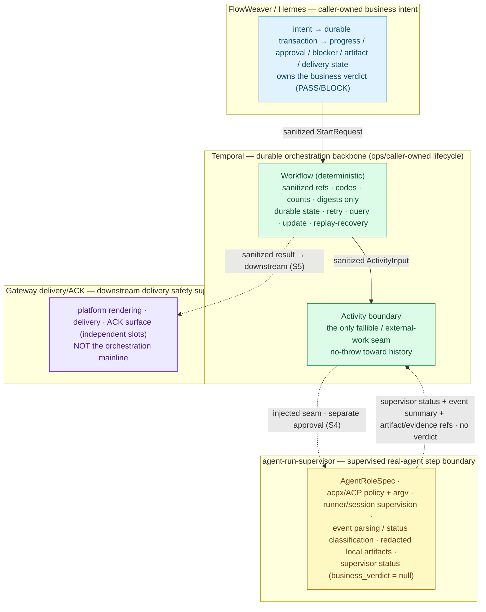
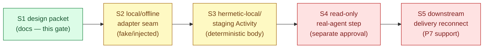

# Sachima S1 — agent-run-supervisor × Temporal Integration Architecture/Design Packet

Date: 2026-06-30
Status: **Docs/status architecture-design packet (plan stage S1).** This is a design packet, not an implementation, not a PR log, and not an approval. It writes documentation only. It starts no Temporal Worker/service/runtime/subprocess, runs no agent/acpx/npx/real agent step, performs no real send, touches no Gateway/Feishu/live/default-on/public-ingress surface, and writes no production config. Every code-bearing stage it describes (S2–S5) requires its own separate, named approval.

> **Authority and scope.** This document is derivative. It refines stage S1 of `docs/plans/2026-06-30-sachima-mainline-calibration-agent-run-supervisor-temporal-integration-plan.md` into an operationally precise integration contract. It does not redefine `GOAL.md`, expand scope, reclassify boundaries, or grant any runtime/live/delivery approval. Phase meaning and dashboard truth remain owned by `docs/roadmap/current-status.md`; durable-runtime and step-execution authority remain owned by the P5/P6 plans; the delivery surface authority remains owned by the P7 runbooks. Where this packet names a contract type, stable code, or control surface, it is describing the already-merged support-foundation source (`sachima_supervisor/p5_temporal/*`, `sachima_supervisor/p6b_read_only_real_agent.py`, `sachima_supervisor/p6_runtime_attach.py`, `gateway/sachima_delivery_ack.py`) as the design basis — it adds no new source.

---

## 1. Status / scope / authority

S1 is a **docs/status architecture-design packet**. It specifies the integration between Sachima/FlowWeaver orchestration, the **agent-run-supervisor** supervised real-agent step boundary, and **Temporal** as the durable orchestration backbone, at the level of contracts, data model, failure mapping, and no-leak surfaces.

S1 grants **no** implementation, runtime, or live approval:

- It does not approve or perform any S2/S3/S4/S5 implementation.
- It starts no Temporal Worker/service/runtime/subprocess and instantiates no Worker.
- It runs no real agent, no `acpx`, no `npx`, and no controlled real-agent step.
- It touches no Gateway/Feishu/live/default-on/public-ingress behavior and performs no real send.
- It writes no production config and enables no write-capable role.

S1 is a specification surface. Reading or merging it enables nothing; each later stage is separately gated (§8, §9). The explicit non-approvals carried by the current dashboard and the S0 calibration plan remain in force verbatim (§8.6).

**Inputs treated as authority.** `GOAL.md`; `docs/roadmap/current-status.md`, `README.md`, `boundary-register.md`, `reference-index.md`; the S0 calibration plan; the P5/P6/P7 plans and runbooks; and the support-foundation source listed above. The agent-run-supervisor project authority (`GOAL.md`, PRD, architecture, technical solution, roadmap/current-status, and AI_FLOW) is cross-checked as a sibling project authority; this packet consumes its role/supervisor boundary but does not redefine that project.

---

## 2. Integration verdict

The core mainline is unchanged: **agent-run-supervisor + Temporal**.

1. **Integrate agent-run-supervisor** as the supervised, role-bound, read-only-first real-agent step boundary that FlowWeaver/Hermes drives.
2. **Integrate Temporal** as the durable workflow state / retry / query / update / recovery backbone, with Worker/service lifecycle ops-owned and never Gateway-owned.

The completed P5/P6/P7 slices are the **support foundation** for these two mainlines — not the mainline itself, and not wasted work:

| Foundation | Reclassified role | Mainline it supports |
|---|---|---|
| **P5 Temporal Slice 1** (`sachima_supervisor/p5_temporal/*`) | Temporal foundation — default-off, caller-owned durable runtime on the real Temporal SDK with a controlled-deterministic step body. | Temporal |
| **P6-A controlled AI FLOW composition** (`sachima_supervisor/p6_controlled_ai_flow.py`) | Controlled AI FLOW composition control — default-off outer composition over the unmodified WP4 orchestrator through the P5 `StepExecutor` seam. | Temporal |
| **P6-B bounded read-only real-agent step** (`sachima_supervisor/p6b_read_only_real_agent.py`) | Controlled real-agent step / agent-run-supervisor prerequisite — default-off bridge from the WP4/P6 step seam into agent-run-supervisor controlled local exec. | agent-run-supervisor |
| **P6 runtime lifecycle / controlled attach** (`sachima_supervisor/p6_runtime_attach.py`) | Caller-owned lifecycle / recover boundary — default-off attach shell over an already-supplied P6 session; starts no runtime/Worker/service/subprocess. | agent-run-supervisor |
| **P7 real delivery / ACK closure** (`gateway/sachima_delivery_ack.py`) | Downstream delivery safety support — **not** the current mainline. Default-off bounded delivery/ACK controller. | Gateway delivery/ACK (downstream) |

**P7 real-send canary execute remains paused.** It is downstream delivery safety support and requires a separate, named future send approval binding one execution packet with concrete safe values. Pausing it is a deliberate calibration decision, not an abandonment.

---

## 3. Three-layer responsibility boundary

The integration has three owners with non-overlapping responsibilities. The seams between them are where the design must stay honest: each layer hands the next only sanitized refs and stable codes, never raw material and never lifecycle control it does not own.



### 3.1 agent-run-supervisor

| Owns | Does **not** own |
|---|---|
| The `AgentRoleSpec` as the durable role / policy / authorization boundary (committed role files; the read-only role allowlist and the future/write-role denylist); acpx/ACP invocation compilation (policy + argv); local runner/session lifecycle supervision; observed-event parsing and status classification; redacted local artifacts (claim-check refs + digests only); local supervisor status. | The Sachima business verdict (`business_verdict` stays caller-owned / `null`); Temporal workflow lifecycle; Gateway delivery; production config; public ingress; raw material persistence. |

The supervisor is generic and local-first. **Supervisor status is evidence, never the caller's PASS/BLOCK.** It is invoked only as an explicit, single-AGENT, caller-initiated step — no fan-out, no agent-to-agent auto-routing, no automatic replies. The read-only-first posture is structural: capabilities are a non-empty subset of `{read, search}`, the role key must be an existing controlled read-only role (never a write/future key), and the committed roles stay non-runnable by construction so the default path cannot launch even when fully wired.

### 3.2 Temporal

| Owns | Does **not** own |
|---|---|
| Durable workflow state, retry, query, update, and replay-based recovery for FlowWeaver orchestration; Activity scheduling. The **Activity is the only fallible / external-work boundary.** | Worker/service lifecycle (ops-owned / caller-owned, **never Gateway-owned**); the Gateway; agent policy; raw material. The Workflow holds only sanitized refs/codes/counts/digests. An Activity may reach agent-run-supervisor **only under a separate approval** (S4). |

Workflow code is deterministic and replay-safe: no file/network/subprocess/Gateway/Temporal-client operations, no wall-clock or randomness, and it consumes only the sanitized contract types — it never imports WP4 / orchestrator internals. All non-determinism lives in the Activity. Claim-check discipline is the invariant: durable Temporal state carries sanitized references and stable codes, and the no-leak scans apply to **both** the JSON history projection and the serialized event-history bytes (§7).

### 3.3 Gateway delivery/ACK

| Owns | Does **not** own |
|---|---|
| Platform rendering, delivery, and the ACK surface as independent slots; downstream delivery safety (default-off, bounded caller-supplied adapter seam, ACK only from accepted receipts, rollback without restart). | The orchestration mainline; agent execution; the Temporal Worker lifecycle. |

Delivery reconnection happens **only after** the orchestration mainline is safe (S5). Until then, P7 stays default-off and its real-send canary execute stays paused.

---

## 4. Temporal Activity ↔ agent-run-supervisor seam contract

This section specifies the seam as a **contract, not code**. The seam is the injection point at which a Temporal Activity body delegates a step to the supervisor. In S2/S3 the seam is bound to a fake/injected/deterministic body; only S4 binds it to a real read-only agent step, under a separate approval. The Activity never constructs a runner.

### 4.1 Shape

The seam reuses the already-merged WP4 `StepExecutor` protocol shape and its oracle-conformant control surface:

```
execute(request, *, role_binding, resolved_inputs) -> StepExecutionOutcome
query(*, run_id, step_id)    -> sanitized snapshot
recover(*, run_id, step_id)  -> sanitized snapshot (reattach by id; never relaunch)
cancel(*, run_id, step_id, scope, idempotency_key, interrupt_outcome=None) -> StepExecutionOutcome
close()                      -> sanitized close marker
history_projection() / serialized_history_bytes()   -> SCAN 1 / SCAN 2 surfaces
```

The Temporal-backed implementation (`P5TemporalStepExecutor`) and the read-only real-agent bridge (`P6BReadOnlyRealAgentStepExecutor`) already implement this shape and are behaviorally substitutable (the same surface is offered by the local/offline oracle). S1 fixes the seam *between* the Activity body and the supervisor as the same contract.

### 4.2 Contract clauses

1. **Workflow-facing payloads carry only sanitized material.** Everything that crosses into a workflow start payload, an update, an Activity input/output, or a query snapshot is a frozen, schema-versioned sanitized projection: opaque safe refs, role keys, claim-check refs + sha256 digests, counts/indices, idempotency material, and stable codes. No raw prompt/context/output, no platform/card/message identifiers, no media, no credentials, no exception text. (Grounded in the `StartRequest` / `ActivityInput` / `ActivityOutput` contract types; see §5.)

2. **The Activity receives a sanitized claim-check-backed request and validates it first.** Before contacting any supervisor adapter, the Activity body validates the `ActivityInput` (exact type, schema version, safe `run_ref`/`step_ref`, bounded `attempt_index`, read-only `role_key`, claim-check `input_claim_refs`). A missing, malformed, or unsafe ref fails **closed** with a stable code (`invalid_start_payload` / `runtime_unsafe_material`) before any seam call. Identity material that is absent/`None`/empty is never collapsed into a safe-looking id.

3. **The Activity calls an injected/caller-supplied supervisor seam — it never builds a runner.** The supervisor adapter is dependency-injected (the executor's `control_surface`/`runner`, or the bridge's `invoke_supervisor` and explicitly injected stores / prompt materializer / artifact sink). The Activity constructs no local-agent launcher, shell, child-process API, shell interpolation, or network client, and embeds **no shell strings**. The real-agent binding of this seam is reachable only under the S4 approval; absent the enable flag and exact token, the seam makes zero supervisor/launch/sink calls and returns a sanitized disabled/mismatch outcome.

4. **The supervisor returns status + normalized event summaries + claim refs — never a business verdict.** A `StepExecutionOutcome` carries `ok`, a normalized `step_status`, bounded claim-check `artifact_refs` (refs/digests only; bytes never enter state), an `evidence_ref` + `evidence_digest`, a stable `error_code`, and the cancellation flags (`interrupted`, `cleanup_verified`, `ambiguous`). It carries **no** `business_verdict`. Success is not inferred as PASS: the caller-owned orchestration verifies the single output artifact ref itself and records completion only after that verification.

5. **The Activity wrapper is no-throw toward workflow history.** Raw exceptions are collapsed to stable error codes/results before anything enters history. The contract error type carries the stable code *as its message* — never raw input, exception text, or a traceback. Every control-surface failure maps to a member of the stable code family; an unmapped inner detail collapses to a conservative outer code rather than surfacing. Workflow history therefore never sees a raw exception string.

6. **Forbidden inside the seam.** No shell strings; no Gateway/platform payloads; no production config; no real send; and **no Worker/service/subprocess lifecycle hidden inside the seam** — the Activity body schedules no Worker and starts no runtime. Lifecycle is ops/caller-owned and lives outside the seam.

### 4.3 Seam sequence (design)

```mermaid
sequenceDiagram
    participant WF as Workflow (deterministic)
    participant ACT as Activity body (no-throw)
    participant SEAM as Injected supervisor seam
    participant SUP as agent-run-supervisor (S4 only)

    WF->>ACT: ActivityInput (sanitized claim-check refs only)
    ACT->>ACT: validate refs → fail closed on unsafe/missing (stable code)
    ACT->>SEAM: execute(request, role_binding, resolved_inputs)
    Note over SEAM: default-off + exact token gate;<br/>zero calls if not admitted
    SEAM->>SUP: controlled read-only step (S4-gated; role-pinned)
    SUP-->>SEAM: supervisor status + event summary + artifact/evidence refs
    SEAM->>SEAM: claim-check output (exactly one bounded ref; bytes excluded)
    SEAM-->>ACT: StepExecutionOutcome (business_verdict = null)
    ACT->>ACT: collapse any raw exception → stable error code
    ACT-->>WF: sanitized ActivityOutput (refs + digests + stable code only)
```

---

## 5. Claim-check data model

The model is small and reuses the already-merged P5 `ClaimCheckRef` plus the P6/P7 concepts. Durable state carries a **reference + sha256 digest + safe metadata**, never an inline payload. The trust boundary is a single sanitizer module: every cross-boundary value is an exact, frozen, schema-versioned dataclass validated against an allowlist of keys and a denylist of markers; hostile subclasses, extra/missing fields, malformed refs, non-`sha256` digests, and every denylist marker are rejected.

### 5.1 Field groups (allowed material)

| Group | Carries | Grounded in |
|---|---|---|
| Transaction / workflow / step refs | `run_ref`, `workflow_ref`, `step_ref`, `attempt_index`; deterministic workflow id `p5wf_<48 hex>` keyed on `(run_ref, step_ref)` + schema/mode. | `StartRequest`, `workflow_id_from_refs` |
| Input claim refs | tuple of `ClaimCheckRef{ ref, digest, kind, byte_count }` — sanitized projections of upstream artifacts. | `ClaimCheckRef`, `input_claim_refs` |
| Role binding / role key / role refs | `role_keys` (read-only, allowlisted; write/future markers rejected); role-file digest and prior-evidence digest as opaque refs. | `_safe_role_key`, `role_file_digest` |
| Supervisor run / session claim refs | `activity_id` / session claim id derived from the sanitized refs; resident-claim recovery key. | controlled-exec activity id, attach claim store |
| Output artifact / evidence refs | `StepArtifactRef{ artifact_id, producer_step_id, content_digest, artifact_kind, byte_count, created_at_ref }`; `evidence_ref` + `evidence_digest`. | `StepArtifactRef`, `ActivityOutput` |
| Status / error code refs | a normalized `state` and a member of the stable code family (`error_code`). | `STABLE_CODES`, `ALLOWED_SNAPSHOT_KEYS` |
| Idempotency / fingerprint material | `idempotency_material`; start/step fingerprints (digests over sanitized projections); lease id/epoch/holder + state version. | `idempotency_material`, attach fingerprints |
| Safe counts / kinds / digests | element counts, applied-event/resume counts, `artifact_kind`, sha256 digests, bounded `byte_count`. | `counts`, `_safe_kind`, `_safe_digest` |

Refs are strictly shaped (lowercase `[a-z0-9_]`, bounded length; dotted/dashed upstream ids are normalized only after the raw string passes a charset + denylist check, so a URL/path/connection-string can never be collapsed into a safe-looking id). Digests are exactly `sha256:<64 hex>`. Workflow ids are durable backend keys, never normalized from raw material.

### 5.2 Forbidden material (fail closed, never in durable state)

Raw prompts / context / model output; raw tool output; raw acpx/ACP/agent stdout/stderr; exception text / tracebacks; private platform identifiers (chat/user/message ids, `oc_`/`ou_`/`om_` and platform/card identifiers), card JSON, message ids; media bytes / private filesystem paths (`/home/`, `/tmp/`, `/var/`, `/users/`); credentials / tokens / secrets / connection strings / signed URLs / bearer material; PIDs / hostnames where unsafe; and delivery/callback payloads. These are enforced by a denylist of markers matched case-insensitively against the lowered rendering of every field and projection, plus a write/deliver/approve/reject/mutate role-marker denylist. A match fails closed with `runtime_unsafe_material` / `runtime_history_leak_detected` / `invalid_start_payload`.

---

## 6. Failure / recovery / duplicate-start / no-relaunch mapping

Every row maps to a **stable code** and a **no-relaunch** decision. The invariant: a same-step start always maps to exactly one durable workflow per `(run_ref, step_ref)`; duplicates reconcile, divergences fail closed, and uncertain work is never re-executed. "WATCH" means the system records an unproven condition and refuses to claim success.

| Condition | Mapping (stable code) | No-relaunch / recovery decision |
|---|---|---|
| Disabled / token mismatch / operator gate blocked | `runtime_disabled` / `runtime_approval_mismatch` / `p6_attach_gate_blocked` | **Rejected before any call.** Zero Temporal/supervisor calls on any path when not admitted. |
| Invalid or unsafe claim ref | `invalid_start_payload` / `runtime_unsafe_material` | **Fail closed before any call.** Missing/`None`/empty identity is never collapsed into a safe id. |
| Duplicate **identical** start/request | reconcile → replay (`replayed = true`) | **Query/recover the existing snapshot; no relaunch.** Start policies reject a duplicate id (`REJECT_DUPLICATE` for closed, `FAIL` for running) so a same-id start enters reconciliation, not a new execution. Attach matches the start fingerprint and recovers. |
| Duplicate **divergent** start/request | `runtime_idempotency_conflict` / `p6_attach_idempotency_conflict` | **Conflict, no relaunch.** Divergence is detected by comparing the sanitized canonical payload / fingerprint, not by trusting a digest. |
| Caller restart / Worker restart | reattach by workflow id + query snapshot | **No second real execution.** Recover reattaches by workflow id only; it never auto-relaunches uncertain work. The claim is written before delegation, so a recreated wrapper over the same store still recovers. |
| Activity timeout / cancellation | `active_run_cancellation_watch` → `cancel_ambiguous` | **WATCH; no clean-cancel claim unless proven.** A clean `cancelled` is returned only with a confirmed interrupted + cleanup-verified lower-layer outcome; otherwise the WP3b WATCH is preserved. |
| Supervisor runner timeout / error / permission / protocol drift | inner code mapped to a stable outer code (e.g. `p6b_runner_provenance_unverified`, `p6b_role_not_read_only`, `p6b_prompt_materialization_failed`); else conservative `*_precondition_unmet` | **Supervisor status preserved; business verdict remains caller-owned / `null`.** Raw inner detail never surfaces; outer codes wrap, never replace, inner codes. |
| Crash after pre-launch claim, before final artifact | recover/no-relaunch boundary; `runtime_not_found` if no resident claim | **Recover by resident claim id; never relaunch.** S4 must additionally prove cross-process crash → no-relaunch with exact runner/role/sink evidence pinning before any real smoke. |
| Output artifact unsafe / missing / extra | `p6b_output_unsafe` (zero/extra/unsafe/oversized refs) | **Fail closed; no business success.** Exactly one sanitized artifact ref must be produced; bytes never enter durable state; the ref is re-verified for kind/producer/size. |
| Delivery ACK unknown / timeout | `p7_send_timeout` / `p7_send_unknown` / `p7_ack_missing` → WATCH | **P7 WATCH later (S5), not S1/S4 success.** Timeout/unknown/accepted-without-receipt become WATCH, never optimistic delivery. |

---

## 7. Temporal history no-leak boundary

Temporal history is the durable, replayable record. Anything that enters it is effectively permanent and visible to replay/recovery, so it must carry only sanitized claim-check material.

### 7.1 History surfaces

The leak-bearing surfaces are: workflow **start payloads**; **updates / signals**; **activity inputs / outputs**; **activity failures**; **query snapshots**; and **result snapshots**. Each is constrained to a sanitized, schema-versioned projection (start = `StartRequest`; activity I/O = `ActivityInput` / `ActivityOutput`; query/result = the allowlist-only snapshot). Query snapshots are built before the first `await` and restricted to an explicit key allowlist, so any query between awaits sees only sanitized state.

### 7.2 Claim-check by construction + dual scan

No-leak is enforced two ways and both are required:

- **By construction** — the cross-boundary types are frozen and validated; a snapshot whose keys are not a subset of the allowlist is rejected.
- **Dual scan** — **SCAN 1** walks the JSON history projection for any forbidden marker or seeded canary; **SCAN 2** scans the **real serialized event-history bytes** (the Temporal protobuf history serialized to bytes), catching anything a JSON-only view would miss. A hit returns `runtime_history_leak_detected` and fails closed.

### 7.3 No-throw Activity wrapper

The Activity wrapper keeps raw exception text out of failure history: every raw exception is collapsed to a stable error code *before* it can enter history, and the contract error type carries only the stable code as its message. Failure history therefore records a code, never a traceback.

### 7.4 Updates with validators; signals only after reduction

Payload-carrying external events are modeled as **Updates with validators** so a malformed or divergent payload is rejected at the validator before it mutates durable state; the update set is pinned (e.g. `{resume, request_cancel}`) with event-key idempotency and explicit divergence rejection. **Signals** are used only after ingress has already reduced an event to safe refs — a signal cannot reject its own payload, so it must not be the first place untrusted material lands.

### 7.5 Logs / prints / evidence

Logs, prints, and exported evidence must not echo raw exception text or raw material. Local history projections are themselves leak-scanned; a projection that would leak is replaced by a sanitized `history_projection_rejected` marker carrying only a stable code.

---

## 8. S2 / S3 / S4 / S5 path and verification

Docs/status first (S1, this packet), then code only under separate, named implementation approvals. Each stage is a slice with its own scope, its own seam posture, and its own verification gate; **a later stage never inherits an earlier stage's approval.**



### 8.1 S2 — local/offline adapter seam

Build the Temporal-Activity-boundary → agent-run-supervisor adapter seam, **fake/injected only by default**, with offline tests. **No Worker, no runtime, no real agent.** The seam is asserted by source/contract and unit tests with an injected/fake step body, not by a live Worker.

Verification categories: unit + static checks; `compileall` import smoke; SCAN 1 no-leak over local projections; fake-client / static-source gates that prove zero lifecycle and zero supervisor calls when not admitted.
Non-approval carry-forward: introduces no runtime; no real agent/acpx/npx; no Gateway/Feishu/live; no production config.

### 8.2 S3 — hermetic-local/staging Temporal Activity integration

The Activity calls the seam under a hermetic-local/staging Temporal Worker, using sanitized claim-check refs and a controlled-deterministic or injected-fake step body. The Worker runs **only** under a separately approved, namespace-scoped grant (ops-owned, the existing scoped P5 grant); it is **never Gateway-owned**. **Still no real agent.**

Verification categories: the S2 gates plus a hermetic-local round-trip; SCAN 2 over the real serialized event-history bytes; duplicate-start idempotency and recover/no-relaunch against the real backend.
Non-approval carry-forward: the deterministic/injected body remains; no real agent; no production cluster/traffic; no Gateway-owned lifecycle.

### 8.3 S4 — controlled read-only real-agent step inside an Activity

The Activity invokes agent-run-supervisor for a **single bounded read-only** real-agent step, under a **separate named approval** (read-only, bounded, single step). Role pinning is mandatory (capabilities ⊆ `{read, search}`; existing controlled read-only role; non-runnable-by-construction default). **No write roles, no file/git mutation.**

Verification categories: role-pin and double-wall read-only enforcement; no-leak dual scan; crash → no-relaunch proof and exact runner/role/sink evidence pinning; duplicate-start idempotency; WP3b WATCH preserved (no clean-cancel claim unless proven); Codex read-only blocker review and CI green before merge.
Non-approval carry-forward: single bounded read-only step only; no additional real smoke without separate approval; no write-capable roles; no live/Gateway/Feishu; no real delivery.

### 8.4 S5 — downstream Gateway delivery/ACK reconnection

Reconnect the P7 delivery/ACK controller to the now-safe orchestration mainline. **Default-off** until a separate delivery/canary approval binds concrete safe values; P7 remains downstream safety support and its real-send canary execute stays paused until that approval exists.

Verification categories: surface/ACK separation (independent slots); ACK only from an accepted receipt; identical-replay idempotency (no second send) and divergent-replay fail-closed; timeout/unknown → WATCH not success; rollback disables new sends while preserving query, with **no Gateway restart**; no-leak over all delivery projections.
Non-approval carry-forward: no real send; no live/default-on; no public ingress; no production config; no platform adapter mutation.

### 8.5 Verification posture (all stages)

No verification step in any stage may be read as enabling a stage that has not been separately approved. No stage may start a Temporal Worker/service/runtime, `acpx`, `npx`, a real agent, the Gateway, or any subprocess lifecycle except where that exact stage is separately and namedly approved.

### 8.6 Explicit non-approvals (carried verbatim)

This packet does **not** approve, and each remains a separate named gate:

```text
real external Sachima ingress
real external delivery / production delivery control
P7 real-send canary execute (paused; separate approval required)
Gateway / Feishu / live / default-on behavior
public webhook / ingress exposure
production config writes or service restart/reload
Gateway-owned Temporal / Worker / service / subprocess lifecycle
Temporal Worker / service / runtime / subprocess startup by this gate
additional real agent / acpx / npx execution beyond the recorded bounded read-only smoke
write-capable Claude/Codex roles or file/git mutation by agent steps
Satine or Hermes-profile ACP execution
broader real controlled AI FLOW execution beyond the recorded scope
production cluster or production traffic
```

The scoped P5 hermetic-local/staging Temporal lifecycle grant stays ops-owned and is **not** exercised by this gate. S2 introduces no runtime; S3 needs a separate namespace-scoped approval; S4 needs a separate read-only real-agent approval; S5 needs a separate delivery/canary approval.

---

## 9. Review / PR handoff

- **Architect (Claude Code):** owns this S1 architecture/design packet and the narrow `current-status.md` / `boundary-register.md` / `reference-index.md` updates that record it. Docs only.
- **Codex CLI:** read-only blocker review — confirm no scope creep, no implied approval, no leaked raw identifiers or commands, that the seam/claim-check/failure mapping preserves every existing boundary, and that S1 grants only docs/status design.
- **Hermes:** controller / verifier / PR-approval closer — runs the docs/static checks, opens the PR, drives CI, and issues the approval card. No runtime, real send, or agent execution is part of this handoff.
