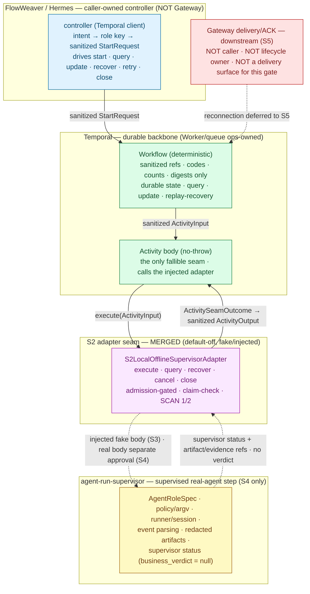

# Sachima S3 — Temporal Activity/Controller × S2 Supervisor-Adapter Seam Design Packet

Date: 2026-06-30
Status: **Docs/status design packet (refines future implementation stage S3).** This is a design packet, not an implementation, not a PR log, and not an approval. It writes documentation only. It starts no Temporal Worker/service/runtime/subprocess, instantiates no Worker, runs no agent/acpx/npx/real agent step, performs no real send, touches no Gateway/Feishu/live/default-on/public-ingress surface, and writes no production config.

```text
Governance markers (in force for this gate)
DESIGN_ONLY
IMPLEMENTATION_NOT_APPROVED
LIVE_NOT_APPROVED
GATEWAY_NOT_APPROVED
REAL_DELIVERY_NOT_APPROVED
CONTROLLED_AI_FLOW_EXECUTION_NOT_APPROVED
TEMPORAL_WORKER_START_NOT_APPROVED
REAL_AGENT_EXECUTION_NOT_APPROVED
PRODUCTION_CONFIG_NOT_APPROVED
```

> **Naming boundary (read first).** This gate is called the *S3 Activity/controller design packet*. It is a **docs-only design gate that refines the future S3 implementation**. It does **not** approve S3 implementation, and it does **not** approve starting a Temporal Worker. The next, separately approvable code stage is named **“S3 hermetic-local Temporal Activity implementation”** (§12) — still fake/injected, no real agent, and namespace/task-queue scoped. Reading or merging this packet enables nothing.

> **Authority and scope.** This document is derivative. It refines the future implementation stage S3 of the S0 calibration plan (`docs/plans/2026-06-30-sachima-mainline-calibration-agent-run-supervisor-temporal-integration-plan.md`) and the S1 architecture/design packet (`docs/plans/2026-06-30-sachima-s1-agent-run-supervisor-temporal-integration-architecture-design-packet.md`) into an operationally precise contract for **how a Temporal Activity body and its caller-owned controller call the already-merged S2 local/offline supervisor-adapter seam**. It does not redefine `GOAL.md`, expand scope, reclassify boundaries, or grant any runtime/live/delivery approval. Phase meaning and dashboard truth remain owned by `docs/roadmap/current-status.md`; durable-runtime and step-execution authority remain owned by the P5/P6 plans; the delivery surface authority remains owned by the P7 runbooks. Where this packet names a contract type, stable code, id shape, or seam method, it is describing the already-merged support-foundation source (`sachima_supervisor/p5_temporal/contracts.py`, `sachima_supervisor/p5_temporal/s2_supervisor_adapter.py`) — it adds no new source.

---

## 1. Status / scope / authority

S3-design is a **docs/status design packet**. It specifies the calling contract between (a) a Temporal Activity body plus its caller-owned controller and (b) the merged **S2 local/offline Activity-boundary → supervisor adapter seam**, at the level of request/response shape, claim-check data, stable ids and codes, role mapping, lifecycle semantics, no-leak surfaces, and Worker/ops ownership.

This packet grants **no** implementation, runtime, or live approval:

- It does not approve or perform any S3 (or S4/S5) implementation.
- It starts no Temporal Worker/service/runtime/subprocess and instantiates no Worker.
- It runs no real agent, no `acpx`, no `npx`, and no controlled real-agent step.
- It does not run a real or broader controlled AI FLOW execution.
- It touches no Gateway/Feishu/live/default-on/public-ingress behavior and performs no real send.
- It writes no production config and enables no write-capable role.

**Inputs treated as authority.** `GOAL.md`; `docs/roadmap/current-status.md`; the S0 calibration plan and the S1 design packet; the merged contract/adapter source above. The agent-run-supervisor project authority (`GOAL.md`, `docs/product/prd.md`, `docs/design/architecture.md`, `docs/design/technical-solution.md`) is cross-checked as a sibling-project authority: this packet consumes its role/supervisor boundary but does not redefine that project, and it modifies no file in it.

The explicit non-approvals carried by the dashboard, the S0 plan, and the S1 packet remain in force verbatim (§12).

---

## 2. What this gate refines

The S1 packet fixed the integration at the architecture level and named the staged path S2→S5. S2 is now **merged** as a default-off, fake/injected adapter seam (`S2LocalOfflineSupervisorAdapter`). This packet sits between merged S2 and the *future* S3 implementation, and pins one thing precisely: **the calling relationship from the Temporal Activity/controller into that merged seam.**

| Element | State | This packet’s job |
|---|---|---|
| S1 integration design packet | Merged (docs) | Authority for the three-layer model, claim-check model, and failure mapping. Not re-decided here. |
| S2 local/offline adapter seam | **Merged** (default-off, fake/injected; `s2_supervisor_adapter.py`) | The seam this packet calls **into**. Its surface, codes, and ids are the design basis. Not modified here. |
| **S3 Activity/controller design (this gate)** | **Design — current** | Fix the Activity↔adapter request/response, role mapping, lifecycle, no-leak, and Worker/ops contract that the future S3 implementation must honor. Docs only. |
| S3 hermetic-local Temporal Activity implementation | Future — separate approval (§12) | The code stage this packet refines. Injected-fake body, namespace/task-queue scoped, no real agent. Not approved here. |

---

## 3. Calling path and responsibility boundary

The calling path has four sanitized hops and one explicitly-excluded surface. Each hop hands the next only sanitized refs and stable codes — never raw material, never lifecycle control it does not own.



**The four owners (non-overlapping).**

| Owner | Owns | Does **not** own |
|---|---|---|
| **Controller (FlowWeaver/Hermes, caller-owned)** | Business intent; intent-class → role-key resolution; building the sanitized `StartRequest`; driving start/query/update/recover/retry/close against the durable workflow; the business verdict (PASS/BLOCK). | The deterministic workflow body; the Activity seam internals; Worker/task-queue lifecycle; raw material persistence. The controller is **not** the Gateway. |
| **Temporal Activity/Workflow** | Durable workflow state, query, update, replay recovery (workflow); the single fallible seam (Activity). Holds only sanitized refs/codes/counts/digests. | Worker/service/task-queue lifecycle (ops-owned, **never Gateway-owned**); agent policy; the business verdict; raw material. An Activity reaches agent-run-supervisor **only under the separate S4 approval**. |
| **S2 adapter seam (merged)** | Admission gating (default-off), claim-check idempotency keyed on `(run_ref, step_ref)`, no-relaunch recovery, dual no-leak scans, mapping an injected body’s result to a sanitized outcome. | Building a runner/Worker/child-process/network client (it constructs none); the business verdict; any Temporal lifecycle. |
| **agent-run-supervisor (S4 only)** | `AgentRoleSpec` authorization, acpx/ACP policy + argv, runner/session supervision, event parsing/status classification, redacted artifacts, supervisor status with `business_verdict = null`. | Temporal lifecycle; Gateway delivery; production config; public ingress; the business verdict. Reachable only under the separate S4 real-agent approval. |

§11 states the Gateway exclusion in full.

---

## 4. Temporal Activity ↔ S2 adapter seam request/response contract

The merged adapter (`S2LocalOfflineSupervisorAdapter`) exposes one execution entrypoint plus a set of sanitized read/lifecycle surfaces. Every surface is admission-gated and no-throw.

```text
execute(activity_input: ActivityInput) -> ActivitySeamOutcome          # Activity body calls this
query(*, run_id, step_id)              -> sanitized snapshot dict       # controller reads through this
recover(*, run_id, step_id)            -> sanitized snapshot dict       # reattach by id; never relaunch
cancel(*, run_id, step_id, scope, idempotency_key, interrupt_outcome=None) -> ActivitySeamOutcome
close()                                -> sanitized close marker dict
history_projection() / serialized_history_bytes()  -> SCAN 1 / SCAN 2 surfaces
```

### 4.1 Request — into `execute`

The Activity body calls `execute` with a single sanitized `ActivityInput` and nothing else:

`ActivityInput { schema_version, run_ref, step_ref, attempt_index, role_key, input_claim_refs: tuple[ClaimCheckRef] }`

- It is derived from the sanitized `StartRequest` by `build_activity_input` (the workflow’s `role_key` is the first allowlisted role key; see §6).
- The controller has already reduced all business material to refs **before** the workflow start, so no raw prompt/context/tool output/platform id ever reaches the Activity or the seam.

### 4.2 Response — out of `execute`

`ActivitySeamOutcome { ok, op, error_code, output: ActivityOutput|None, replayed, active_run_watch, interrupted, cleanup_verified, ambiguous, step_status }`

On success, `output` is exactly one sanitized `ActivityOutput { schema_version, status="completed", artifact_ref: StepArtifactRef, evidence_ref, evidence_digest }` — one claim-check artifact ref (refs/digests only; bytes never enter state) plus an evidence ref/digest, and **no** business verdict. The Activity body returns this `ActivityOutput` as its Temporal result; that projection is what enters workflow history.

### 4.3 Admission gate (the default-off guarantee the controller relies on)

Before any other work, every surface consults `_admission_code()`. When the adapter is not admitted it makes **zero** seam/body calls and returns a sanitized rejection carrying a stable code:

| Condition | Stable code |
|---|---|
| Enable flag is not exactly `True` | `runtime_disabled` |
| Approval token ≠ `S2_SUPERVISOR_ADAPTER_SEAM_APPROVAL_TOKEN` | `runtime_approval_mismatch` |
| Injected seam missing / has no callable `run_step` | `runtime_precondition_unmet` |

The token is an exact literal (referenced by name; not reproduced here) that encodes the in-force non-approvals — default-off, injected-fake deterministic body only, no runtime/service/lifecycle start, no real agent/runner, no write roles, no external messaging surface, no production config, no real delivery. The S3 implementation does not weaken this gate: an Activity may bind the seam to an injected fake body, but flag-off / token-mismatch / no-seam must still yield zero calls.

### 4.4 Validation-before-call and no-throw-toward-history

Inside `execute`, the adapter validates the `ActivityInput` **before** any body call: an unsafe marker (raw prompt / platform / path / secret) fails closed as `runtime_unsafe_material`; a malformed payload as `invalid_start_payload`. The injected body is then called inside a no-throw boundary — any raw-looking exception collapses to `runtime_error` without the exception object ever being referenced, so its text/repr/traceback cannot leak. The Activity body therefore returns either a sanitized `ActivityOutput` or a stable error code; it never surfaces a raw exception into Temporal history.

### 4.5 Seam sequence (design)

```mermaid
sequenceDiagram
    participant CTRL as Controller (caller-owned)
    participant WF as Workflow (deterministic)
    participant ACT as Activity body (no-throw)
    participant AD as S2 adapter (merged)
    participant SUP as agent-run-supervisor (S4 only)

    CTRL->>WF: start(StartRequest) on ops-owned task queue · workflow id p5wf_<48 hex>
    WF->>ACT: ActivityInput (sanitized claim-check refs only)
    ACT->>AD: execute(ActivityInput)
    Note over AD: _admission_code() → zero calls if not admitted;<br/>validate input → fail closed on unsafe/invalid
    AD->>SUP: injected fake body (S3) · real read-only step (S4 only)
    SUP-->>AD: SupervisorStepResult (status + artifact/evidence refs · no verdict)
    AD->>AD: claim-check (exactly one bounded ref) · SCAN 1
    AD-->>ACT: ActivitySeamOutcome (business_verdict = null)
    ACT->>ACT: collapse any raw exception → stable code
    ACT-->>WF: sanitized ActivityOutput (refs + digests + stable code)
    CTRL->>WF: query / update(resume|request_cancel) / recover / close
```

---

## 5. Claim-check refs, evidence refs, stable ids, stable codes

Durable state carries a **reference + sha256 digest + safe metadata**, never an inline payload. All of the following are already enforced by the merged contracts module; the S3 implementation reuses them unchanged.

### 5.1 Stable ids (shape is the invariant)

| Id | Shape | Meaning |
|---|---|---|
| Workflow id | `p5wf_<48 hex>`, from `workflow_id_from_refs(run_ref, step_ref)` | Deterministic durable key — **one workflow per `(run_ref, step_ref)`** + schema/mode. A durable backend key, never normalized from raw material; validated by `validate_workflow_id`. |
| Adapter claim key | `workflow_id_from_refs(run_ref, step_ref)` | The same key the adapter’s claim store uses, so idempotency and recovery align with the workflow id by construction. |
| Artifact id | `p5_artifact_<run_ref>_<step_ref>_<attempt_index>` (bounded 128) | Output claim-check artifact identity. |
| Evidence ref | `p5_evidence_<16 hex>` | Evidence claim-check identity. |
| Refs / kinds | lowercase `[a-z0-9_]`, bounded length; upstream dotted/dashed ids normalized **only after** a raw charset + denylist check | So a URL/path/connection-string can never collapse into a safe-looking id. |
| Digests | exactly `sha256:<64 hex>` | Content/evidence digests. |

### 5.2 Claim-check + evidence refs (allowed material)

- **Input claim refs:** tuple of `ClaimCheckRef { ref, digest, kind, byte_count }` — sanitized projections of upstream artifacts.
- **Output artifact ref:** exactly one `StepArtifactRef { artifact_id, producer_step_id, content_digest, artifact_kind, byte_count, created_at_ref }`.
- **Evidence:** `evidence_ref` + `evidence_digest`.
- **Counts / kinds / digests:** element counts, applied-event/resume counts, `artifact_kind`, bounded `byte_count`, sha256 digests.

Bytes never enter durable state; only refs, digests, counts, and bounded kinds do.

### 5.3 Stable status / error codes (the only failure vocabulary)

Every failure on every surface maps to a member of `STABLE_CODES`; an unmapped inner detail collapses to a conservative outer code rather than surfacing:

```text
runtime_disabled · runtime_approval_mismatch · runtime_precondition_unmet
invalid_start_payload · runtime_unsafe_material · runtime_history_leak_detected
runtime_idempotency_conflict · runtime_not_found · runtime_error
runtime_cancel_scope_unsupported · active_run_cancellation_watch · cancel_ambiguous
```

Normalized lifecycle states (seam + snapshot vocabulary): `completed`, `failed_terminal`, `cancelled`, `cancel_ambiguous`, `running`, `not_found`, `store_invalid`, `closed`. The contract error type carries the stable code **as its message** — never raw input, exception text, or a traceback.

---

## 6. Role mapping — intent class → role key, fail closed

Role resolution happens in the **controller, before** the `StartRequest` is built, and is then carried as a sanitized `role_key`. agent-run-supervisor owns the durable role authorization boundary (`AgentRoleSpec.role_id`); the integration only ever passes a **role key ref**, never a role definition, and never a runtime authorization decision.

### 6.1 The mapping (closed allowlist)

- A caller-owned **intent class** (the business classification of a request) maps to a **role key** drawn from a fixed, committed, read-only-role allowlist. The Sachima read-only role taxonomy is reflected in the merged step→artifact-kind map: `architect → architecture_packet`, `programmer_candidate → implementation_candidate_analysis`, `reviewer → blocker_review`.
- The mapping is a **closed set**: it resolves a known intent class to one allowlisted read-only role key, or it fails. There is no default role, no permissive fallback, and no caller-supplied role definition.
- The resolved role key is sanitized by `_safe_role_key`: it must match the bare-id shape `[a-z][a-z0-9_]{0,127}`, carry no forbidden marker, and carry none of the write-capability markers `{write, deliver, approve, reject, mutate}`.

### 6.2 Fail-closed cases (all reject before any seam/body call)

| Case | What it is | Outcome |
|---|---|---|
| **Unknown role** | An intent class with no allowlist entry, or a role key not in the committed read-only set. | Fail closed (`invalid_start_payload`). No default, no fallback, no “closest” role. |
| **Arbitrary role path** | A role expressed as a path/filename/URL/free string, or one carrying a write/deliver/approve/reject/mutate marker. | Rejected by `_safe_role_key` (`invalid_start_payload`). A role key is a bare safe id; a path/string is never normalized into one. |
| **Platform-derived role label** | A “role” derived from inbound platform/IM identity — a Feishu/Lark sender or chat role, an `@mention`, an `oc_`/`ou_`/`om_` id, a `chat_id`/`user_id`/`message_id`. | Rejected: those tokens are denylisted markers (`runtime_unsafe_material` / `invalid_start_payload`), and structurally a role key may originate **only** from the committed allowlist, never from inbound platform material. |

The role key remains an opaque ref through the whole calling path. It is resolved to an actual `AgentRoleSpec` (a committed, non-runnable-by-construction read-only role) **only inside agent-run-supervisor, under the S4 approval**. For this gate and the S3 implementation the injected fake body does not resolve a real role at all.

---

## 7. Lifecycle semantics — start / query / update / recover / retry / close

All six are driven by the caller-owned controller against the durable workflow; the Activity body only ever runs `execute`. Worker/task-queue lifecycle is ops-owned and lives outside the seam (§10).

| Operation | Driver | Semantics | Reaches the seam as |
|---|---|---|---|
| **start** | Controller | Resolve intent→role key (§6), build sanitized `StartRequest`, derive `deterministic_workflow_id` = `p5wf_<48 hex>`, start on the ops-owned task queue with a duplicate-rejecting start policy (reject-duplicate for a closed id, fail for a running id). The workflow schedules the Activity, which calls `execute`. | `execute(ActivityInput)` |
| **query** | Controller | Temporal query → the workflow returns an allowlist-only snapshot built **before the first await**; the adapter reads through resident sanitized state (`completed` / `running` / `store_invalid` / `not_found`) and never relaunches. | `query(run_id, step_id)` |
| **update** | Controller | Payload-carrying external events are **Updates with validators**, pinned to `{resume, request_cancel}`; a malformed or off-list type (incl. delivery/approval/rejection, which imply P6/Gateway/real delivery) is rejected at the validator before it mutates durable state. Signals are used only after ingress has already reduced an event to safe refs. | validated `UpdatePayload` |
| **recover** | Controller | Reattach by workflow id; return a sanitized snapshot marked `recovery_marker = "reattached_no_relaunch"`. Caller/Worker restart reattaches by id and queries; it never auto-relaunches uncertain work. | `recover(run_id, step_id)` |
| **retry** | Temporal retry policy | A retried Activity re-enters `execute`; because the claim is written on the `(run_ref, step_ref)` key **before** delegation, an identical retry reconciles and replays the resident outcome, a divergent retry conflicts, and a retry over an unresolved pre-claim reattaches and WATCHes — never a second body call (§8). | `execute(ActivityInput)` (idempotent) |
| **close** | Controller | Sanitized close marker (`state: closed`); the caller-owned claim store is not disconnected. When not admitted, returns `store_invalid` + code. Workflow/Worker close is caller/ops-owned; the seam starts and stops no runtime. | `close()` |

---

## 8. Duplicate / recover / no-relaunch / ambiguous mapping

The invariant: a same-step start always maps to exactly one durable workflow per `(run_ref, step_ref)`; duplicates reconcile, divergences fail closed, and uncertain work is never re-executed. “WATCH” means the system records an unproven condition and refuses to claim success. Every row below is already realized by the merged adapter; the S3 implementation must preserve it against the real backend.

| Condition | Stable code / result | No-relaunch / recovery decision |
|---|---|---|
| Not admitted (disabled / token mismatch / no seam) | `runtime_disabled` / `runtime_approval_mismatch` / `runtime_precondition_unmet` | **Rejected before any call.** Zero body/seam calls on every surface. |
| Invalid or unsafe input | `invalid_start_payload` / `runtime_unsafe_material` | **Fail closed before any call.** Absent/`None`/empty identity is never collapsed into a safe id. |
| Duplicate **identical** request (same fingerprint, same key) | reconcile → replay (`replayed = true`) | **Replay the resident outcome; no second body call.** |
| Duplicate **divergent** request (different fingerprint, same key) | `runtime_idempotency_conflict` | **Conflict, no relaunch.** Divergence is detected by comparing the sanitized fingerprint, not by trusting a digest. |
| Crash after pre-claim, before the outcome resolves | `active_run_cancellation_watch` (ambiguous, `active_run_watch = true`) | **Reattach + WATCH; never relaunch.** The claim is written before delegation, so a recreated wrapper over the same store recovers rather than re-executes. |
| recover / query over a missing key | `runtime_not_found` (state `not_found`) | **Honest not-found; no fabricated state.** |
| recover / query over a resolved-failed outcome | resident stable code (state `store_invalid`) | **Surface the resident code; no relaunch.** |
| `cancel(scope = active_run)` without a proven interrupt | `active_run_cancellation_watch` → `cancel_ambiguous` | **WP3b WATCH.** A clean `cancelled` is returned **only** with a confirmed interrupted + cleanup-verified lower-layer outcome; the adapter proves nothing itself. |
| `cancel` with a non-`active_run` scope | `runtime_cancel_scope_unsupported` | **Unsupported scope fails closed.** |
| Output ref zero / extra / unsafe / oversized | `runtime_unsafe_material` (or `runtime_history_leak_detected`) | **Fail closed; no business success.** Exactly one sanitized artifact ref must be produced; bytes never enter state. |

---

## 9. Temporal history no-leak boundary

Temporal history is durable and replayable, so anything that enters it is effectively permanent. The boundary is absolute: **raw prompt, raw context, raw tool output, raw exception text, card JSON, and platform identifiers do not enter Temporal history, query snapshots, or any log/evidence projection.**

### 9.1 Leak-bearing surfaces (all constrained to sanitized projections)

Workflow **start payloads**; **updates / signals**; **activity inputs / outputs**; **activity failures**; **query snapshots**; **result snapshots**; and the adapter’s **local history/outcome projections**. Each is a frozen, schema-versioned projection (start = `StartRequest`; activity I/O = `ActivityInput` / `ActivityOutput`; query/result = the allowlist-only snapshot). Query snapshots are built before the first `await` and restricted to the snapshot key allowlist.

### 9.2 Enforced two ways (both required)

- **By construction** — cross-boundary types are frozen and validated; a projection whose keys are not a subset of the allowlist is rejected; the no-throw boundary collapses raw exceptions to stable codes before anything enters history.
- **Dual scan** — **SCAN 1** walks the JSON projection for any forbidden marker or seeded canary; **SCAN 2** scans the **real serialized history bytes** for the same, catching anything a JSON-only view would miss. A hit returns `runtime_history_leak_detected` and the projection is replaced by a sanitized rejected marker carrying only a stable code.

### 9.3 What the denylist covers

Raw prompt/context/model output; raw tool/agent stdout/stderr; exception text / tracebacks; platform identifiers (`chat_id`, `user_id`, `message_id`, `oc_`/`ou_`/`om_`, card JSON, `feishu`/`lark`); media bytes / private filesystem paths; credentials / tokens / secrets / connection strings / signed URLs; and delivery/callback payloads. A match fails closed. The S3 implementation adds the real backend but **changes none of these scans** — it must pass SCAN 1 over the JSON projection and SCAN 2 over the real serialized event-history bytes.

---

## 10. Worker ownership, task queue, shutdown, and the S3 verification path

### 10.1 Worker ownership

The Temporal Worker is **ops-owned / caller-owned, never Gateway-owned**. **This design gate starts no Worker and instantiates none.** The future S3 implementation may run a Worker **only** under a separate, namespace-scoped, ops-owned grant (the existing scoped P5 hermetic-local/staging grant) — never as a default, never as production, never owned by the Gateway.

### 10.2 Task queue

The Activity/controller binds to a **single, ops-owned, namespace-scoped task queue**. The merged foundation pins a slice-scoped queue constant (`P5_TEMPORAL_TASK_QUEUE`); whether the S3 implementation reuses that queue or pins its own equally-scoped S3 queue name is an implementation decision **deferred to the named S3 implementation gate**. The design constraint is fixed now: exactly one scoped queue, ops-owned registration, no default-on queue, no public or production queue.

### 10.3 Shutdown

Worker shutdown is ops/caller-owned (graceful drain of the scoped queue). The Activity/controller owns no process/Worker/daemon lifecycle inside the seam; `close()` is a sanitized marker only and stops no Worker. A shutdown leaves durable state queryable, and any in-flight work resolves on restart via reattach + no-relaunch (§8) — never a second execution.

### 10.4 S3 implementation verification path (categories, not commands)

The future S3 implementation must demonstrate, before merge:

- unit + static checks and an import smoke over the changed modules;
- **SCAN 1** over JSON projections **and SCAN 2** over the real serialized event-history bytes;
- fake-client / static-source gates proving **zero** Worker/runtime/lifecycle start and **zero** seam/body calls when not admitted (flag-off / token-mismatch / no-seam);
- a hermetic-local round-trip **only** under the separately approved, namespace-scoped grant — with an **injected-fake / controlled-deterministic body only, no real agent**;
- duplicate-start idempotency and recover/no-relaunch against the real backend;
- Codex read-only blocker review and CI green before merge.

No verification step may be read as enabling a stage that has not been separately approved.

---

## 11. agent-run-supervisor / Temporal Activity-controller / Gateway boundary

- **agent-run-supervisor** owns role authorization, policy/argv compilation, runner/session supervision, event parsing/status classification, redacted artifacts, and supervisor status (`business_verdict = null`). It is reachable from an Activity **only under the separate S4 real-agent approval**; for this gate and S3 the seam binds only the injected fake body. It owns no Temporal lifecycle and no delivery.
- **The Temporal Activity/controller** owns durable workflow state/query/update/recovery (workflow) and the single fallible seam (Activity), driven by the caller-owned controller for start/query/update/recover/retry/close. It holds only sanitized refs/codes/counts/digests, constructs no runner or Worker inside the seam, and owns no agent policy and no delivery. Worker/task-queue lifecycle is ops-owned.

### 11.1 Gateway is explicitly excluded from this gate

**For this gate, the Gateway is not the caller, not the lifecycle owner, and not a delivery surface.**

- **Not the caller** — the controller that starts/queries/updates/recovers/closes the workflow is FlowWeaver/Hermes (caller-owned), not the Gateway. The Gateway invokes nothing in this path.
- **Not the lifecycle owner** — the Gateway owns no Workflow, Activity, Worker, task queue, namespace, or subprocess lifecycle here. Worker/queue lifecycle is ops-owned.
- **Not a delivery surface** — no result leaves the Temporal boundary toward the Gateway in this gate. Downstream delivery/ACK reconnection is stage S5, separately approved; P7 stays default-off and its real-send canary execute stays paused until a separate, named send approval binds one execution packet.

---

## 12. Future approval text for the next implementation gate

The next, separately approvable code stage is **narrower than any live or real-agent approval**. It is a hermetic-local, injected-fake Activity implementation only. Suggested approval text for Hermes/the approver to lift verbatim:

```text
APPROVE: Sachima S3 hermetic-local Temporal Activity implementation.

Scope (and nothing beyond):
- Implement the Temporal Activity body and the caller-owned controller that drive the
  already-merged S2 local/offline supervisor-adapter seam (sachima_supervisor/p5_temporal/
  s2_supervisor_adapter.py), per this design packet.
- Controlled-deterministic / injected-fake step body ONLY (FakeDeterministicSupervisorSeam
  or an equivalently injected fake). NO real agent, NO acpx, NO npx.
- A Temporal Worker may run ONLY hermetic-local / staging, on a single ops-owned,
  namespace-scoped task queue, under the existing scoped P5 grant. Worker/queue lifecycle
  stays ops-owned and is NEVER Gateway-owned.
- Offline + hermetic-local tests only: admission/default-off gates, SCAN 1 (JSON) and
  SCAN 2 (serialized history bytes), duplicate-start idempotency, and recover/no-relaunch.

Still NOT approved by this stage (each remains a separate named gate):
- real agent / acpx / npx execution, or any controlled real AI FLOW execution;
- write-capable roles or file/git mutation by agent steps;
- Gateway / Feishu / live / default-on / public-ingress behavior;
- real send / real delivery / production delivery control (P7 canary stays paused);
- production cluster, production traffic, or production config writes;
- Gateway-owned Temporal / Worker / service / subprocess lifecycle.
```

### 12.1 Explicit non-approvals (carried verbatim)

This packet does **not** approve, and each remains a separate named gate:

```text
real external Sachima ingress
real external delivery / production delivery control
P7 real-send canary execute (paused; separate approval required)
Gateway / Feishu / live / default-on behavior
public webhook / ingress exposure
production config writes or service restart/reload
Gateway-owned Temporal / Worker / service / subprocess lifecycle
Temporal Worker / service / runtime / subprocess startup by this gate
real agent / acpx / npx execution, including any real read-only smoke
write-capable Claude/Codex roles or file/git mutation by agent steps
Satine or Hermes-profile ACP execution
broader real controlled AI FLOW execution
production cluster or production traffic
```

The scoped P5 hermetic-local/staging Temporal lifecycle grant stays ops-owned and is **not** exercised by this gate. The S3 implementation needs the separate, namespace-scoped approval above; S4 needs a separate read-only real-agent approval; S5 needs a separate delivery/canary approval.

---

## 13. Review / handoff

- **Architect (Claude Code):** owns this design packet, its manifest, and the narrow `current-status.md` update that records it. Docs only.
- **Codex CLI:** read-only blocker review — confirm no scope creep, no implied approval, no leaked raw identifiers or commands, that the Activity↔adapter contract / role mapping / lifecycle / no-leak mapping preserves every existing boundary, and that this gate grants only docs/status design.
- **Hermes:** controller / verifier / PR-approval closer — runs the docs/static checks, opens the PR, drives CI, and issues the approval card. No runtime, real send, or agent execution is part of this handoff.
