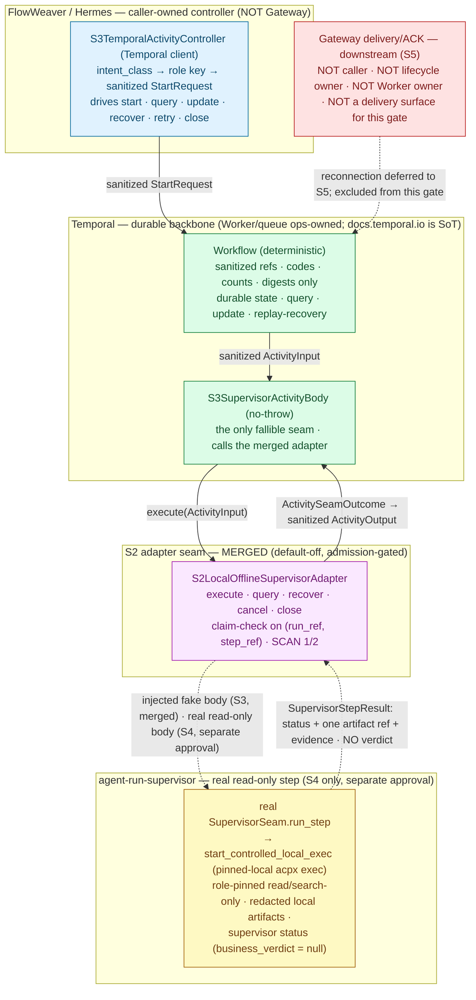

# Sachima S4 — Read-only Real-agent Step × S3 Activity/Controller Design Packet

Date: 2026-07-01
Status: **Docs/status design packet (refines future implementation stage S4).** This is a design packet, not an implementation, not a PR log, and not an approval. It writes documentation only. It starts no Temporal Worker/service/runtime/subprocess, instantiates no Worker, runs no agent/`acpx`/`npx`/real agent step, performs no real send, touches no Gateway/Feishu/live/default-on/public-ingress surface, enables no write-capable role, and writes no production config.

```text
Governance markers (in force for this gate)
DESIGN_ONLY
IMPLEMENTATION_NOT_APPROVED
LIVE_NOT_APPROVED
GATEWAY_NOT_APPROVED
REAL_DELIVERY_NOT_APPROVED
TEMPORAL_WORKER_START_NOT_APPROVED
REAL_AGENT_EXECUTION_NOT_APPROVED_BY_THIS_GATE
WRITE_ROLES_NOT_APPROVED
PRODUCTION_CONFIG_NOT_APPROVED
```

> **Naming boundary (read first).** This gate is the *S4 read-only real-agent step design packet*. It is a **docs-only design gate that refines the future S4 implementation**. It does **not** approve S4 implementation, it does **not** approve starting a Temporal Worker, and — this is the whole point of S4 — it does **not** approve running a real agent / `acpx` / `npx` step. The next, separately approvable code stage is named **"S4 read-only real-agent step implementation"** (§13); that stage would bind the Activity seam to a bounded, single, read-only real-agent step, and it needs its own separate named approval. Reading or merging this packet enables nothing.

> **Temporal source of truth.** Temporal semantics in this packet (retry, timeout, heartbeat, cancellation, Activity failure, Worker/task-queue ownership) are governed by the **official Temporal documentation at https://docs.temporal.io/ , which is the single source of truth.** Any local `llm-wiki` / cached synthesis is dated, non-authoritative, and must not override https://docs.temporal.io/. Where this packet paraphrases Temporal behavior, the official docs win on any conflict.

> **Authority and scope.** This document is derivative. It refines the future implementation stage S4 of the S0 calibration plan (`docs/plans/2026-06-30-sachima-mainline-calibration-agent-run-supervisor-temporal-integration-plan.md`) and the S1 architecture/design packet (`docs/plans/2026-06-30-sachima-s1-agent-run-supervisor-temporal-integration-architecture-design-packet.md`), building directly on the **merged** S3 surfaces: the S3 Activity/controller design packet (`docs/plans/2026-06-30-sachima-s3-activity-controller-design-packet.md`) and the **merged** S3 hermetic-local Temporal Activity implementation (`sachima_supervisor/p5_temporal/s3_activity_controller.py`, tracked by `docs/plans/2026-06-30-sachima-s3-hermetic-local-temporal-activity-implementation-manifest.yaml`). It pins one thing precisely: **how the already-merged Temporal Activity body and controller would bind a bounded, single, read-only *real* agent step through agent-run-supervisor, in place of the injected fake body — without changing the Activity↔adapter contract, the claim-check data model, the no-leak boundary, or any lifecycle/ownership rule.** It does not redefine `GOAL.md`, expand scope, reclassify boundaries, or grant any runtime/live/delivery/real-agent approval. Phase meaning and dashboard truth remain owned by `docs/roadmap/current-status.md`; durable-runtime and step-execution authority remain owned by the P5/P6 plans; delivery-surface authority remains owned by the P7 runbooks. Where this packet names a contract type, stable code, id shape, seam method, role key, or provenance wall, it is **describing already-merged support-foundation source** (`sachima_supervisor/p5_temporal/contracts.py`, `.../s2_supervisor_adapter.py`, `.../s3_activity_controller.py`, `sachima_supervisor/p6b_read_only_real_agent.py`, `sachima_supervisor/activity_controlled_exec.py`) — it adds no new source.

---

## 1. Status / scope / authority

S4-design is a **docs/status design packet**. It specifies the calling contract for a bounded, single, read-only **real** agent step reached through (a) the merged Temporal Activity body plus its caller-owned controller, (b) the merged **S2 local/offline Activity-boundary → supervisor adapter seam**, now bound to a **real read-only supervisor seam** instead of the injected fake, and (c) the merged agent-run-supervisor controlled-exec wall — at the level of request/response shape, claim-check data, stable ids and codes, role mapping, side-effect idempotency, Temporal Activity semantics, no-leak surfaces, and Worker/ops ownership.

This packet grants **no** implementation, runtime, live, or real-agent approval:

- It does not approve or perform any S4 (or S5) implementation.
- It starts no Temporal Worker/service/runtime/subprocess and instantiates no Worker.
- **It runs no real agent, no `acpx`, no `npx`, and no controlled real-agent step. `REAL_AGENT_EXECUTION_NOT_APPROVED_BY_THIS_GATE`.**
- It touches no Gateway/Feishu/live/default-on/public-ingress behavior and performs no real send.
- It writes no production config and enables no write-capable role.

**Inputs treated as authority.** `GOAL.md`; `docs/roadmap/current-status.md`; the S0 calibration plan, the S1 design packet, the S3 Activity/controller design packet, and the S3 hermetic-local implementation manifest; and the merged support-foundation source above. The agent-run-supervisor project authority (`GOAL.md`, `docs/product/prd.md`, `docs/design/architecture.md`, `docs/design/technical-solution.md`) is cross-checked as a **read-only sibling-project authority**: this packet consumes its role/supervisor/redaction boundary but does not redefine that project, and **it modifies no file in the agent-run-supervisor repo.** Temporal behavior is governed by **https://docs.temporal.io/ (source of truth)**; the local `llm-wiki` is dated synthesis only.

The explicit non-approvals carried by the dashboard, the S0 plan, the S1 packet, and the S3 packet remain in force verbatim (§13.1).

---

## 2. What this gate refines — the single change from merged S3

S3 is **merged** on two surfaces: the S3 Activity/controller **design packet** and the S3 hermetic-local Temporal **Activity implementation** (`S3SupervisorActivityBody` + `S3TemporalActivityController`, wrapping `S2LocalOfflineSupervisorAdapter` over an injected `SupervisorSeam`). Everything S3 fixed — the `ActivityInput → execute → ActivityOutput` contract, the claim-check data model, the closed intent-class→role-key mapping, the stable ids/codes, the duplicate/recover/no-relaunch map, the dual no-leak scans, and the ops-owned Worker/task-queue boundary — stays exactly as merged.

**S4 changes exactly one thing:** the injected supervisor body. Where S3 binds `FakeDeterministicSupervisorSeam` (a pure function of the sanitized `ActivityInput`), S4 would bind a **real read-only supervisor seam** whose `run_step` delegates one bounded read-only step to the merged agent-run-supervisor controlled-exec wall (`start_controlled_local_exec`, via the shape proven by `P6BReadOnlyRealAgentStepExecutor`). Nothing else in the seam, the Activity body, the workflow, the controller, the contracts, or the no-leak scans moves.

| Element | State | This packet's job |
|---|---|---|
| S1 integration design packet | Merged (docs) | Authority for the three-layer model, claim-check model, failure mapping. Not re-decided. |
| S3 Activity/controller design packet | Merged (docs) | Authority for the Activity↔adapter contract, role mapping, lifecycle, no-leak, Worker/ops ownership. Not re-decided. |
| S3 hermetic-local Activity implementation | **Merged** (injected-fake, hermetic-local) | The code S4 extends **by binding only a different, real body**. Its surface/codes/ids are the design basis. Not modified here. |
| S2 adapter seam (merged) | **Merged** (default-off, fake/injected) | The seam whose injected `SupervisorSeam` S4 would bind to a **real** body. Its `execute/query/recover/cancel/close` surface is unchanged. |
| **S4 read-only real-agent step design (this gate)** | **Design — current** | Fix the real-read-only-body binding contract, the real-agent side-effect idempotency, and the Temporal Activity semantics the future S4 implementation must honor. Docs only. |
| S4 read-only real-agent step implementation | Future — separate approval (§13) | The code stage this packet refines. Bounded single read-only real step, role-pinned, no-leak, crash/no-relaunch proven. **Not approved here.** |

---

## 3. Calling path and responsibility boundary

The calling path has five sanitized hops and one explicitly-excluded surface. Each hop hands the next only sanitized refs and stable codes — never raw material, never lifecycle control it does not own. The **only** structural difference from merged S3 is that the injected seam body, under the separate S4 approval, resolves to a real read-only agent step inside agent-run-supervisor instead of a deterministic fake.



**The four owners (non-overlapping).**

| Owner | Owns | Does **not** own |
|---|---|---|
| **Controller (FlowWeaver/Hermes, caller-owned)** | Business intent; `intent_class → role_key` resolution (closed allowlist); building the sanitized `StartRequest`; driving start/query/update/recover/retry/close against the durable workflow; the business verdict (PASS/BLOCK). | The deterministic workflow body; the Activity seam internals; the real-agent step; Worker/task-queue lifecycle; raw-material persistence. The controller is **not** the Gateway. |
| **Temporal Activity/Workflow** | Durable workflow state, query, update, replay recovery (workflow); the single fallible seam (Activity); the Activity retry/timeout/heartbeat/cancellation contract. Holds only sanitized refs/codes/counts/digests. | Worker/service/task-queue lifecycle (ops-owned, **never Gateway-owned**); agent policy/argv; the business verdict; raw material. Reaches the real read-only step **only under the separate S4 approval**. |
| **S2 adapter seam (merged)** | Admission gating (default-off + exact token + injected seam), claim-check idempotency keyed on `(run_ref, step_ref)`, no-relaunch recovery, dual no-leak scans, mapping the injected body's `SupervisorStepResult` to a sanitized `ActivityOutput`/stable code. | Building a runner/Worker/child-process/network client (it constructs none); the business verdict; any Temporal lifecycle. It calls the injected `SupervisorSeam.run_step` and nothing else. |
| **agent-run-supervisor (S4 only)** | `AgentRoleSpec` authorization; `acpx`/ACP policy + argv compilation; pinned-local runner provenance; local runner/session supervision + outer watchdog; observed-event parsing / status classification; **redacted local artifacts**; supervisor status with `business_verdict = null`. | Temporal lifecycle; Gateway delivery; production config; public ingress; the business verdict. Reachable only under the separate S4 real-agent approval. |

§11 states the Gateway exclusion in full. **The Gateway is not in this path at all** — see §3.1 and §11.1.

### 3.1 Gateway is not in the S4 calling path (stated up front, repeated in §11)

**Blunt statement, repeated here and in §11.1: for this gate and for the S4 implementation it refines, the Gateway is NOT the caller, NOT the lifecycle owner, NOT the Worker owner, and NOT a delivery surface.** The controller that starts/queries/updates/recovers/closes the workflow is FlowWeaver/Hermes. The Worker and the pinned-local `acpx` runner are ops-owned. No result crosses the Temporal boundary toward the Gateway in S4. Delivery/ACK reconnection is stage **S5**, separately approved, and P7 stays default-off with its real-send canary execute **paused**.

---

## 4. agent-run-supervisor real read-only step ↔ S3 Activity/controller contract

*(Coverage item 1.)*

The seam contract is **unchanged** from merged S3/S2. What S4 fixes is how the injected `SupervisorSeam.run_step` — when bound to a real body under the S4 approval — bridges the sanitized `ActivityInput` into one bounded read-only `acpx exec` and maps the sanitized result back, without ever widening the surface the Activity/workflow/history sees.

### 4.1 The real seam is an injected `SupervisorSeam`, nothing more

`S2LocalOfflineSupervisorAdapter` calls exactly one caller-supplied method:

```text
SupervisorSeam.run_step(activity_input: ActivityInput) -> SupervisorStepResult
```

In merged S3 this is `FakeDeterministicSupervisorSeam`. In S4 it is a **real read-only seam** whose `run_step` performs the bounded read-only step and returns the same frozen `SupervisorStepResult { ok, step_status, artifact_ref: StepArtifactRef|None, evidence_ref, evidence_digest, error_code, interrupted, cleanup_verified, ambiguous }`. The adapter, the Activity body, the workflow, the controller, and the contract types do not change. The real seam **is the only new construction**, and it is reached only when the adapter is admitted (default-off + exact S2 token + injected seam) **and** the Activity body is admitted (default-off + exact S3 token) **and** the real seam is itself admitted (default-off + exact S4 token).

### 4.2 Inside the real seam: `ActivityInput` → bounded read-only `acpx exec` → `SupervisorStepResult`

The real `run_step` reuses the already-merged translation/execution/projection shape proven by `P6BReadOnlyRealAgentStepExecutor` + `activity_controlled_exec.start_controlled_local_exec`. It never constructs a shell, child-process launcher with shell strings, or network client of its own; it calls the merged controlled-exec boundary and nothing else.

| Step | Input | Merged mechanism | Fail-closed on |
|---|---|---|---|
| **Admission** | S4 enable flag + exact S4 token + required injected stores/materializer/sink | new S4 real-seam admission gate (mirrors the S2/S3/P6-B gates) | flag-off / token-mismatch / missing store → zero controlled-exec/launch/sink calls, stable code |
| **Read-only role check** | `role_key` (from `ActivityInput`) → resolved read-only role | `_read_only_rejection` shape: capabilities ⊆ `{read, search}`, role key in `CONTROLLED_EXEC_ROLE_ALLOWLIST`, not in `CONTROLLED_EXEC_FUTURE_ROLE_KEYS` | write/future/unknown role → `role_not_read_only`-class → mapped to a conservative stable code (§5.3) |
| **Sanitized translation** | `run_ref`, `step_ref`, `attempt_index`, `input_claim_refs` | `safe_ref` + `artifact_ref_to_claim_check`; `activity_id = p6b_exec_<wfid-suffix>`, `idempotency_key = p6b_idem_<suffix>_<attempt>` | any raw/private/secret marker in a resolved input (`scan_projection_for_leak`) → fail closed before any launch |
| **Pinned-local provenance** | `role_file_digest` + committed role file | `_check_runner_provenance`: exact role-file sha256, non-null absolute `acpx_binary`, no fetch-shaped/shell basename (`FORBIDDEN_RUNNER_BASENAMES`) | null/relative/fetch-shaped binary or digest mismatch → provenance-unverified → conservative stable code |
| **Prompt materialization** | injected `prompt_materializer` (after the pre-launch claim) | `_materialize_prompt`: bounded, screened; **raw prompt never enters durable claim state, fingerprints, or query projections** | `None`/raising/oversized/unsafe materializer → `prompt_materialization_failed`-class → conservative stable code |
| **Bounded read-only exec** | one `exec_controlled` request | `start_controlled_local_exec` → one pinned-local `acpx exec` supervised with the outer watchdog | supervisor non-success status → mapped down to a conservative stable code; `business_verdict` from below → collapse to terminal failure |
| **Single-output claim-check** | one supervisor artifact via injected `artifact_sink` | exactly one sanitized `StepArtifactRef` (refs/digests only; bytes never enter state); `verify_artifact_ref` re-checks kind/producer/size | zero/extra/unsafe/oversized ref → `output_unsafe`-class → `runtime_unsafe_material` |
| **Result projection** | verified artifact + evidence | build `SupervisorStepResult(ok=True, step_status="completed", artifact_ref, evidence_ref, evidence_digest)` | evidence ref not conforming to the strict Activity-history id shape → normalize or fail closed (§5.1) |

**Key invariant:** the real seam returns the **same `SupervisorStepResult` shape** the fake returns. The adapter then builds the sanitized `ActivityOutput` exactly as today (`_build_output` + `validate_activity_output` + SCAN 1), so the Activity's Temporal result is byte-for-byte the same *class* of sanitized projection whether the body was fake (S3) or real (S4). The richer supervisor evidence (normalized events, redacted stdout, exit classification, kill metadata) stays **local to the agent-run-supervisor artifact tree on the Worker host** and never crosses into the seam outcome or Temporal history.

### 4.3 Seam sequence (S4 real read-only body)

```mermaid
sequenceDiagram
    participant CTRL as Controller (caller-owned)
    participant WF as Workflow (deterministic)
    participant ACT as S3SupervisorActivityBody (no-throw)
    participant AD as S2 adapter (merged)
    participant REAL as real SupervisorSeam (S4 only)
    participant SUP as agent-run-supervisor controlled-exec wall

    CTRL->>WF: start(StartRequest) on ops-owned task queue · workflow id p5wf_<48 hex>
    WF->>ACT: ActivityInput (sanitized claim-check refs only)
    ACT->>AD: execute(ActivityInput)
    Note over AD: _admission_code() → zero calls if not admitted;<br/>validate input → fail closed on unsafe/invalid;<br/>claim on (run_ref, step_ref) BEFORE delegation
    AD->>REAL: run_step(ActivityInput)
    Note over REAL: S4 admission + read-only role pin + provenance +<br/>prompt materialize (after claim) → fail closed on any miss
    REAL->>SUP: start_controlled_local_exec (one pinned-local acpx read-only exec)
    SUP-->>REAL: sanitized ControlledLocalExecResult (status + one artifact ref + evidence · no verdict)
    REAL->>REAL: single-output claim-check + evidence normalize → SupervisorStepResult
    REAL-->>AD: SupervisorStepResult (business_verdict = null)
    AD->>AD: build ActivityOutput · SCAN 1 · post-claim resident outcome
    AD-->>ACT: ActivitySeamOutcome (ok / stable code)
    ACT->>ACT: collapse any raw exception → bare stable code (ApplicationError)
    ACT-->>WF: sanitized ActivityOutput (refs + digests + stable code)
    CTRL->>WF: query / update(resume|request_cancel) / recover / close
```

---

## 5. `ActivityInput` / `ActivityOutput`, claim-check refs, evidence refs, stable ids, stable codes

*(Coverage item 2.)*

Durable state carries a **reference + sha256 digest + safe metadata**, never an inline payload. All of the following are already enforced by the merged `contracts` module; S4 reuses them unchanged and adds no new cross-boundary type.

### 5.1 Stable ids (shape is the invariant)

| Id | Shape | Meaning |
|---|---|---|
| Workflow id | `p5wf_<48 hex>`, from `workflow_id_from_refs(run_ref, step_ref)` | Deterministic durable key — **one workflow per `(run_ref, step_ref)`** + schema/mode; validated by `validate_workflow_id`; never normalized from raw material. |
| Adapter claim key | `workflow_id_from_refs(run_ref, step_ref)` | The S2 adapter's claim-store key, so idempotency/recovery align with the workflow id by construction. |
| Supervisor activity id | `p6b_exec_<wfid-suffix>` (controlled-exec `activity_id`) | The real seam's controlled-exec claim identity, derived only from the sanitized workflow-id suffix. |
| Supervisor idempotency key | `p6b_idem_<wfid-suffix>_<attempt_index>` | The controlled-exec check-and-set key for the bounded real step. |
| Output artifact id | `p5_artifact_<run_ref>_<step_ref>_<attempt_index>` (bounded 128) | Output claim-check artifact identity. |
| Evidence ref | strict `[a-z][a-z0-9_]{0,127}` (`_safe_id`) for the `ActivityOutput`; sha256 digest `sha256:<64 hex>` | **Evidence-ref normalization invariant:** the supervisor's evidence ref may use a `:`/`-`-bearing shape; before it crosses into `ActivityOutput.evidence_ref` it must be normalized to the strict `_safe_id` charset (`safe_ref`) or the output fails closed. A `:`/`-` evidence ref is never passed raw into history. |
| Refs / kinds | lowercase `[a-z0-9_]`, bounded; upstream dotted/dashed ids normalized **only after** a raw charset + denylist check | So a URL/path/connection-string can never collapse into a safe-looking id. |
| Digests | exactly `sha256:<64 hex>` | Content/evidence digests. |

### 5.2 `ActivityInput` / `ActivityOutput` and claim-check + evidence refs (allowed material)

- **`ActivityInput`** `{ schema_version, run_ref, step_ref, attempt_index, role_key, input_claim_refs: tuple[ClaimCheckRef] }` — derived from the sanitized `StartRequest` by `build_activity_input` (role_key = first allowlisted role key). Unchanged for S4.
- **`ActivityOutput`** `{ schema_version, status="completed", artifact_ref: StepArtifactRef, evidence_ref, evidence_digest }` — exactly one claim-check artifact ref plus evidence ref/digest, and **no** business verdict. Unchanged for S4; this is what enters workflow history.
- **Input claim refs:** tuple of `ClaimCheckRef { ref, digest, kind, byte_count }`.
- **Output artifact ref:** exactly one `StepArtifactRef { artifact_id, producer_step_id, content_digest, artifact_kind, byte_count, created_at_ref }`; `artifact_kind` from the read-only step taxonomy (`architect → architecture_packet`, `programmer_candidate → implementation_candidate_analysis`, `reviewer → blocker_review`).
- **Counts / kinds / digests:** element counts, applied-event/resume counts, bounded `byte_count`, sha256 digests.

Bytes never enter durable state; only refs, digests, counts, and bounded kinds do — **for the real body exactly as for the fake body.**

### 5.3 Stable status / error codes — the Temporal-history vocabulary stays frozen

Temporal history's failure vocabulary is the frozen `STABLE_CODES` family:

```text
runtime_disabled · runtime_approval_mismatch · runtime_precondition_unmet
invalid_start_payload · runtime_unsafe_material · runtime_history_leak_detected
runtime_idempotency_conflict · runtime_not_found · runtime_error
runtime_cancel_scope_unsupported · active_run_cancellation_watch · cancel_ambiguous
```

The merged S2 adapter surfaces only a `STABLE_CODES` member (`_map_result` collapses any non-member to `runtime_error`), and the S3 Activity body raises a **bare** stable code (`ApplicationError(code, type=code, non_retryable=True)`) — merged S3 raises **every** code with `non_retryable=True`, so by Temporal's rule nothing retries at the Temporal layer today; §9.1 fixes how the future S4 failure helper must split a retryable transient `runtime_error` from these non-retryable deterministic codes. Therefore the real seam **must map its richer inner vocabulary down to a conservative `STABLE_CODES` member before the outcome crosses into the adapter** — the same "outer wraps, never replaces inner" discipline `P6BReadOnlyRealAgentStepExecutor` already uses, but projected onto the frozen history family:

| Real-seam / controlled-exec inner condition | `STABLE_CODES` projection at the Temporal boundary |
|---|---|
| S4 disabled / token mismatch / missing store | `runtime_disabled` / `runtime_approval_mismatch` / `runtime_precondition_unmet` |
| Role not read-only (`role_not_read_only`, unknown/future/write role) | `invalid_start_payload` (unknown/off-list) or `runtime_precondition_unmet` (resolved-but-not-runnable) |
| Runner provenance unverified (`runner_provenance_unverified`) | `runtime_precondition_unmet` |
| Prompt materialization failed (`prompt_materialization_failed`) | `runtime_precondition_unmet` |
| Supervisor non-success status (`timed_out`, `permission_denied`, `protocol_error`, `infrastructure_error`, …) | `runtime_error` (transient-shaped) — never `completed`, never a verdict |
| Output unsafe (zero/extra/unsafe/oversized ref) | `runtime_unsafe_material` (or `runtime_history_leak_detected` on a leak) |
| Duplicate divergent request | `runtime_idempotency_conflict` |
| Crash after pre-claim, before terminal | `active_run_cancellation_watch` → `cancel_ambiguous` (WATCH) |

The richer `p6b_*` / controlled-exec inner codes remain in the supervisor's **local redacted evidence** for operator forensics; they are **off the Temporal-history path**. Whether the S4 implementation instead *widens* `STABLE_CODES` (a `contracts.py` change) is deferred to the named S4 implementation gate; **if unchanged, the map-down above is mandatory** so history's vocabulary and no-leak posture are preserved.

---

## 6. Role mapping — intent class → role key → real read-only role, fail closed

*(Coverage item 3.)*

There are **two** closed mappings, both fail-closed, on opposite sides of the Temporal boundary. Neither introduces a default role, a permissive fallback, a caller-supplied role definition, or a platform-derived role.

### 6.1 Controller-side (history-safe) — merged, unchanged

`S3TemporalActivityController` maps a caller-owned `intent_class` to a sanitized, history-safe **role key** via the closed `INTENT_CLASS_TO_ROLE_KEY` allowlist, then carries only the `role_key` through `StartRequest`/`ActivityInput`. Each value is a bare read-only role **key ref** passing `_safe_role_key` (bare-id shape `[a-z][a-z0-9_]{0,127}`, no forbidden marker, no `{write, deliver, approve, reject, mutate}` marker). Resolution happens **before** the `StartRequest` is built and fails closed on unknown/platform-derived/write-ish intent before any control-surface or runtime call.

### 6.2 Supervisor-side (S4, real) — the new closed mapping this gate fixes

Inside the real seam, the history-safe `role_key` resolves to an **actual runnable read-only role** in the merged controlled-exec allowlist. This gate fixes that second closed mapping **as a fully enumerated, fail-closed table**: each of the three merged-S3 intent classes maps through its history-safe (underscore, dot-free) role key to **exactly one** dotted controlled-exec role key, and **every other input — any other S3 role key, any future/write key, any platform-derived label, any caller-supplied role definition — rejects before launch**.

**Closed `intent_class → S3 role_key → controlled-exec role key` mapping (the whole runnable set; no other row resolves).**

| Merged S3 `intent_class` | History-safe S3 `role_key` (`INTENT_CLASS_TO_ROLE_KEY`, underscore bare-id) | Runnable controlled-exec role key (`CONTROLLED_EXEC_ROLE_ALLOWLIST`, dotted) | Adapter | Runnable **only** as |
|---|---|---|---|---|
| `architecture_packet` | `sachima_claude_read_only_architect` | `sachima.claude.read_only_reviewer` | `claude` | read-only analysis/report role — **NOT** an architect write role |
| `programmer_candidate_review` | `sachima_claude_read_only_programmer_candidate` | `sachima.claude.read_only_reviewer` | `claude` | read-only analysis/report role — **NOT** a programmer write role |
| `blocker_review` | `sachima_codex_read_only_reviewer` | `sachima.codex.primary_reviewer` | `codex` | read-only blocker-review role |

- **Deliberate, fail-closed policy.** `architecture_packet` and `programmer_candidate_review` both resolve to `sachima.claude.read_only_reviewer` **only as a read-only analysis/report role** — they resolve to **no** architect or programmer *write* role, and there is deliberately **no** binding to `sachima.claude.architect` / `sachima.claude.main_programmer` on this path. `blocker_review` resolves to `sachima.codex.primary_reviewer`. Any future architect/programmer/write variant of these intents stays **fail-closed** until its own separately-named write gate exists. `WRITE_ROLES_NOT_APPROVED`.
- The runnable read-only roles are exactly the two committed controlled-exec roles above: `sachima.codex.primary_reviewer` (adapter `codex`) and `sachima.claude.read_only_reviewer` (adapter `claude`) — both read/search-only one-shot `exec`, each pinning exactly one adapter, and both **null-binary by construction** (non-runnable until an operator pins a verified local `acpx` executable + `role_file_digest`).
- **Everything outside the table rejects before any launch.** Any S3 role key that is not one of the three history-safe keys above; any write-capable / future controlled-exec key (`sachima.claude.architect`, `sachima.claude.main_programmer`, `sachima.claude.docs_engineer`, `sachima.codex.blocker_only_reviewer` — the `CONTROLLED_EXEC_FUTURE_ROLE_KEYS`); any platform-derived label; and any caller-supplied role definition **fail closed exactly like an unknown role** (§6.3).
- The resolution is a **closed allowlist**: a known history-safe `role_key` resolves to exactly one runnable read-only controlled-exec role from the table above, or it fails. There is no default, no "closest" role, and no caller-supplied role definition.

### 6.3 Fail-closed cases (all reject before any real `acpx` launch)

| Case | What it is | Outcome |
|---|---|---|
| **Unknown role** | An `intent_class` with no allowlist entry, or a `role_key` that resolves to no runnable read-only controlled-exec role. | Fail closed (`invalid_start_payload` / `runtime_precondition_unmet`). No default, no fallback. |
| **Write-capable / future role** | A `role_key` resolving to a write-capable or future controlled-exec key, or any key carrying a `{write, deliver, approve, reject, mutate}` marker. | Rejected by `_safe_role_key` (history side) and by the `_read_only_rejection` + `CONTROLLED_EXEC_FUTURE_ROLE_KEYS` wall (supervisor side). `WRITE_ROLES_NOT_APPROVED`. |
| **Arbitrary role path** | A role expressed as a path/filename/URL/free string. | A role key is a bare safe id; a path/string is never normalized into one. Fail closed. |
| **Platform-derived role label** | A "role" derived from inbound platform/IM identity — a Feishu/Lark sender or chat role, an `@mention`, an `oc_`/`ou_`/`om_` id, a `chat_id`/`user_id`/`message_id`. | Rejected: those tokens are denylisted markers (`runtime_unsafe_material` / `invalid_start_payload`), and structurally a role key may originate **only** from the committed allowlist, never from inbound platform material. |
| **Capabilities exceed read-only** | Resolved role capabilities are not a non-empty subset of `{read, search}`, or the role file declares any of the read-only-false permission classes as true. | Rejected by the controlled-exec double wall (`role_not_read_only` / `activity_role_capability_rejected`). |

The role key stays an opaque ref through the whole path; it is resolved to a real read-only `AgentRoleSpec` **only inside agent-run-supervisor, under the S4 approval, against a role file whose sha256 is pre-pinned** — and even then the committed role stays non-runnable until an operator pins a verified local `acpx` binary. `REAL_AGENT_EXECUTION_NOT_APPROVED_BY_THIS_GATE`.

---

## 7. Temporal history no-leak boundary

*(Coverage item 4.)*

Temporal history is durable and replayable, so anything that enters it is effectively permanent. The boundary is absolute and **unchanged by binding a real body**: **raw prompt, raw context, raw tool output, raw agent/`acpx` stdout/stderr, raw exception text/tracebacks, card JSON, and platform identifiers do NOT enter Temporal history, query snapshots, heartbeat details, or any log/evidence projection.** A real agent produces far more raw material than a fake — so S4 must prove the boundary holds against real supervisor output, not merely re-assert it.

### 7.1 Two containment layers (both required)

- **Supervisor-local containment (agent-run-supervisor).** The real read-only step's raw prompt, observed `acpx` stdout/stderr, assembled final message, normalized events, exit/kill metadata, and any secret-shaped material are **redacted and written only to the local `.agent-run-supervisor/` artifact tree on the Worker host** (dir `0700`, file `0600`, atomic), per the supervisor's redaction boundary. Observed output is treated as **untrusted text**, never rendered as trusted Markdown/HTML, and never returned up the seam. Raw prompt text never enters durable claim state, fingerprints, or query projections (controlled-exec invariant).
- **Seam/history containment (Sachima).** Only a sanitized `SupervisorStepResult` (one `StepArtifactRef`, evidence ref/digest, a normalized status, a stable code — **no** raw body, **no** verdict) crosses into the adapter, which builds a sanitized `ActivityOutput`. Every leak-bearing surface is a frozen, schema-versioned, allowlist-only projection.

### 7.2 Leak-bearing surfaces (all constrained to sanitized projections)

Workflow **start payloads**; **updates / signals** (pinned to `{resume, request_cancel}`); **activity inputs / outputs**; **activity failures** (bare stable code as `ApplicationError` type/message — never a traceback); **query / result snapshots** (built before the first `await`, allowlist keys only); **Activity heartbeat details** (§9.3 — safe counters only, never event text); and the adapter's **local history/outcome projections**.

### 7.3 Enforced two ways (both required), unchanged for S4

- **By construction** — cross-boundary types are frozen and validated; a projection whose keys are not a subset of the allowlist is rejected; the no-throw boundary collapses raw exceptions to stable codes before anything enters history.
- **Dual scan** — **SCAN 1** walks the JSON projection for any forbidden marker or seeded canary (`scan_projection_for_leak`); **SCAN 2** scans the **real serialized event-history bytes** (`scan_bytes_for_leak`), catching anything a JSON-only view would miss. A hit returns `runtime_history_leak_detected` and the projection is replaced by a sanitized rejected marker carrying only a stable code.

### 7.4 What the denylist covers (named, not exemplified)

Raw prompt/context/model output; raw tool/agent `acpx` stdout/stderr; exception text / tracebacks; platform identifiers (`chat_id`, `user_id`, `message_id`, `oc_`/`ou_`/`om_`, card JSON, `feishu`/`lark`); media bytes / private filesystem paths; credentials / tokens / secrets / connection strings / signed URLs; and delivery/callback payloads. A match fails closed. **The S4 implementation adds the real backend and a real agent body but changes none of these scans** — it must pass SCAN 1 over the JSON projection and SCAN 2 over the real serialized event-history bytes **with a real read-only agent producing the output**, including a seeded-canary test proving that material visible to the supervisor's local artifacts never appears in history.

---

## 8. Real-agent side-effect idempotency — pre-claim / post-claim / duplicate / recover / no-relaunch / ambiguous

*(Coverage item 5.)*

The invariant is stronger for a real body than a fake one, because a real `acpx exec` has a real side effect (it consumes an agent run and produces a report; its output is not a pure function of its input). The rule: **a same-step start maps to exactly one durable workflow per `(run_ref, step_ref)`; the pre-launch claim is written before the real launch; duplicates reconcile, divergences fail closed, and uncertain work is never re-executed.** Read-only lowers the blast radius of ambiguity — but it does **not** license auto-relaunch; recovery still reattaches + WATCHes, so the no-relaunch contract is uniform across fake and real bodies.

Two claim layers cooperate:

1. **Adapter layer (S2, keyed on `(run_ref, step_ref)`):** the adapter writes its claim **before** delegating to `run_step`, so a crash before the outcome resolves reattaches rather than re-executes.
2. **Controlled-exec layer (agent-run-supervisor, keyed on `activity_id`/`idempotency_key`):** an **atomic pre-launch check-and-set** is written **before** the pinned-local `acpx` boundary is invoked. Identical replays of an in-progress or terminal claim return the resident sanitized projection; a crashed in-progress claim is **never auto-relaunched**; concurrent identical starts resolve to exactly one acquisition; concurrent conflicting starts fail closed before any second launch. The file-backed store provides the same CAS with local cross-process persistence, so a Worker-process restart still sees the resident claim.

| Condition | Stable code / result | No-relaunch / recovery decision |
|---|---|---|
| Not admitted (S2/S3/S4 disabled / token mismatch / missing seam or store) | `runtime_disabled` / `runtime_approval_mismatch` / `runtime_precondition_unmet` | **Rejected before any call.** Zero body/seam/`acpx` calls on every surface. |
| Invalid or unsafe input | `invalid_start_payload` / `runtime_unsafe_material` | **Fail closed before any launch.** Absent/`None`/empty identity never collapses into a safe id. |
| **Pre-claim written, before launch** | (internal) `claimed_in_progress` | The claim exists **before** the `acpx` exec starts, so any crash after this point recovers, never relaunches. |
| Duplicate **identical** request (same fingerprint, same key) | reconcile → replay (`replayed = true`) | **Replay the resident outcome; no second `acpx` run.** |
| Duplicate **divergent** request (different fingerprint, same key) | `runtime_idempotency_conflict` | **Conflict, no relaunch.** Divergence detected by comparing sanitized fingerprints, not by trusting a digest. |
| **Post-claim terminal** (run resolved: completed or terminal failure) | resident outcome replayed | **Surface the resident outcome; no relaunch.** |
| Crash after pre-claim, before terminal (Worker/caller restart) | `active_run_cancellation_watch` (ambiguous, `active_run_watch = true`) → `cancel_ambiguous` | **Reattach + WATCH; never relaunch.** A recreated wrapper over the same (cross-process) claim store recovers; a crashed in-progress claim is not auto-relaunched even though the step is read-only. |
| recover / query over a missing key | `runtime_not_found` (state `not_found`) | **Honest not-found; no fabricated state.** |
| recover / query over a resolved-failed outcome | resident stable code (state `store_invalid`) | **Surface the resident code; no relaunch.** |
| Output ref zero / extra / unsafe / oversized | `runtime_unsafe_material` (or `runtime_history_leak_detected`) | **Fail closed; no business success.** Exactly one sanitized artifact ref; bytes never enter state. |

**S4 acceptance adds** (beyond merged S3's duplicate/recover proofs): a **cross-process crash → no-relaunch** proof with exact runner/role/sink evidence pinning — i.e. that a Worker crash mid-`acpx`-exec, followed by Temporal retry/recover, reattaches the resident claim and does **not** start a second real agent run.

---

## 9. Temporal Activity retry / timeout / heartbeat / cancellation / failure semantics

*(Coverage item 6. Temporal behavior is governed by https://docs.temporal.io/ — source of truth; the local `llm-wiki` is dated synthesis only.)*

The real read-only step is a **long-running Activity** (a bounded `acpx exec` supervised by an outer watchdog), so its Temporal Activity options matter far more than for the deterministic fake. The contract below fixes the semantics; concrete numeric config values are **deferred to the named S4 implementation gate** and are **not** production values (`PRODUCTION_CONFIG_NOT_APPROVED`).

### 9.1 Retry

**Temporal rule (per https://docs.temporal.io/, source of truth):** an Application Failure raised with `non_retryable=true` is **not** retried — regardless of the retry policy, and regardless of whether its type also appears in `non_retryable_error_types`. The flag/type carried on the raised failure, not the policy alone, decides retryability.

- **Merged S3 today (unchanged by this gate).** The S3 Activity body raises **every** bare stable code as `ApplicationError(code, type=code, non_retryable=True)`. By the rule above this means **no** stable code retries at the Temporal layer under merged S3 — **including `runtime_error`**. That is safe because the guarantee is **idempotency, not retry**: even if a transient failure were retried, a retried Activity re-enters `execute`, hits the resident `(run_ref, step_ref)` pre-claim, and **replays / conflicts / WATCHes — never a second `acpx` run** (§8).
- **Future S4 implementation change (named S4 implementation gate — NOT merged S3).** So that genuinely transient conditions can actually be retried, the S4 Activity failure helper **must split** the failure it raises by class:
  - **Deterministic fail-closed codes** (`runtime_disabled`, `runtime_approval_mismatch`, `runtime_precondition_unmet`, `invalid_start_payload`, `runtime_unsafe_material`, `runtime_history_leak_detected`, `runtime_idempotency_conflict`, `runtime_cancel_scope_unsupported`) stay **non-retryable** — raised `non_retryable=True` (and/or listed in the retry policy's `non_retryable_error_types`). Retrying them cannot help and must not re-drive the seam.
  - **Transient runtime failure** — a `runtime_error` from a genuinely transient condition — may be raised **retryable**: `non_retryable=False`, or as an equivalent retryable failure type under Temporal Python semantics, so the retry policy can retry it. It is still projected to the bare `runtime_error` stable code so history carries a code, never raw material. (A Worker/runner-lost condition surfaces separately as a Temporal **heartbeat/timeout** failure, which is retryable by policy without an `ApplicationError`; §9.3.)
- **Idempotency stays the safety mechanism either way.** Retryability only decides whether Temporal re-drives the Activity; it never decides correctness. A retried transient failure reconciles against the resident pre-claim and **never** starts a second real `acpx` run (§8). Retry is defense-in-depth layered on top of the pre-claim, never the safety mechanism.
- The Activity body still raises a **bare stable code** — deterministic → `ApplicationError(code, type=code, non_retryable=True)`; transient → `runtime_error` raised retryably per the split above — so retry decisions and failure history carry a code, never raw material. **No `non_retryable=True` failure is ever retried** (per the Temporal rule above); it is the split into a retryable failure/type — never a claim that a `non_retryable=True` failure "may retry" — that makes `runtime_error` retryable in the S4 implementation.

### 9.2 Timeouts

- **`start_to_close_timeout`** must exceed the supervisor's outer watchdog envelope (`acpx` timeout + grace + force-kill window) plus a margin, so Temporal never times out a still-legitimately-running bounded read-only exec and schedules a duplicate attempt while the first is alive.
- **`schedule_to_close_timeout`** bounds the total lifetime including retries; because retries reconcile against the resident claim, this bound cannot cause a second real run.
- **`schedule_to_start_timeout`** is an ops/queue concern, not a correctness lever for the real step.

### 9.3 Heartbeat

- A long real exec **heartbeats** so a dead Worker/subprocess is detected quickly (`heartbeat_timeout` ≪ `start_to_close_timeout`). Detection triggers a Temporal retry, which **reconciles against the resident claim (no relaunch)**.
- **Heartbeat details are recorded in history/describe**, so they are subject to the same no-leak rule: heartbeat details carry only a **safe monotonic counter / applied-event count** — never observed event text, never `acpx` stdout, never a prompt or platform id. SCAN applies to heartbeat details as to any projection.

### 9.4 Cancellation

- Temporal cancellation is delivered to the Activity (surfaced on heartbeat). The Activity requests the supervisor to abort the bounded exec (the runner's outer watchdog terminates the process group, then force-kills, recording kill metadata locally).
- A clean `cancelled` (`step_status = "cancelled"`, `interrupted = true`, `cleanup_verified = true`) is claimed **only** with a proven interrupted + cleanup-verified lower-layer outcome. **Absent that proof, the WP3b WATCH is preserved: `active_run_cancellation_watch` → `cancel_ambiguous`, `active_run_watch = true`.** The seam manufactures no clean cancel; it only reflects an already-proven lower-layer interrupt. A non-`active_run` cancel scope fails closed (`runtime_cancel_scope_unsupported`).

### 9.5 Failure semantics

- The Activity is **no-throw toward history**: any raw-looking exception from the real seam collapses to a stable code without the exception object ever being referenced (its text/repr/traceback cannot leak). A non-`ActivitySeamOutcome`/non-`ActivityOutput` result collapses to `runtime_error`.
- Supervisor non-success (timeout, permission denial, protocol drift, infrastructure error) is **supervisor evidence mapped to a stable code — never `completed`, never a business verdict**. Business success is never inferred from an exit code or supervisor status; the caller-owned orchestration verifies the single output artifact ref itself before recording completion.

---

## 10. Worker ownership, task queue, shutdown, staging namespace, ops runbook boundary

*(Coverage item 7.)*

### 10.1 Worker ownership

The Temporal Worker is **ops-owned / caller-owned, never Gateway-owned**. **This design gate starts no Worker and instantiates none.** The future S4 implementation may run a Worker **only** under a separate, namespace-scoped, ops-owned grant (the existing scoped P5 hermetic-local/staging grant) — never as a default, never as production, never Gateway-owned. `TEMPORAL_WORKER_START_NOT_APPROVED`.

### 10.2 Task queue and where the real agent runs

- The Activity/controller binds to a **single, ops-owned, namespace-scoped task queue** (the merged foundation pins `P5_TEMPORAL_TASK_QUEUE`; whether S4 reuses it or pins an equally-scoped S4 queue is deferred to the S4 implementation gate). Exactly one scoped queue, ops-owned registration, no default-on queue, no public/production queue.
- **The real `acpx` read-only exec runs local to the Worker host** (pinned-local `acpx` binary; fetch-shaped/`npx`/shell basenames fail provenance closed). The Worker host is therefore where the operator must have pinned a verified local `acpx` and role file. No network runner, no `npx` fetch, no remote agent.

### 10.3 Shutdown

Worker shutdown is ops/caller-owned (graceful drain of the scoped queue). The Activity/controller owns no process/Worker/daemon lifecycle inside the seam; `close()` is a sanitized marker only and stops no Worker or `acpx` process. A shutdown leaves durable state queryable; in-flight real work resolves on restart via reattach + no-relaunch (§8), never a second exec. The supervisor's own watchdog owns terminating an orphaned `acpx` child.

### 10.4 Ops runbook boundary

The S4 implementation's operational envelope (namespace, task-queue name, the pinned-local `acpx` provenance, the operator gate, the single-smoke bound) is an **ops-runbook concern owned outside this packet**. This design gate defines the boundary; it authors no runbook values, pins no namespace, and writes no config. Any real run remains gated behind a separate named approval binding one bounded read-only smoke.

---

## 11. agent-run-supervisor / Temporal Activity-controller / Gateway delivery-ACK three-layer boundary

*(Coverage items 8 and 9.)*

- **agent-run-supervisor** owns `AgentRoleSpec` authorization, policy/argv compilation, pinned-local runner provenance, runner/session supervision + watchdog, event parsing / status classification, **redacted local artifacts**, and supervisor status (`business_verdict = null`). It is reachable from an Activity **only under the separate S4 real-agent approval**; it owns no Temporal lifecycle and no delivery. Its raw/redacted evidence stays local to the Worker host.
- **The Temporal Activity/controller** owns durable workflow state/query/update/recovery (workflow) and the single fallible seam (Activity), driven by the caller-owned controller for start/query/update/recover/retry/close. It holds only sanitized refs/codes/counts/digests, constructs no runner or Worker inside the seam, and owns no agent policy and no delivery. Worker/task-queue lifecycle is ops-owned.
- **Gateway delivery/ACK** is downstream (stage S5), default-off, and **excluded from this gate** — see §11.1.

### 11.1 Gateway is explicitly excluded from this gate (blunt, and repeated)

**For this gate and for the S4 implementation it refines, the Gateway is NOT the caller, NOT the lifecycle owner, NOT the Worker owner, and NOT a delivery surface.** Stated bluntly and repeated from §3.1:

- **NOT the caller** — the controller that starts/queries/updates/recovers/closes the workflow is FlowWeaver/Hermes (caller-owned), not the Gateway. The Gateway invokes nothing in this path.
- **NOT the lifecycle owner** — the Gateway owns no Workflow, Activity, Worker, task queue, namespace, `acpx` process, or subprocess lifecycle here. Worker/queue/`acpx` lifecycle is ops-owned.
- **NOT the Worker owner** — the Worker (and the pinned-local `acpx` runner it hosts) is ops-owned; the Gateway never owns, starts, restarts, or reloads it. `GATEWAY_NOT_APPROVED`.
- **NOT a delivery surface** — no result leaves the Temporal boundary toward the Gateway in this gate. The real read-only step's output is a claim-check ref inside durable state, not a delivered card. Downstream delivery/ACK reconnection is stage **S5**, separately approved; P7 stays default-off and its real-send canary execute stays **paused** until a separate, named send approval binds one execution packet. `REAL_DELIVERY_NOT_APPROVED`.

---

## 12. S4 implementation RED/GREEN test plan

*(Coverage item 10. Categories and required assertions, not commands or config values. Every test is offline / hermetic-local / injected unless a step is under the separate S4 grant, and none of these tests is an approval to run a real agent.)*

| # | RED (must fail before the guard exists) | GREEN (must hold after) | Category |
|---|---|---|---|
| T1 | A flag-off / token-mismatched / missing-store real seam still reaches the controlled-exec boundary. | **Default-off / fail-closed:** S2, S3, and S4 admission each independently yield **zero** adapter/seam/controlled-exec/launch/sink calls and a stable code; no `acpx`, no `npx`, no subprocess. | fail-closed |
| T2 | A raw prompt / observed `acpx` stdout / platform id / traceback appears in a history projection or serialized bytes. | **No-leak dual scan with a real-shaped body:** SCAN 1 (JSON) **and** SCAN 2 (serialized event-history bytes) pass; a seeded canary present in the supervisor's local artifacts never appears in history, query snapshots, or heartbeat details. | no-leak |
| T3 | A second identical start launches a second real exec; a divergent start reuses the claim; a crash relaunches. | **Duplicate / recover / no-relaunch:** identical duplicate replays the resident outcome (no second exec); divergent duplicate → `runtime_idempotency_conflict`; cross-process crash after pre-claim → reattach + WATCH, **never** a second `acpx` run, with exact runner/role/sink evidence pinning. | duplicate/recover/no-relaunch |
| T4 | A write/future/platform-derived role, non-`{read,search}` capabilities, or a null/fetch-shaped/mismatched-digest binary reaches a launch. | **Real-agent read-only boundary:** read-only role pin + double wall + pinned-local provenance all fail closed before any launch; only the two committed read/search-only roles are runnable, and only with a verified pinned-local `acpx` + matching role-file digest. | real-agent read-only boundary |
| T5 | The seam constructs a shell/network client, or reaches a Gateway/Feishu/live/delivery/`npx` surface. | **Forbidden live-surface scan:** static + fake-client gates prove no shell string, no network client, no `npx`/fetch runner, no Gateway/Feishu/IM/delivery import or call, no Worker/service/subprocess start by the seam or this gate. | forbidden live surface |
| T6 | A supervisor non-success or a below-layer `business_verdict` is laundered into `completed`/PASS. | **Failure/verdict semantics:** supervisor non-success maps to a stable code (never `completed`); `business_verdict` stays caller-owned/`null`; a below-layer verdict collapses to terminal failure; cancellation preserves the WP3b WATCH unless interrupted + cleanup-verified is proven. | failure semantics |
| T7 | Temporal options let a live exec time out into a duplicate; heartbeat details carry event text; **a deterministic fail-closed code is raised retryable, or a transient `runtime_error`/runner-lost failure is raised `non_retryable=True` so it can never retry regardless of policy.** | **Temporal semantics (per https://docs.temporal.io/):** `start_to_close` > supervisor watchdog envelope; heartbeat details carry only a safe counter; retries reconcile against the resident claim (no relaunch); **the S4 failure helper splits retryability — deterministic fail-closed codes raised non-retryable (`non_retryable=True`), transient `runtime_error`/runner-lost raised retryable (`non_retryable=False` or an equivalent retryable failure type) — and a `non_retryable=True` failure is never retried regardless of policy, proving the flag/type distinction.** | Temporal semantics |

The S4 implementation must additionally run: unit + static checks and a `compileall` import smoke over the changed modules; and **Codex read-only blocker review + CI green before merge**. A hermetic-local Temporal round-trip runs **only** under the separately approved, namespace-scoped grant, and a **single bounded read-only real smoke** runs **only** under the separate S4 real-agent approval — no verification step may be read as enabling a stage that has not been separately approved.

---

## 13. This gate is design-only; the next stage needs a separate named approval

This packet is a **specification surface**. Reading or merging it approves nothing and enables nothing. The next, separately approvable code stage — **S4 read-only real-agent step implementation** — is the first stage in the whole S0→S5 path that would run a real agent, and it is therefore the **most gated** stage so far. Suggested approval text for Hermes/the approver to lift verbatim, if and when they choose to open that gate:

```text
APPROVE: Sachima S4 read-only real-agent step implementation.

Scope (and nothing beyond):
- Bind the already-merged Temporal Activity seam (S2 adapter + S3 Activity body/
  controller) to a REAL read-only supervisor seam whose run_step delegates ONE
  bounded read-only step to the merged agent-run-supervisor controlled-exec wall
  (start_controlled_local_exec), per this design packet.
- Read-only role ONLY: capabilities a non-empty subset of {read, search}; an existing
  committed controlled read-only role (Codex primary reviewer or Claude read-only
  reviewer); write/future/platform-derived roles fail closed. NO write roles, NO
  file/git mutation.
- Pinned-local acpx provenance ONLY: non-null absolute acpx_binary, exact role-file
  sha256, no npx/fetch/shell basename. NO npx, NO network runner.
- A Temporal Worker may run ONLY hermetic-local / staging, on a single ops-owned,
  namespace-scoped task queue, under the existing scoped P5 grant. Worker/queue/acpx
  lifecycle stays ops-owned and is NEVER Gateway-owned.
- One bounded read-only real smoke ONLY, plus offline/hermetic tests: default-off/
  fail-closed gates, SCAN 1 (JSON) and SCAN 2 (serialized history bytes) with a real
  body, duplicate/recover, and cross-process crash -> no-relaunch with runner/role/
  sink evidence pinning.

Still NOT approved by this stage (each remains a separate named gate):
- any additional real agent / acpx / npx execution beyond the single bounded read-only smoke;
- write-capable roles or file/git mutation by agent steps;
- Gateway / Feishu / live / default-on / public-ingress behavior;
- real send / real delivery / production delivery control (P7 canary stays paused);
- production cluster, production traffic, or production config writes;
- Gateway-owned Temporal / Worker / service / subprocess lifecycle.
```

### 13.1 Explicit non-approvals (carried verbatim)

This packet does **not** approve, and each remains a separate named gate:

```text
real external Sachima ingress
real external delivery / production delivery control
P7 real-send canary execute (paused; separate approval required)
Gateway / Feishu / live / default-on behavior
public webhook / ingress exposure
production config writes or service restart/reload
Gateway-owned Temporal / Worker / service / subprocess lifecycle
Temporal Worker / service / runtime / subprocess startup by this gate
real agent / acpx / npx execution, including any real read-only smoke
write-capable Claude/Codex roles or file/git mutation by agent steps
Satine or Hermes-profile ACP execution
broader real controlled AI FLOW execution
production cluster or production traffic
```

The scoped P5 hermetic-local/staging Temporal lifecycle grant stays ops-owned and is **not** exercised by this gate. The S4 implementation needs the separate, namespace-scoped, read-only real-agent approval above; S5 needs a separate delivery/canary approval. **`REAL_AGENT_EXECUTION_NOT_APPROVED_BY_THIS_GATE`.**

---

## 14. Review / handoff

- **Architect (Claude Code):** owns this design packet, its manifest, and the narrow `current-status.md` update that records it (S3 hermetic-local implementation done/merged; current design surface = this S4 packet, docs-only). Docs only.
- **Codex CLI:** read-only blocker review — confirm no scope creep, no implied implementation/runtime/real-agent approval, no leaked raw identifiers or commands, that the real-read-only-body binding / role mapping / side-effect idempotency / Temporal Activity semantics / no-leak mapping preserve every existing boundary, that Temporal claims defer to https://docs.temporal.io/ , and that this gate grants only docs/status design.
- **Hermes:** controller / verifier / PR-approval closer — runs the docs/static checks (changed-file allowlist, S3 stale-status wording scan, required non-approval markers, manifest/status parse, secret/no-leak/forbidden-approval-wording scan, `git diff --check`), opens the PR, drives CI green before closeout, and issues the Feishu approval card **bound to the latest head SHA**. No runtime, real send, or agent execution is part of this handoff.
