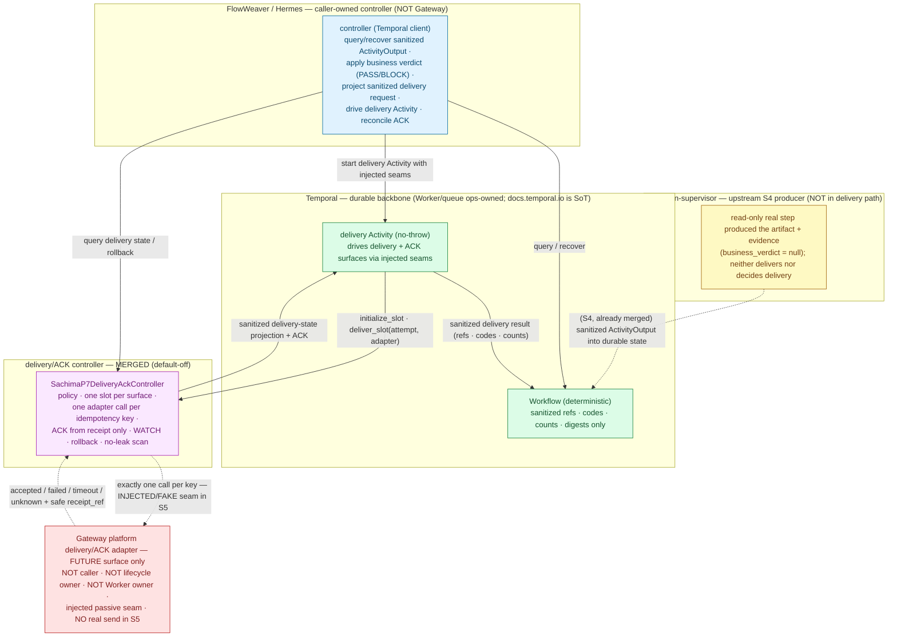

# Sachima S5 — Downstream Delivery / ACK Reconnect × S4 Orchestration Output Design Packet

Date: 2026-07-01
Status: **Docs/status design packet (refines a future implementation stage S5).** This is a design packet, not an implementation, not a PR log, and not an approval. It writes documentation only. It starts no Temporal Worker/service/runtime/subprocess, instantiates no Worker, runs no agent/`acpx`/`npx`/real agent step, performs no real send, touches no Gateway/Feishu/live/default-on/public-ingress surface, enables no write-capable role, and writes no production config.

```text
Governance markers (in force for this gate)
DESIGN_ONLY
IMPLEMENTATION_NOT_APPROVED
LIVE_NOT_APPROVED
GATEWAY_NOT_APPROVED
REAL_DELIVERY_NOT_APPROVED
TEMPORAL_WORKER_START_NOT_APPROVED
REAL_AGENT_EXECUTION_NOT_APPROVED_BY_THIS_GATE
WRITE_ROLES_NOT_APPROVED
PRODUCTION_CONFIG_NOT_APPROVED
```

> **Naming boundary (read first).** This gate is the *S5 downstream delivery / ACK reconnect design packet*. It is a **docs-only design gate that refines a future S5 implementation**. It does **not** approve S5 implementation, it does **not** approve any real delivery or real send, and it does **not** re-open the S4 real-agent gate. The next, separately approvable code stage is named **"S5 downstream delivery reconnect implementation"** (§13); that stage would bind the merged S4 orchestration output to the already-merged, default-off delivery/ACK controller through an **injected (fake) delivery-adapter seam only**, and it needs its own separate named approval. A **real send** is a *second*, still-separate gate beyond even that — the existing **P7 bounded real-send canary** gate (§13). Reading or merging this packet enables nothing and sends nothing.

> **Temporal source of truth.** Temporal semantics in this packet (Activity retry, timeout, heartbeat, cancellation, Activity failure, Worker/task-queue ownership) are governed by the **official Temporal documentation at https://docs.temporal.io/ , which is the single source of truth.** Any local `llm-wiki` / cached synthesis is dated, non-authoritative, and must not override https://docs.temporal.io/. Where this packet paraphrases Temporal behavior, the official docs win on any conflict.

> **Authority and scope.** This document is derivative. It refines the future implementation stage S5 of the S0 calibration plan and the S1 architecture/design packet, and it sits **downstream of the merged S4 read-only real-agent step**: the S4 design packet (`docs/plans/2026-07-01-sachima-s4-read-only-real-agent-step-design-packet.md`) and the merged S4 seam (`sachima_supervisor/p5_temporal/s4_read_only_real_agent_step.py`, over the merged S2 adapter and S3 Activity body/controller). It pins one thing precisely: **how the already-merged Temporal Activity/controller orchestration output would be reconnected to the already-merged, default-off downstream delivery/ACK surface — without making the Gateway a Temporal caller or lifecycle owner, without changing the claim-check data model or the no-leak boundary, and without performing any real send.** It does not redefine `GOAL.md`, expand scope, reclassify boundaries, or grant any runtime/live/delivery/real-agent approval. Phase meaning and dashboard truth remain owned by `docs/roadmap/current-status.md`; durable-runtime and step-execution authority remain owned by the P5/P6 plans; delivery-surface authority remains owned by the **P7 runbooks and the merged P7 delivery/ACK controller**. Where this packet names a contract type, stable code, ref shape, seam method, or surface, it is **describing already-merged support-foundation source** (`sachima_supervisor/p5_temporal/contracts.py`, `.../s3_activity_controller.py`, `.../s4_read_only_real_agent_step.py`, `gateway/sachima_delivery_ack.py`, `gateway/flowweaver_delivery_activity.py`) — it adds no new source.

---

## 1. Status / scope / authority

S5-design is a **docs/status design packet**. It specifies the reconnection contract between (a) the merged S4 orchestration output — the sanitized `ActivityOutput` (one claim-check artifact ref + evidence, `business_verdict = null`) held in durable Temporal state and read by the caller-owned controller — and (b) the merged, default-off **downstream delivery/ACK surface** (`SachimaP7DeliveryAckController` + the FlowWeaver delivery-Activity pattern), at the level of request/response shape, claim-check + evidence refs, stable ids and codes, delivery intent/channel/role/permission mapping, delivery-side idempotency, ACK/retry/timeout/cancellation/failure semantics, no-leak surfaces, and the four-layer responsibility boundary.

This packet grants **no** implementation, runtime, live, delivery, or real-send approval:

- It does not approve or perform any S5 implementation.
- It starts no Temporal Worker/service/runtime/subprocess and instantiates no Worker.
- It runs no real agent, no `acpx`, no `npx`, and no controlled real-agent step. `REAL_AGENT_EXECUTION_NOT_APPROVED_BY_THIS_GATE`.
- **It performs no real send and enables no delivery. `REAL_DELIVERY_NOT_APPROVED`.** The delivery/ACK controller stays default-off and the P7 real-send canary stays **paused**.
- It touches no Gateway/Feishu/live/default-on/public-ingress behavior, constructs no platform adapter, and restarts no Gateway.
- It writes no production config and enables no write-capable role.

**Inputs treated as authority.** `GOAL.md`; `docs/roadmap/current-status.md`; the S0 calibration plan, the S1 design packet, the S3 Activity/controller design packet, and the merged S4 design packet + implementation manifest; the P7 real-delivery/ACK design gate (`docs/plans/2026-06-29-sachima-p7-real-delivery-ack-closure-design-gate-technical-solution.md`), the P7 bounded real-send canary prep gate, and the P7/FlowWeaver delivery runbooks (`docs/runbooks/sachima-real-delivery-ack-closure.md`, `docs/runbooks/flowweaver-delivery-activity-ack-reconciliation.md`); and the merged support-foundation source above. Temporal behavior is governed by **https://docs.temporal.io/ (source of truth)**; the local `llm-wiki` is dated synthesis only.

The explicit non-approvals carried by the dashboard, the S0 plan, the S1/S3/S4 packets, and the P7 gates remain in force verbatim (§13.1).

---

## 2. What this gate refines — the single reconnection from merged S4 to the delivery/ACK surface

Two ends are **merged and unchanged**:

- **Upstream (S4).** The Temporal Activity/controller produces a sanitized `ActivityOutput` — exactly one `StepArtifactRef` plus an evidence ref/digest, a stable status, and **no** business verdict — held in durable workflow state. Whether the body was the S3 fake or the S4 real read-only agent, the *class* of output crossing history is byte-for-byte the same sanitized projection. The caller-owned controller (FlowWeaver/Hermes) already drives start/query/update/recover/close and **owns the business verdict** (PASS/BLOCK).
- **Downstream (P7, merged, default-off).** `gateway/sachima_delivery_ack.py` implements `SachimaP7DeliveryAckController`: an operator-approved delivery policy, one initialized delivery slot per surface, exactly one caller-supplied adapter send seam per idempotency key, ACK recorded only from an accepted send receipt or approved receipt, sanitized delivery-state projection, and rollback without a Gateway restart. `gateway/flowweaver_delivery_activity.py` implements the delivery-Activity pattern that drives a delivery surface + a runtime ACK surface through **injected** seams.

**S5 changes exactly one thing:** it defines the **reconnect** — a sanitized, caller-driven projection from the durable S4 `ActivityOutput` into an initialized delivery request that the default-off delivery/ACK controller consumes through an **injected** delivery-adapter seam. Nothing in the S4 contract, the claim-check data model, the no-leak scans, the delivery controller's policy/slot/ACK semantics, or the ops-owned Worker boundary moves. **No real send is added; the send seam is injected/fake for the entire S5 implementation stage, and a real send stays behind the separate P7 canary gate.**

| Element | State | This packet's job |
|---|---|---|
| S1 integration design packet | Merged (docs) | Authority for the three-layer model, claim-check model, failure mapping. Not re-decided. |
| S3 Activity/controller design + S4 real read-only step | Merged (docs + code) | Authority for the Activity↔adapter contract, `ActivityOutput` shape, stable ids/codes, no-leak, ownership. The **producer** of the output S5 reconnects. Not re-decided. |
| P7 delivery/ACK controller (`sachima_delivery_ack.py`) | **Merged** (default-off, injected-adapter) | The downstream **consumer** S5 reconnects to. Its policy/slot/attempt/ACK/rollback surface is unchanged. Not modified here. |
| FlowWeaver delivery Activity (`flowweaver_delivery_activity.py`) | **Merged** (injected surfaces) | The delivery-Activity pattern the reconnect reuses to drive the controller through injected seams. Not modified here. |
| **S5 downstream delivery reconnect design (this gate)** | **Design — current** | Fix the output→delivery request contract, the closed delivery mapping, delivery-side idempotency, ACK/Temporal semantics, and the four-layer boundary the future S5 implementation must honor. Docs only. |
| S5 downstream delivery reconnect implementation | Future — separate approval (§13) | The code stage this packet refines. Default-off, injected/fake send seam, offline/hermetic. **Not approved here.** |
| P7 bounded real-send canary execute | Paused — separate approval (§13) | The *second* gate: one bounded real send, only under a named canary approval binding one execution packet. **Not approved here.** |

---

## 3. Reconnect path and responsibility boundary

The reconnect path is **pull-then-push, caller-driven**: the caller-owned controller *pulls* the sanitized result out of durable state, applies its own business verdict, projects a sanitized delivery request, and *pushes* it into an **injected, passive** delivery seam. No result is pushed from Temporal into the Gateway; the Gateway is never the initiator. The **only** structural difference from merged S4 is that a *verified, caller-approved* orchestration output — and only such an output — is projected into an initialized delivery request; everything else is already-merged behavior.



**The four owners (non-overlapping).** *(Coverage item 7; stated in full in §10.)*

| Owner | Owns | Does **not** own |
|---|---|---|
| **Temporal / controller (FlowWeaver/Hermes, caller-owned)** | The business verdict (PASS/BLOCK); reading the sanitized `ActivityOutput` via query/recover; **projecting** the sanitized delivery request; driving the delivery Activity and reconciling ACK; durable workflow state/query/recovery. | The platform send; the delivery policy's operator approval; Worker/task-queue lifecycle (ops-owned, **never Gateway-owned**); raw material. The controller is **not** the Gateway. |
| **agent-run-supervisor (upstream S4)** | The read-only real step that *produced* the artifact + evidence (`business_verdict = null`); redacted local artifacts on the Worker host. | Any delivery; any ACK; any decision to deliver. It is **upstream** of the reconnect and **not in the delivery path** at all. |
| **delivery/ACK controller (P7, merged, default-off)** | Delivery admission (default-off + exact token), one initialized slot per surface, one adapter call per idempotency key, ACK reconciliation from receipts only, WATCH for unknown/timeout, rollback without Gateway restart, no-leak scan of every projection. | Building a platform adapter/runner/Worker/network client (it constructs none); the business verdict; any Temporal lifecycle; production config. It calls a **caller-supplied** send seam and nothing else. |
| **Gateway platform delivery/ACK adapter (future)** | Platform rendering and the actual send/ACK, **only** as an injected seam the controller calls — and **only** under a separate real-send approval. | The Temporal call; the Workflow/Activity/Worker/task-queue/namespace/subprocess lifecycle; any initiation. In S5 it is a **future** surface; the seam used is **injected/fake** and performs **no real send**. `GATEWAY_NOT_APPROVED`. |

§11 states the Gateway exclusion in full. **The Gateway remains a passive, injected leaf** — see §3.1 and §11.

### 3.1 Gateway is a passive injected leaf, not a driver (stated up front, repeated in §11)

**Blunt statement, repeated here and in §11: for this gate and for the S5 implementation it refines, the Gateway is NOT the Temporal caller, NOT the lifecycle owner, NOT the Worker owner, and NOT an active delivery driver.** The controller that queries/recovers durable state and drives the delivery Activity is FlowWeaver/Hermes. The delivery Activity is ops/caller-owned; the Worker is ops-owned. The Gateway platform adapter is an **injected, passive send seam** that the delivery controller calls *exactly once per idempotency key* — and in the entire S5 implementation stage that seam is **fake/injected and performs no real send**. Real send is the separate, still-paused **P7 canary** gate.

---

## 4. S4 orchestration output → delivery / ACK request contract

*(Coverage item 1.)*

The reconnect is a **sanitized re-projection**, driven entirely by the caller-owned controller, from the durable S4 `ActivityOutput` into an *initialized* P7 delivery request. It bridges a deliberate **namespace gap** (S4 `p5_*`/`sha256` refs → P7 `runtime_*`/`p7key_*` refs) carrying **only refs, digests, counts, and bounded kinds** — never bytes, never raw material, never a platform identity.

### 4.1 The reconnect is gated on a caller-owned PASS — never on a supervisor status or exit code

The S4 `ActivityOutput` carries `business_verdict = null` by construction: the supervisor never decides business success, and a supervisor "completed" status / exit code is **not** a delivery trigger. The reconnect therefore has a hard precondition:

> **Delivery-precondition invariant.** A delivery request is projected **only** after the caller-owned controller has (a) verified the single output artifact ref itself (`verify_artifact_ref`-class check) and (b) recorded a caller-owned **PASS**. On **BLOCK**, or on any unverified/missing artifact, **zero** delivery slots are initialized and **zero** adapter calls occur. Business success is never inferred from a supervisor status, an exit code, a heartbeat, or a platform event.

### 4.2 Projection: `ActivityOutput` → initialized delivery request (refs only)

| S4 durable element | Reconnect projection | Downstream P7 field | Fail-closed on |
|---|---|---|---|
| `ActivityOutput.status` (`completed`) + caller PASS | precondition gate (§4.1) | (none — gate only) | non-`completed` / caller BLOCK / unverified artifact → **no** request built |
| `ActivityOutput.artifact_ref.artifact_kind` | closed intent→surface map (§6) | slot `surface` ∈ `{progress_card, rich_card, final_text, media, artifact}` | unknown/unmapped kind → `p7_delivery_surface_not_approved` before any slot |
| `ActivityOutput.artifact_ref` (`StepArtifactRef`, refs+digest) | re-project into the delivery namespace, refs+digest only | slot `artifact_ref` = `runtime_artifact_N`; digest carried as a safe ref | bytes / raw / oversized → rejected; never inlined |
| per-surface initialized slot | one `initialize_slot` per surface | `delivery_ref` = `runtime_delivery_N`, `required` bool | surfaces are **independent** slots; a card slot never implies a `final_text` slot |
| sanitized `(run_ref, step_ref, attempt_index, surface)` | deterministic delivery idempotency key | attempt `idempotency_key` = `p7key_<safe suffix>` | derived only from sanitized refs; never from raw/platform material |
| operator-approved delivery policy target | closed channel map (§6) | attempt `target_ref` = `safe_<label>` ∈ `policy.approved_targets` | platform-derived / off-list target → `p7_delivery_target_not_approved` |
| `ActivityOutput.evidence_ref` / `evidence_digest` | provenance ref only | attempt provenance ref/digest | non-conforming ref → normalized to safe id or dropped; never raw |

**Key invariant:** the reconnect **widens nothing**. It consumes the same sanitized `ActivityOutput` that already crossed history and emits an initialized P7 request whose every field is a bounded safe ref/digest/count. The delivery controller then applies its own already-merged validation (`_validate_slot`, `_validate_attempt`, `_validate_policy`) and no-leak scan; a request that fails any of those is rejected before any adapter call. Rendering an actual card, resolving an actual recipient, and performing an actual send all happen **downstream of history, inside the future injected Gateway adapter** — never in the projection and never in Temporal state.

### 4.3 Reconnect sequence (S5 design; injected/fake send seam)

```mermaid
sequenceDiagram
    participant CTRL as Controller (caller-owned)
    participant WF as Workflow (durable state)
    participant DACT as delivery Activity (no-throw)
    participant P7 as delivery/ACK controller (default-off)
    participant ADP as delivery adapter seam (INJECTED/FAKE in S5)

    CTRL->>WF: query / recover → sanitized ActivityOutput (artifact ref + evidence · verdict = null)
    CTRL->>CTRL: verify artifact ref · apply business verdict
    Note over CTRL: BLOCK or unverified → STOP (no slot, no send)
    CTRL->>CTRL: project sanitized delivery request (initialized slots + attempt · refs/digests only)
    CTRL->>DACT: start delivery Activity with injected delivery + ACK surfaces
    Note over DACT,P7: admission: default-off + exact token → zero calls if not enabled
    DACT->>P7: initialize_slot(slot) · deliver_slot(attempt, adapter)
    Note over P7: S5 durable pre-claim wrapper BEFORE deliver_slot; existing P7 finalizes after adapter
    P7->>ADP: exactly one send per key (FAKE seam — no real send in S5)
    ADP-->>P7: outcome {accepted|failed|timeout|unknown} + safe receipt_ref
    P7->>P7: ACK from accepted+receipt only · else WATCH · sanitized projection + no-leak scan
    P7-->>DACT: sanitized delivery-state projection (refs · codes · counts)
    DACT-->>WF: sanitized delivery result (no raw material)
    CTRL->>P7: query delivery state / rollback (disable without Gateway restart)
```

---

## 5. Claim-check refs, evidence refs, stable ids, stable status / error codes

*(Coverage item 2.)*

Durable state and every delivery projection carry a **reference + digest + bounded safe metadata**, never an inline payload. The upstream (S4) shapes are the already-merged `contracts` types; the downstream (P7) shapes are the already-merged delivery-controller types. S5 reuses both unchanged and adds no new cross-boundary type; the reconnect is a mapping between them, not a widening of either.

### 5.1 Stable ids and ref shapes (the invariant is the shape)

| Id / ref | Shape | Side | Meaning |
|---|---|---|---|
| Workflow id | `p5wf_<48 hex>` | S4 | Deterministic durable key — one workflow per `(run_ref, step_ref)`; never normalized from raw material. |
| Output artifact ref | `StepArtifactRef { artifact_id, producer_step_id, content_digest, artifact_kind, byte_count, created_at_ref }` | S4 | The single claim-check artifact the reconnect consumes. Refs + one `sha256:<64 hex>` digest only. |
| Evidence ref / digest | strict `[a-z][a-z0-9_]{0,127}` + `sha256:<64 hex>` | S4 | Orchestration-provenance ref carried into the delivery attempt as a safe ref/digest. |
| Delivery ref | `runtime_delivery_N` | P7 | One initialized delivery slot per surface. |
| Delivery artifact ref | `runtime_artifact_N` | P7 | The re-projected artifact identity in the delivery namespace. |
| Delivery attempt id | `runtime_delivery_attempt_N` | P7 | One attempt per delivery try. |
| ACK ref | `runtime_delivery_ack_N` | P7 | One ACK event per recorded receipt. |
| Delivery idempotency key | `p7key_[a-z0-9_]{1,64}` | P7 | Check-and-set key for the one adapter call; derived deterministically from sanitized S4 refs + surface. |
| Delivery target | `safe_[a-z0-9_]{1,91}` | P7 | Operator-approved recipient **class label** only — never a real recipient id, URL, or credential. |

### 5.2 Allowed material at each boundary

- **Upstream `ActivityOutput`** `{ schema_version, status="completed", artifact_ref: StepArtifactRef, evidence_ref, evidence_digest }` — exactly one artifact ref plus evidence, **no** verdict. Unchanged for S5.
- **Delivery policy** `{ type, enabled, mode, approval_token, approved_targets, allowed_surfaces, delivery_url_class, max_attempts, side_effects }` — operator-approved, default `enabled=False`; `delivery_url_class` is a **class label**, never a URL/secret.
- **Delivery slot** `{ type, delivery_ref, surface, artifact_ref, required, side_effects }`; **delivery attempt** `{ type, attempt_id, delivery_ref, surface, idempotency_key, target_ref, artifact_ref, side_effects }`; **send response** `{ outcome ∈ {accepted, failed, timeout, unknown}, delivery_ref, surface, receipt_ref }`.
- **Counts / digests:** delivery/ACK counts, applied/duplicate/rejected summaries, `sha256` digests. Bytes never enter durable state or any projection.

### 5.3 Stable status / error codes — two frozen vocabularies, mapped, never merged

The upstream Temporal-history vocabulary (`STABLE_CODES`: `runtime_disabled · runtime_approval_mismatch · runtime_precondition_unmet · invalid_start_payload · runtime_unsafe_material · runtime_history_leak_detected · runtime_idempotency_conflict · runtime_not_found · runtime_error · runtime_cancel_scope_unsupported · active_run_cancellation_watch · cancel_ambiguous`) stays frozen and owns the *orchestration* result. The downstream delivery vocabulary is the frozen P7 family and owns the *delivery* result:

```text
p7_delivery_disabled            p7_ack_target_mismatch      p7_send_rejected
p7_delivery_url_unconfigured    p7_ack_missing              p7_send_timeout
p7_delivery_target_not_approved p7_ack_duplicate            p7_send_unknown
p7_delivery_surface_not_approved p7_ack_unsafe_material     p7_divergent_replay
p7_max_attempts_exceeded        p7_rollback_active
p7_invalid_request · p7_invalid_slot · p7_invalid_policy
```

The delivery-Activity result additionally classifies each outcome as **non-retryable** (deterministic fail-closed: `invalid_*`, `*_disabled`, `uninitialized_ack_target`, `delivery_target_mismatch`, `unsafe_material`, `delivery_cancelled`) or **transient** (`delivery_surface_failed`, `delivery_surface_timeout`, `runtime_reconciliation_failed`, `unsafe_runtime_output`, `final_text_delivery_missing`); see §9.

> **Vocabulary-separation invariant.** The reconnect **maps** between the two frozen families at the boundary; it never merges them and never invents a code. An orchestration `STABLE_CODES` value is never emitted as a delivery result, and a `p7_*` code is never written into Temporal-orchestration history as an orchestration code. Each surface carries only its own frozen vocabulary; a non-member collapses to that surface's conservative code (`runtime_error` upstream; `p7_invalid_request`/`p7_send_unknown` downstream).

---

## 6. Delivery intent / channel / role / permission — closed mapping, fail closed

*(Coverage item 3.)*

Delivery resolves along four closed axes. **None** introduces a default surface, a permissive fallback, a caller-supplied policy override, a platform-derived value, or a write-capable role. Every axis fails closed before any adapter call.

### 6.1 The four closed axes

| Axis | Resolves from | Closed target | Fail-closed rule |
|---|---|---|---|
| **Intent → surface** | S4 `artifact_kind` + caller verdict | one surface ∈ `{progress_card, rich_card, final_text, media, artifact}` | unknown/unmapped kind, or any surface outside the allowlist → `p7_delivery_surface_not_approved`. Surfaces are **independent**; a card surface never implies `final_text`. |
| **Channel → target** | operator-approved `policy.approved_targets` | one `safe_<label>` | a target not in `approved_targets`, or **any platform-derived recipient** (a Feishu/Lark sender/chat, `@mention`, `oc_`/`ou_`/`om_` id, `chat_id`/`user_id`/`message_id`) → `p7_delivery_target_not_approved` / `p7_ack_unsafe_material`. A recipient class label originates **only** from the operator-approved policy, never from inbound platform material. |
| **Role → delivery capability** | delivery policy (read-only report delivery) | send of a sanitized report artifact only | any write-capable / mutate / approve / reject delivery role, or an agent write role reused as a delivery role → fail closed. `WRITE_ROLES_NOT_APPROVED`. Delivery is a **read-only report emission**, not a state-mutating action. |
| **Permission → admission** | default-off + exact token | `enabled=True` **and** exact `SACHIMA_P7_DELIVERY_ENABLE_TOKEN` | disabled (the default) → `p7_delivery_disabled`, zero adapter calls; any live/default-on/public-ingress assumption → fail closed. `LIVE_NOT_APPROVED`. In S5 the send seam is injected/fake even when admitted; real send is the separate canary gate. |

### 6.2 Closed intent → surface mapping (the whole reconnectable set; no other row resolves)

The three merged S4 read-only artifact kinds map to a **report** surface only. A report is delivered as sanitized `final_text` and/or a `rich_card`; `media`/`artifact` slots remain available but carry only a safe artifact ref, never bytes.

| S4 `artifact_kind` | Delivered as (closed) | Never as |
|---|---|---|
| `architecture_packet` | `final_text` and/or `rich_card` report | a write action, a repo/file mutation, or a live default-on push |
| `implementation_candidate_analysis` | `final_text` and/or `rich_card` report | a code-apply, a merge, or an auto-delivery without caller PASS |
| `blocker_review` | `final_text` and/or `rich_card` report | an approval/reject side effect on any platform |

- **Everything outside the four axes rejects before any adapter call.** Any unmapped artifact kind; any surface, target, or role outside the closed sets; any platform-derived channel/recipient; any write-capable delivery role; any live/default-on assumption; any caller-supplied policy that widens the operator-approved policy — all **fail closed exactly like an unknown value**, with the stable P7 code above and **zero** adapter calls.
- The delivery target and surface stay opaque safe labels/enums through the whole path; they are bound to a concrete recipient and a concrete rendered card **only inside the future Gateway adapter, under a separate real-send approval** — and even then only against an operator-approved policy. `REAL_DELIVERY_NOT_APPROVED`.

---

## 7. No-leak boundary — raw material out of history, query, and every delivery projection

*(Coverage item 4.)*

Temporal history is durable and replayable; a delivery projection is exported and operator-visible. Both are permanent-effect surfaces, and the reconnect **adds two new leak vectors that did not exist upstream** — the rendered **card JSON** and the **platform recipient identity**. The boundary is absolute and unchanged in strength: **raw prompt, raw context, raw tool output, raw agent/`acpx` stdout/stderr, raw exception text/tracebacks, card JSON, and platform identifiers do NOT enter Temporal history, query snapshots, heartbeat details, the delivery-Activity result, the delivery-state projection, ACK events, exports, or any log.**

### 7.1 Card JSON and platform identity never enter history — they live only in the future adapter

- **Card JSON.** A rendered progress/rich card is a raw platform payload. It is **never** built in the projection, **never** carried in the delivery slot/attempt, and **never** written to Temporal history or the delivery-state projection. Only a sanitized `artifact_ref` + digest crosses; the card is rendered **inside the future injected Gateway adapter**, downstream of history, from that safe ref.
- **Platform recipient.** A real `chat_id`/`user_id`/`message_id`/`oc_`/`ou_`/`om_` recipient is **never** carried. The attempt holds only an operator-approved `safe_<label>` class; the label is resolved to a real recipient **only inside the future adapter**, under a separate real-send approval.
- **Receipts.** An ACK derives only from an accepted send response carrying a **safe `receipt_ref`** (or an approved receipt event) — never from raw platform callback payloads, which are denied as `p7_ack_unsafe_material` and scrubbed.

### 7.2 Two containment layers (both required)

- **Upstream containment (S4/supervisor).** The read-only step's raw prompt, observed `acpx` stdout/stderr, normalized events, and kill metadata are redacted to the local `.agent-run-supervisor/` tree on the Worker host and never cross the seam. Only a sanitized `ActivityOutput` reaches durable state. This is merged and unchanged; the reconnect consumes only that sanitized output.
- **Downstream containment (delivery).** Only sanitized refs/codes/counts cross into the delivery Activity and the delivery controller. The delivery Activity's history JSON and serialized event bytes, the controller's delivery-state projection, ACK events, and exports are frozen, schema-versioned, allowlist-only projections. `scan_sachima_p7_no_leak(...)` reports any forbidden marker, and an internal guard refuses to emit a projection that fails the scan.

### 7.3 Enforced two ways (both required)

- **By construction** — cross-boundary types are frozen and validated; a projection whose keys are not a subset of the allowlist is rejected; the delivery Activity is no-throw and collapses raw exceptions to stable codes before anything enters history; raw exception text is never echoed.
- **Dual scan** — the reconnect must pass **SCAN 1** (JSON projection: history payloads, delivery result, delivery-state projection, ACK events) **and SCAN 2** (serialized event-history bytes of the delivery Activity), plus `scan_sachima_p7_no_leak` over every controller projection/export. A hit fails closed to `runtime_history_leak_detected` (upstream) / `p7_ack_unsafe_material` (downstream) and the projection is replaced by a sanitized rejected marker carrying only a stable code.

### 7.4 What the denylist covers (named, not exemplified)

Raw prompt/context/model output; raw tool/agent `acpx` stdout/stderr; exception text / tracebacks; **card JSON**; platform identifiers (`chat_id`, `user_id`, `message_id`, `oc_`/`ou_`/`om_`, `feishu`/`lark`); **raw platform callback payloads**; media bytes / private filesystem paths; credentials / tokens / secrets / connection strings / signed URLs; and real recipient ids / delivery URLs. A match fails closed. **The S5 implementation must prove the scans pass over the delivery Activity history and every delivery projection, including a seeded-canary test that material visible upstream (or a card/recipient shape) never appears in history, query, heartbeat details, the delivery-state projection, or an export.**

---

## 8. Delivery-side idempotency — pre-claim / post-claim / duplicate / recover / no-relaunch / ambiguous

*(Coverage item 5.)*

Idempotency is **stricter** here than for the read-only agent step, because a **real send is irreversible**: a delivered message reaches a human and cannot be un-sent. Read-only work can in principle be re-run; a send cannot. The rule: **a delivery maps to exactly one adapter call per idempotency key; S5 must own a durable pre-claim before it invokes the delivery controller; duplicates reconcile, divergences fail closed, and an uncertain send is never retried into a second delivery.** No-relaunch here means **no double-send**.

Two claim layers cooperate — the same two-layer discipline as S4, now with an **S5-owned durable delivery pre-claim**. Important correction: the merged P7 controller records its fingerprint/projection after `_finalize(...)` returns; it is not, by itself, a cross-process durable pre-claim before the adapter call. Therefore the future S5 reconnect implementation must add or inject the durable pre-claim wrapper **above** `deliver_slot(...)` before any adapter call, and then let P7 keep its existing in-process/finalized projection semantics:

1. **Orchestration layer (S4/S2, keyed on `(run_ref, step_ref)`):** governs the *upstream* result and is already merged. The reconnect reads a resolved, resident outcome; it never re-drives the agent step.
2. **Delivery layer (S5 reconnect wrapper + P7 controller, keyed on `idempotency_key = p7key_...`):** S5 writes a durable pre-claim **before** calling P7 `deliver_slot(...)`; P7 performs the default-off validation, adapter call, ACK classification, and post-finalized in-process projection. Identical replays return the resident delivery-state projection; a divergent replay fails closed; a crash after the S5 pre-claim is **never** auto-re-sent; an unknown/timeout outcome becomes WATCH, never optimistic success.

| Condition | Stable code / result | No-double-send / recovery decision |
|---|---|---|
| Not admitted (delivery disabled / token mismatch / missing policy) | `p7_delivery_disabled` / `p7_invalid_policy` | **Rejected before any call.** Zero adapter/send calls on every surface. |
| Invalid or unsafe request/slot/attempt | `p7_invalid_request` / `p7_invalid_slot` / `p7_ack_unsafe_material` | **Fail closed before any send.** Absent/`None`/platform-derived identity never collapses into a safe label. |
| **S5 durable pre-claim written, before calling `deliver_slot`** | (internal) claimed-in-progress | The idempotency key is claimed **before** P7 can call the adapter, so any crash after this point recovers to the resident claim/WATCH path, never blindly re-sends. |
| Duplicate **identical** replay (same key + same target/surface/refs) | resident projection replayed | **Return the stored projection; no second send.** |
| Duplicate **divergent** replay (same key, different content) | `p7_divergent_replay` | **Conflict, no send.** Divergence detected by comparing sanitized fingerprints. |
| Distinct attempt against an already-acked slot | `p7_ack_duplicate` | **Reject; no second send.** |
| Attempts beyond the bound | `p7_max_attempts_exceeded` | **Stop; no further send.** The canary ceiling (≤ 2) is stricter than the controller cap. |
| **Post-finalize terminal** (accepted+receipt, or failed) | resident outcome / ACK replayed | **Surface the resident outcome; no re-send.** P7's existing `_finalize` projection remains useful, but S5 cannot rely on it as the pre-send crash boundary. |
| Crash after S5 pre-claim, before a terminal receipt (Worker/caller restart) | `p7_send_timeout` / `p7_send_unknown` → **WATCH** | **Reattach to the S5 claim + delivery-state projection; never auto-re-send.** An accepted send with no safe receipt is `p7_ack_missing` → WATCH, not success. |
| recover / query over a missing key | (honest not-found) | **No fabricated ACK; no re-send.** |
| Rollback active | `p7_rollback_active` | **Refuse new sends; preserve WATCH unknowns and query/export; no Gateway restart.** |

**S5 acceptance adds** (beyond the merged P7 duplicate/rollback proofs): a **cross-process crash → no-double-send** proof owned by S5 — a crash after the S5 durable pre-claim and before terminal receipt, followed by Temporal retry/recover, reattaches the resident claim/projection and **does not** perform a second send; and an **ambiguous-outcome → WATCH** proof — a timeout/unknown never resolves to a delivered ACK without a real receipt. If the future implementation cannot provide a durable pre-claim store with this behavior, S5 implementation must stop and request a narrower named approval instead of claiming no-double-send.

---

## 9. ACK / retry / timeout / cancellation / failure semantics

*(Coverage item 6. Temporal behavior is governed by https://docs.temporal.io/ — source of truth; the local `llm-wiki` is dated synthesis only.)*

The delivery is a Temporal Activity driving an injected send seam, so its Activity options and failure classification matter. The contract below fixes the semantics; concrete numeric config values are **deferred to the named S5 implementation gate** and are **not** production values (`PRODUCTION_CONFIG_NOT_APPROVED`).

### 9.1 ACK — receipts only, surfaces independent

- An ACK is recorded **only** from an accepted send response carrying a safe `receipt_ref`, or a separately approved receipt event. It is **never** invented from an initialized slot, planned delivery, a transcript row, an exit code, or optimistic rendering.
- An `accepted` pipeline result **with no matching receipt** is a WATCH outcome (`p7_ack_missing`), **not** a delivered outcome. Pipeline result and business (ACK-closure) outcome are two axes, reported separately, never collapsed.
- Surfaces are independent: a `rich_card`/`progress_card`/`media` ACK **never** marks `final_text` delivered. `final_text` needs its own initialized slot and its own receipt.

### 9.2 Retry — split by class; retries reconcile, never double-send

**Temporal rule (per https://docs.temporal.io/, source of truth):** an Application Failure raised with `non_retryable=true` is **not** retried, regardless of the retry policy; the flag/type on the raised failure decides retryability.

- **Deterministic fail-closed** delivery failures (`p7_delivery_disabled`, `p7_delivery_target_not_approved`, `p7_delivery_surface_not_approved`, `p7_divergent_replay`, `p7_invalid_*`, `p7_ack_unsafe_material`, `uninitialized_ack_target`, `delivery_target_mismatch`, `unsafe_material`, `delivery_cancelled`) stay **non-retryable** — retrying cannot help and must not re-drive delivery.
- **Transient** delivery failures (`delivery_surface_failed`, `delivery_surface_timeout`, `runtime_reconciliation_failed`, `unsafe_runtime_output`, `final_text_delivery_missing`) may be raised **retryable** so the Temporal retry policy can retry — but **every retry reconciles against the S5-owned resident delivery pre-claim and never performs a second send** (§8). Retry is defense-in-depth over the pre-claim, never the safety mechanism.
- Attempt budgets bound total tries (`p7_max_attempts_exceeded`); the canary ceiling (≤ 2) is stricter than the controller hard cap. The delivery Activity still surfaces a **bare stable code**, never raw material.

### 9.3 Timeout

- **`start_to_close_timeout`** must exceed the injected send seam's own bound plus a margin, so Temporal never times out a still-legitimately-in-flight send and schedules a duplicate. A Temporal timeout is treated as **unknown → WATCH**, never as failed-and-safe-to-resend, because the first send may have reached the recipient.
- **`schedule_to_close_timeout`** bounds total lifetime including retries; because retries reconcile against the S5-owned delivery pre-claim, this bound cannot cause a second send.
- Any heartbeat details (if a long send heartbeats) carry only a **safe counter** — never receipt text, card JSON, a recipient id, or a callback payload — and are subject to SCAN.

### 9.4 Cancellation

- Temporal cancellation delivered to the delivery Activity aborts the send **only if the idempotency key is not yet claimed** (before the one adapter call). Once the S5 durable pre-claim exists, cancellation **preserves the resident claim state** and resolves to WATCH if a receipt is uncertain — it never manufactures a "not-sent" that contradicts a send that may have reached the recipient, and never manufactures a "delivered".
- Rollback (`controller.rollback()`) is the operator disable path: it refuses new sends (`p7_rollback_active`), preserves existing slot states and WATCH unknowns, keeps query/export available, and **requires no Gateway restart**.

### 9.5 Failure semantics

- The delivery Activity is **no-throw toward history**: any raw-looking exception collapses to a stable code without the exception object being referenced (text/repr/traceback cannot leak). A non-conforming result collapses to a conservative stable code.
- Adapter non-success (rejected, timeout, unknown, exception) is **evidence mapped to a stable code or WATCH — never a delivered ACK, never a business success**. Delivery success is never inferred from a status; only a real receipt closes an ACK.

---

## 10. Four-layer responsibility boundary: Temporal/controller · agent-run-supervisor · delivery/ACK · Gateway

*(Coverage item 7.)*

- **Temporal / controller (caller-owned)** owns durable workflow state/query/recovery, the **business verdict**, reading the sanitized `ActivityOutput`, **projecting** the sanitized delivery request, driving the delivery Activity, and reconciling ACK. It holds only sanitized refs/codes/counts/digests, constructs no platform adapter, and owns no delivery policy approval. Worker/task-queue lifecycle is ops-owned, never Gateway-owned. It is **not** the Gateway.
- **agent-run-supervisor** is the **upstream S4 producer**: it produced the read-only artifact + evidence (`business_verdict = null`) and keeps its redacted evidence local to the Worker host. It is **not in the delivery path** — it neither delivers nor decides delivery, and no delivery result flows back into it.
- **delivery/ACK controller (merged, default-off)** owns delivery admission (default-off + exact token), one slot per surface, one adapter call per idempotency key, ACK reconciliation from receipts only, WATCH for unknown/timeout, rollback without Gateway restart, and the delivery-state no-leak scan. It calls a caller-supplied send seam and **constructs none**; it owns no Temporal lifecycle and no business verdict.
- **Gateway platform delivery/ACK adapter (future)** owns platform rendering and the actual send/ACK — **only** as an injected passive seam the controller calls, and **only** under a separate real-send approval. It owns **no** Temporal call, **no** Workflow/Activity/Worker/task-queue/namespace/subprocess lifecycle, and initiates nothing. In S5 the seam is injected/fake and performs no real send.

The boundary is layered and one-directional for control: **the caller-owned controller drives down through the delivery Activity into the default-off controller into an injected seam; nothing drives back up from the Gateway into Temporal.**

---

## 11. Gateway is not the Temporal caller / lifecycle owner / Worker owner; future delivery surface only; no real send

*(Coverage item 8.)*

**For this gate and for the S5 implementation it refines, the Gateway is NOT the caller, NOT the lifecycle owner, NOT the Worker owner, and NOT an active delivery driver. S5 discusses only a future delivery adapter/surface and performs no real send.** Stated bluntly and repeated from §3.1:

- **NOT the caller** — the controller that queries/recovers durable state and drives the delivery Activity is FlowWeaver/Hermes (caller-owned). The Gateway invokes nothing; it is a passive seam that gets called.
- **NOT the lifecycle owner** — the Gateway owns no Workflow, Activity, Worker, task queue, namespace, or subprocess lifecycle here. Worker/queue lifecycle is ops-owned; the delivery controller owns no lifecycle. `GATEWAY_NOT_APPROVED`.
- **NOT the Worker owner** — the Worker is ops-owned; the Gateway never owns, starts, restarts, or reloads it. Rollback disables delivery **without** a Gateway restart. Low-intrusion (per `GOAL.md`) is preserved: the Gateway silently owns no Temporal service, Worker, task queue, daemon, socket, or subprocess.
- **Future delivery surface only; no real send** — S5 designs only *how* a future delivery adapter/surface would be reached; it constructs no platform adapter and opens no network listener. The send seam used throughout the S5 implementation stage is **injected/fake**. No result performs a real send. A real send is the separate, still-paused **P7 bounded real-send canary** gate, which requires a named approval binding one execution packet with concrete safe values. `REAL_DELIVERY_NOT_APPROVED`.

---

## 12. S5 implementation RED/GREEN test plan

*(Coverage item 9 — the implementation gate's test strategy. Categories and required assertions, not commands or config values. Every test is offline / hermetic-local / injected; the send seam is fake; none of these tests is an approval to perform a real send.)*

| # | RED (must fail before the guard exists) | GREEN (must hold after) | Category |
|---|---|---|---|
| T1 | A disabled / token-mismatched / missing-policy delivery reconnect still reaches the adapter seam. | **Default-off / fail-closed:** delivery admission (default-off + exact token) yields **zero** adapter/send calls and a stable `p7_delivery_disabled`-class code; no platform adapter, no network listener, no Worker/subprocess start. | fail-closed |
| T2 | Card JSON / a platform recipient id / raw prompt / agent stdout / a callback payload / a traceback appears in the delivery Activity history, a query snapshot, the delivery-state projection, an ACK event, or an export. | **No-leak dual scan + P7 scan:** SCAN 1 (JSON) **and** SCAN 2 (serialized delivery-Activity bytes) **and** `scan_sachima_p7_no_leak` pass; a seeded canary (upstream material, a card shape, or a recipient shape) never appears downstream. | no-leak |
| T3 | A second identical delivery double-sends; a divergent replay re-sends; a crash re-sends. | **Delivery idempotency / no-double-send:** identical replay returns the resident projection (no second send); divergent replay → `p7_divergent_replay`; S5-owned cross-process crash after durable pre-claim → reattach + WATCH, **never** a second send; timeout/unknown → WATCH, never optimistic success. | idempotency / no-double-send |
| T4 | An unmapped artifact kind, an off-list surface/target, a platform-derived recipient, or a write-capable delivery role reaches an adapter call. | **Closed delivery mapping:** intent→surface, channel→target, role→capability, permission→admission all fail closed before any send; only operator-approved surfaces/targets resolve; surfaces stay independent (a card ACK never marks `final_text`). | closed delivery mapping |
| T5 | The reconnect performs a real send, constructs a platform adapter, restarts the Gateway, or starts a Worker/service/subprocess. | **Forbidden live-surface scan:** static + fake-seam gates prove no real send, no platform-adapter construction, no Gateway restart/reload, no network listener, no Worker/service/subprocess start by the reconnect; the send seam is injected/fake. | forbidden live surface |
| T6 | An accepted-without-receipt, a supervisor status, or an exit code is laundered into a delivered ACK / business PASS; delivery occurs on caller BLOCK. | **ACK / verdict semantics:** ACK only from an accepted receipt (accepted-without-receipt → WATCH); delivery occurs **only** on a caller-owned PASS over a verified artifact ref; `business_verdict` stays caller-owned; card/media ACK never implies `final_text`. | ACK / verdict semantics |
| T7 | Temporal options let an in-flight send time out into a duplicate; a transient failure double-sends on retry; a deterministic fail-closed delivery code is raised retryable. | **Temporal semantics (per https://docs.temporal.io/):** `start_to_close` > send-seam bound; timeout → WATCH (never resend); retries reconcile against the S5-owned durable delivery pre-claim (no second send); the failure helper splits retryability — deterministic fail-closed non-retryable, transient retryable — and a `non_retryable=true` failure is never retried regardless of policy. | Temporal semantics |

The S5 implementation must additionally run: unit + static checks and a `compileall` import smoke over the changed modules; adjacent P7/delivery-Activity regression; and **Codex read-only blocker review + CI green before merge**. A hermetic-local Temporal delivery round-trip runs **only** under the separately approved, namespace-scoped grant with a **fake send seam**, and **no real send runs at all** in the S5 implementation stage — a real send is the separate P7 canary gate. No verification step may be read as enabling a stage that has not been separately approved.

---

## 13. This gate is design-only; the next stages need separate named approvals

This packet is a **specification surface**. Reading or merging it approves nothing, enables nothing, and sends nothing. There are **two** further, separately approvable stages after this design, in order:

1. **S5 downstream delivery reconnect implementation** — wire the reconnect projection + delivery Activity to the default-off delivery/ACK controller through an **injected/fake send seam**, offline/hermetic, no real send.
2. **P7 bounded real-send canary execute** — the *second* gate: one bounded real send, only under a named canary approval binding one execution packet with concrete operator-supplied safe values (recipient, surfaces, attempt budget, rollback path, evidence root). This gate stays **paused**.

Suggested approval text for Hermes/the approver to lift verbatim for stage 1, if and when they choose to open that gate:

```text
APPROVE: Sachima S5 downstream delivery reconnect implementation.

Scope (and nothing beyond):
- Bind the already-merged S4 orchestration output (sanitized ActivityOutput, one
  claim-check artifact ref + evidence, business_verdict = null) to the already-merged,
  default-off delivery/ACK controller (gateway/sachima_delivery_ack.py) through the
  FlowWeaver delivery-Activity pattern, via an INJECTED (fake) delivery-adapter seam,
  per this design packet.
- Delivery occurs ONLY on a caller-owned PASS over a verified artifact ref; a supervisor
  status / exit code / platform event is NEVER a delivery trigger.
- Default-off ONLY: enabled=True + exact SACHIMA_P7_DELIVERY_ENABLE_TOKEN; disabled makes
  zero adapter calls. Closed intent/surface/target/role mapping; unknown, platform-derived,
  write-capable, and live/default-on values fail closed. NO write roles.
- INJECTED/FAKE send seam ONLY: the module constructs no platform adapter, opens no network
  listener, restarts no Gateway, starts no Worker/service/subprocess. NO real send.
- A Temporal Worker may run ONLY hermetic-local / staging, on a single ops-owned,
  namespace-scoped task queue, under the existing scoped grant. Worker/queue lifecycle stays
  ops-owned and is NEVER Gateway-owned.
- Offline/hermetic tests ONLY: default-off/fail-closed, no-leak (JSON + serialized bytes +
  P7 scan, incl. card-JSON and recipient canaries), delivery idempotency + cross-process
  crash -> no-double-send, closed delivery mapping, ACK/verdict semantics, Temporal
  retry/timeout/cancellation reconcile-not-resend.

Still NOT approved by this stage (each remains a separate named gate):
- any real send / real delivery / production delivery control (P7 canary stays paused);
- Gateway / Feishu / live / default-on / public-ingress behavior, or a platform adapter;
- Gateway restart/reload or Gateway-owned Temporal/Worker/service/subprocess lifecycle;
- any additional real agent / acpx / npx execution;
- write-capable roles or file/git/state/delivery mutation by agent steps;
- production cluster, production traffic, or production config writes.
```

### 13.1 Explicit non-approvals (carried verbatim)

This packet does **not** approve, and each remains a separate named gate:

```text
real external Sachima ingress
real external delivery / production delivery control
P7 real-send canary execute (paused; separate approval required)
Gateway / Feishu / live / default-on behavior
public webhook / ingress exposure
platform adapter construction or mutation
production config writes or service restart/reload
Gateway restart/reload
Gateway-owned Temporal / Worker / service / subprocess lifecycle
Temporal Worker / service / runtime / subprocess startup by this gate
real agent / acpx / npx execution, including any real read-only smoke
write-capable Claude/Codex roles or file/git/state/delivery mutation by agent steps
Satine or Hermes-profile ACP execution
broader real controlled AI FLOW execution
production cluster or production traffic
```

The scoped hermetic-local/staging Temporal lifecycle grant stays ops-owned and is **not** exercised by this gate. The S5 implementation needs the separate, namespace-scoped, fake-send-seam approval above; a real send needs the separate P7 canary approval. **`REAL_DELIVERY_NOT_APPROVED`.**

---

## 14. Review / handoff and current-status dashboard discipline

*(Coverage item 10.)*

- **Architect (Claude Code):** owns this design packet, its manifest, and the narrow `current-status.md` update that records it. The status update follows **dashboard semantics**: it records **task-executor state only** (`Done` / `In progress` / `Blocked` / `Not started` / `Paused`) and **must not** write a version-control ledger — no PR numbers, commit hashes, branch heads, CI/check matrices, merge status, or review histories. As a task-state conclusion (to be rechecked in review): S4 read-only real-agent step implementation is `Done`; S5 downstream delivery reconnect **design** is `Done` in this branch; the next allowed work is the separately-approved **S5 implementation gate** and, later and still paused, the **P7 real-send canary gate**. Docs only.
- **Codex CLI:** read-only blocker review — confirm no scope creep, no implied implementation/live/delivery/real-send approval, no leaked raw identifiers/card JSON/recipients/commands, that the output→delivery contract / closed delivery mapping / delivery idempotency / ACK+Temporal semantics / no-leak mapping / four-layer boundary preserve every existing boundary, that the Gateway stays a passive injected leaf performing no real send, that Temporal claims defer to https://docs.temporal.io/ , and that this gate grants only docs/status design.
- **Hermes:** controller / verifier / PR-approval closer — runs the docs/static checks (changed-file allowlist, stale-status wording scan, required non-approval markers, manifest/status parse, secret/no-leak/forbidden-approval-wording scan, `git diff --check`), opens the PR, drives CI green before closeout, and issues the Feishu approval card **bound to the latest head SHA**. No runtime, real send, delivery, or agent execution is part of this handoff.
